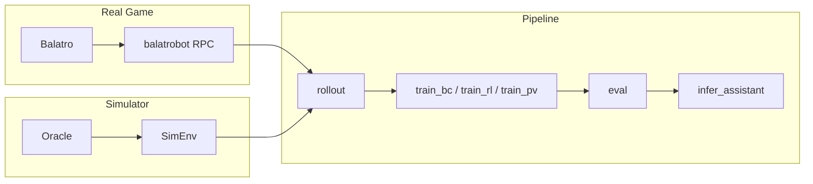

# BalatroAI

AI training and evaluation framework for [Balatro](https://store.steampowered.com/app/2578540/Balatro/) (poker roguelike), with real-game integration via **balatrobot** HTTP RPC and a **Python clean-room simulator** for fast rollouts and regression.

## Features

- **Dual environment**: Real gameplay through **balatrobot** HTTP JSON-RPC and a **Python simulator** for high-throughput rollouts.
- **Training pipeline**: Behavior cloning (BC), policy-value (PV), reinforcement learning (RL), distillation, DAgger; expert search; champion–challenger and risk-aware controllers.
- **Simulator parity**: Oracle (real gamestate) vs sim traces; canonical `state_v1` / `action_v1` / `trace_v1` schemas; directed fixtures and diff tooling for alignment (e.g. `hand_core`, P0–P2b).
- **Deployment**: v1 package spec, inference assistant (TUI / Streamlit), optional “suggest + execute” for sim.

## Architecture



## Project Structure

| Directory / File | Description |
|------------------|-------------|
| `trainer/` | Data collection, BC/RL/PV/distillation training, evaluation, inference assistant. See [trainer/README.md](trainer/README.md). |
| `sim/` | Simulator engine, oracle, canonical schemas, directed fixtures. See [sim/README.md](sim/README.md). |
| `balatro_mechanics/` | Rules and parity CSV/manifests. See [balatro_mechanics/README.md](balatro_mechanics/README.md). |
| `ui/` | Inference assistant TUI and Streamlit UI. |
| `scripts/` | Regression, smoke, cleanup, and git sync PowerShell scripts. |
| `docs/` | P15–P20 specs, alignment status, deploy package spec. |
| `benchmark_balatrobot.py` | Single/multi-instance throughput and latency benchmarks. |
| `sweep_throughput.py` | Batch instance sweeps and summary CSV. |

## Prerequisites

- **Python**: 3.12 or 3.13 (recommended). 3.15 alpha may be unstable for long runs.
- **balatrobot** and Balatro (with lovely `version.dll`). Windows path examples: [USAGE_GUIDE.md](USAGE_GUIDE.md).
- Install dependencies (from repo root):

```bash
python -m pip install -r trainer/requirements.txt
```

Optional: create a dedicated venv:

```powershell
.\trainer\scripts\setup_trainer_env.ps1
```

## Quick Start

1. Start balatrobot (e.g. port 12346):

```powershell
balatrobot serve --headless --fast --port 12346 --love-path "<path-to-Balatro.exe>" --lovely-path "<path-to-version.dll>"
```

2. Run E2E smoke from repo root (rollout → train_bc 1 epoch → eval --offline → infer_assistant --once):

```powershell
.\trainer\scripts\smoke_e2e.ps1 --base-urls "http://127.0.0.1:12346"
```

Full pipeline details (rollout, train, eval, infer) are in [trainer/README.md](trainer/README.md).

## Pipeline Summary

| Step | Script | Notes |
|------|--------|-------|
| **Rollout** | `trainer/rollout.py` | `--backend real|sim`, outputs JSONL. |
| **Train** | `train_bc.py` / `train_rl.py` / `train_pv.py` / `train_distill.py` | Outputs `best.pt`, etc. |
| **Eval** | `trainer/eval.py` | `--offline` / `--online`, `--backend real|sim`. |
| **Inference** | `trainer/infer_assistant.py` | Optional `--execute` (sim). |

For exact arguments and examples, see [trainer/README.md](trainer/README.md).

## Simulator & Oracle

The repo includes a clean-room Python simulator and an oracle pipeline that queries the local balatrobot service. Directed fixtures and oracle/sim diff target alignment (e.g. `hand_core`). For demo steps and commands, see [sim/README.md](sim/README.md).

## Benchmark & Sweep

- **benchmark_balatrobot.py**: Single/multi-instance throughput and latency; optional `--launch-instances` with `direct` or `uvx`.
- **sweep_throughput.py**: Multi-instance sweeps and summary CSV (e.g. `sweep_results.csv`, `sweep_results_summary.csv`).

Command examples: [USAGE_GUIDE.md](USAGE_GUIDE.md) (sections 2 and 3).

## Regression & Tests

- **Regression gates**: P18 / P19 / P20 via `scripts\run_regressions.ps1` (e.g. `-RunP18`, `-RunP19`, `-RunP20`). Wrap in `scripts/safe_run.ps1` for timeout and log capture.
- **Unit tests**: e.g. `python -m unittest trainer.tests.test_ablation_and_gates -v`; sim tests live in `sim/tests/`.
- Gate definitions and artifact layout: `docs/P18_SPEC.md`–`P20_SPEC.md`.

## Deploy Package

Deploy packages follow the v1 spec: directory layout, metadata, checksums, export and verification scripts. See [docs/DEPLOY_PACKAGE_SPEC.md](docs/DEPLOY_PACKAGE_SPEC.md).

## Documentation

- **Specs**: P15–P20, SIM_ALIGNMENT_STATUS, DEPLOY_PACKAGE_SPEC under `docs/`.
- **Usage guide**: [USAGE_GUIDE.md](USAGE_GUIDE.md).

## License & Contributing

License: see repository. Contributions welcome via issues and pull requests.
