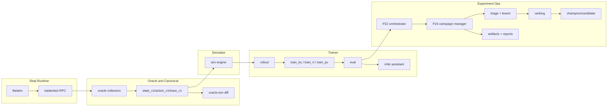

<h1 align="center">BalatroAI</h1>
<p align="center">
  A simulator-first Balatro experimentation platform focused on parity, reproducibility, and gated iteration.
</p>

<!-- BADGES:START -->
<p align="center">
  <a href="scripts/run_regressions.ps1"></a>
  <a href="scripts/git_sync.ps1"></a>
  <a href="configs/experiments/seeds_p23.yaml"></a>
  <a href="scripts/run_p22.ps1"></a>
  <a href="docs/TREND_WAREHOUSE_P26.md"></a>
  <a href="docs/"></a>
  <a href="USAGE_GUIDE.md"></a>
  <a href="trainer/requirements.txt"></a>
  <a href="#license-and-contributing"></a>
</p>
<!-- BADGES:END -->
Badge data source notes:

- `docs/artifacts/status/latest_badges.json` and `latest_status.json` are generated by `trainer.experiments.status_publish`.
- `scripts/update_readme_badges.ps1` patches this README in-place (`-DryRun` / `-Apply`).
- Gate details and trend snapshots are sourced from `docs/artifacts/trends` and latest `report_p*_gate.json`.

## What This Project Is

BalatroAI exists to make policy development and validation for Balatro engineering-grade instead of one-off scripting:

- real-game integration via `balatrobot` RPC
- simulator-driven high-throughput experiments
- oracle/simulator parity checks with canonical traces
- gated experiment operations (orchestrator, campaign manager, triage, ranking)
- reproducibility by seed governance and artifactized reports

## Scope and Boundaries

Suitable for:

- simulator parity and canonical trace alignment work
- offline-online policy iteration (Search -> BC -> DAgger -> RL)
- regression-gated experiment automation (P22+ / P23+ / P24+)
- engineering workflows around champion/candidate decisions

Not suitable for:

- a plug-and-play "always-win" agent
- uncontrolled real-game execution without safety rails
- interpreting metrics outside seed/budget/config/version context
- claiming universal performance without reproducible gate artifacts

## Quick Start

Fastest verified path from repo root:

1. Install trainer dependencies.

```powershell
python -m pip install -r trainer/requirements.txt
```

2. (Optional) Start `balatrobot` service.

```powershell
balatrobot serve --headless --fast --port 12346 --love-path "<path-to-Balatro.exe>" --lovely-path "<path-to-version.dll>"
```

3. Run a dry-run gate smoke.

```powershell
powershell -ExecutionPolicy Bypass -File scripts\run_p23.ps1 -DryRun
```

4. Check outputs.

- `docs/artifacts/p23/runs/latest/`
- `docs/artifacts/p24/runs/latest/`

More details:

- [trainer/README.md](trainer/README.md)
- [USAGE_GUIDE.md](USAGE_GUIDE.md)
- [docs/REPRODUCIBILITY_P25.md](docs/REPRODUCIBILITY_P25.md)

## Architecture Overview


```mermaid
flowchart LR
  subgraph Real[Real Runtime]
    G[Balatro]
    RPC[balatrobot RPC]
    G --> RPC
  end

  subgraph Canonical[Oracle and Canonical]
    ORA[oracle collectors]
    CAN[state_v1/action_v1/trace_v1]
    DIFF[oracle-sim diff]
    ORA --> CAN --> DIFF
  end

  subgraph Sim[Simulator]
    SIM[sim engine]
  end

  subgraph Train[Trainer]
    RO[rollout]
    TR[train_bc / train_rl / train_pv]
    EV[eval]
    INFER[infer assistant]
    RO --> TR --> EV --> INFER
  end

  subgraph Ops[Experiment Ops]
    ORCH[P22 orchestrator]
    CAMP[P24 campaign manager]
    TRI[triage + bisect]
    RANK[ranking]
    CC[champion/candidate]
    ART[artifacts + reports]
    ORCH --> CAMP --> TRI --> RANK --> CC
    CAMP --> ART
  end

  RPC --> ORA
  CAN --> SIM
  SIM --> RO
  EV --> ORCH
```

Data-flow details: [docs/ARCHITECTURE_P25.md](docs/ARCHITECTURE_P25.md)

## Core Workflows

| Workflow | Entry | Output |
|---|---|---|
| Regression gates | `scripts/run_regressions.ps1` (`-RunP23/-RunP24/-RunP25`) | `docs/artifacts/p23|p24|p25/*` |
| Orchestrator | `scripts/run_p22.ps1`, `scripts/run_p23.ps1` | run plans, telemetry, summary tables |
| Campaign ops | `scripts/run_p24.ps1` | campaign status/summary, triage, ranking |
| Training | `trainer/train_bc.py`, `trainer/train_rl.py`, `trainer/train_pv.py` | checkpoints + eval metrics |
| Inference | `trainer/infer_assistant.py` | suggestions / optional controlled execution |

## Reproducibility

Use this repo with explicit gate + seed + config references:

- gate entry: `scripts/run_regressions.ps1`
- seed policy: `configs/experiments/seeds_p23.yaml`
- matrix config: `configs/experiments/p23.yaml`
- campaign config: `configs/experiments/campaigns/p24_quick.yaml`

Full guide: [docs/REPRODUCIBILITY_P25.md](docs/REPRODUCIBILITY_P25.md)

<!-- STATUS:START -->
<!-- README_STATUS:BEGIN -->
### Repository Status (Auto-generated, P27)

- branch: main
- latest_gate: RunP26 (PASS)
- recent_trend_signal: regression
- trend_warehouse_last_updated: 2026-03-02T09:55:22.469609+00:00
- trend_rows_count: 12501
- champion: quick_risk_aware (champion)
- candidate: quick_hybrid (decision: hold)
- docs_coverage: P15-P26
<!-- README_STATUS:END -->
<!-- STATUS:END -->

## Example Outputs

Assets directory: [docs/assets/readme/](docs/assets/readme/)
These samples are lightweight snapshots derived from recent local gate artifacts.

1. Gate log snippet: [sample_run_log.txt](docs/assets/readme/sample_run_log.txt)
2. Summary table snippet: [sample_summary_table.md](docs/assets/readme/sample_summary_table.md)
3. Data-flow visual source: [architecture_dataflow.mmd](docs/assets/readme/architecture_dataflow.mmd)
4. Dashboard snippet: [sample_dashboard_log.txt](docs/assets/readme/sample_dashboard_log.txt)

Example log excerpt:

```text
[RunP24] gate_status=PASS
artifact_dir=docs/artifacts/p24/20260302-150119
functional.pass=true campaign.pass=true reliability.pass=true ops.pass=true
```

Example summary table excerpt:

| exp_id | status | avg_ante | median_ante | win_rate | seeds |
|---|---:|---:|---:|---:|---:|
| quick_risk_aware | passed | 3.8352 | 3.5750 | 0.4041 | 8 |
| quick_hybrid | passed | 3.7396 | 3.4875 | 0.4876 | 8 |
| quick_baseline | passed | 3.5838 | 3.7125 | 0.4143 | 8 |

## Project Structure

| Path | Purpose |
|---|---|
| `trainer/` | rollout/train/eval/infer pipelines |
| `sim/` | simulator, oracle, canonical schemas, parity fixtures |
| `scripts/` | gates, smokes, maintenance scripts |
| `configs/experiments/` | experiment matrix, seeds, campaign, ranking configs |
| `docs/` | specs, status docs, architecture/repro guides |
| `docs/artifacts/` | persisted run artifacts and gate outputs |

## Roadmap

Done:

- P22 orchestrator (modes, telemetry, summaries)
- P23 seed governance + coverage/flake harness
- P24 campaign manager + triage/bisect + ranking + dashboard
- P25 README/docs productization with RunP25 docs gate

In progress:

- RL pilot stabilization and promotion criteria hardening
- stronger nightly scheduling policy and cost controls
- tighter docs and gate coupling for operator onboarding

Planned:

- deeper real canary safeguards and rollout channels
- broader mechanism coverage and richer failure taxonomy
- CI-friendly docs status publishing and release packaging

## Known Limitations

- Real runtime depends on local Balatro + lovely + balatrobot setup.
- Performance claims are seed/budget/version dependent.
- Some gate logic still uses local/manual artifacts, not centralized CI.
- Simulator/mechanic coverage is still expanding across milestones.
- Generated status/readme snippets are local-run artifacts and should be refreshed before release notes.

## Documentation Index

- [trainer/README.md](trainer/README.md)
- [sim/README.md](sim/README.md)
- [USAGE_GUIDE.md](USAGE_GUIDE.md)
- [docs/P24_SPEC.md](docs/P24_SPEC.md)
- [docs/P25_SPEC.md](docs/P25_SPEC.md)
- [docs/REPRODUCIBILITY_P25.md](docs/REPRODUCIBILITY_P25.md)
- [docs/ARCHITECTURE_P25.md](docs/ARCHITECTURE_P25.md)

## License and Contributing

- License: currently not specified by a top-level `LICENSE` file.
- Contributions: use mainline-only workflow and run gates before proposing changes.


