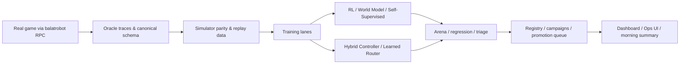
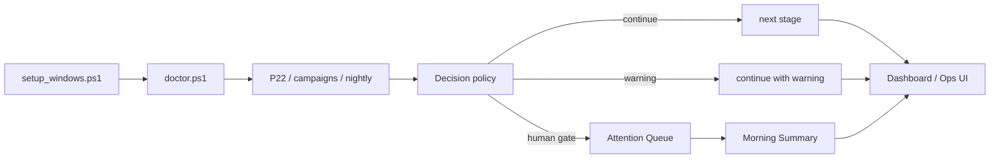

# BalatroAI

> 面向 Balatro 的模拟、训练、评测与运维一体化工程仓库。  
> A simulator-first Balatro research and operations stack for reproducible training, evaluation, and overnight execution.

<!-- BADGES:START -->
[](scripts/run_regressions.ps1)
[](scripts/git_sync.ps1)
[](scripts/run_p22.ps1)
[](docs/P58_WINDOWS_BOOTSTRAP.md)
[](docs/)
[](docs/P58_WINDOWS_BOOTSTRAP.md)
[](trainer/requirements.txt)
[](#license-and-contributing)
[](https://github.com/XcapeAxis/BalatroAI/tags)
<!-- BADGES:END -->

## MVP Demo

这个仓库现在已经包含一个适合面试直接展示的本地 Web Demo。它的定位不是研究后台，而是一个可以打开浏览器、切场景、看局面、比较模型与基线、执行一步并展示训练过程的本地 AI 决策沙盘。

你可以在 2 分钟内展示这些内容：

- 本地浏览器 UI，直接由 simulator 驱动，不是静态 mock 数据
- `3` 个内置高质量场景，覆盖高收益出牌、高压弃牌、Joker 协同
- 模型 vs 启发式基线的并排推荐对比，能直接看出是否同意、谁更保守、谁更激进
- 点击推荐后，局面高亮、结果预览、时间线会同时联动
- 一个真实训练出的最小可用模型，以及可在 UI 中看到的训练过程

MVP Demo 一键启动：

```powershell
powershell -ExecutionPolicy Bypass -File scripts\run_mvp_demo.ps1 -OpenBrowser
```

如果希望先自动补一个可用模型，再启动：

```powershell
powershell -ExecutionPolicy Bypass -File scripts\bootstrap_mvp_demo.ps1 -OpenBrowser
```

默认地址：

```text
http://127.0.0.1:8050/
```

推荐先看的文档：

- [DEMO_README.md](DEMO_README.md)
- [docs/MVP_DEMO_SCRIPT.md](docs/MVP_DEMO_SCRIPT.md)
- `docs/artifacts/mvp/model_train/latest_run.txt`
- `docs/artifacts/mvp/training_status/latest.json`

## MVP Quick Start

1. 克隆仓库并进入目录。
2. 使用仓库已有的本地 Python 环境。
3. 运行 `scripts\run_mvp_demo.ps1` 打开本地 Demo。
4. 先演示 `高收益起手`，再切到 `高压弃牌转折` 和 `Joker 协同爆发`。
5. 按页面主流程讲：左边选场景，中间看局面，右边看模型 vs 基线，下面看执行后变化。
6. 点击一条推荐，让局面高亮、结果预览和时间线一起联动，再执行一步或点击自动演示。
7. 打开训练面板，展示 `run_id`、样本量、loss 曲线、场景对齐结果和实时状态。

如果你要从命令行手动刷新模型：

```powershell
D:\MYFILES\BalatroAI\.venv_trainer_cuda\Scripts\python.exe -m demo.train_mvp_pipeline --status-path docs\artifacts\mvp\training_status\latest.json --budget-minutes 8 --episodes 180 --max-steps 28 --scenario-copies 48 --device auto --batch-size 256 --final-epochs 4 --sweep-epochs 2
```

正式 2 小时预算版本可用同一路径，只需把预算和训练规模换成 `standard` 档。

## MVP Value And Boundaries

适合：

- Balatro 风格 AI 决策可视化
- 场景驱动的本地产品 Demo
- 可解释推荐、一步预览、训练与推理打通
- 最小监督模型训练与本地部署展示

不适合：

- 直接控制商业游戏客户端
- 依赖联网或云端的演示流程
- 把当前模型描述成最终最优代理
- 为了 Demo 继续扩长期 registry / autonomy / world-model 主线

## MVP Architecture

当前 Demo 是一层刻意收敛的产品化薄壳：

- 后端：`demo/` 下的本地 HTTP 服务，包住 simulator、scenario fixture、状态适配和训练状态轮询
- 推理：启发式基线 + 真实训练的手牌阶段策略模型
- 前端：`demo/static/` 下的一页式本地 UI，支持中英文无关的本地演示路径
- 产物：数据集、checkpoint、metrics、training status、fallback 截图统一写到 `docs/artifacts/mvp/`

数据流：

1. 将内置 scenario 载入本地 simulator。
2. 提取当前状态和合法动作。
3. 用启发式或训练模型为动作打分。
4. 在 UI 展示 Top-K 推荐、解释、风险提示和一步预览。
5. 执行动作，刷新资源、阶段和时间线。
6. 如发起训练，则把状态与曲线实时写到 `training_status/latest.json` 并由 UI 轮询展示。

## MVP Roadmap And Known Limits

- 当前 Demo 是 scenario-driven 的，这是为了演示稳定和叙事清晰。
- 当前页面重点展示“局面 -> 推荐 -> 执行后变化”的闭环，而不是自由游玩。
- 当前模型是第一个可工作的监督学习版本，不是终局形态。
- 当前模型主要覆盖手牌阶段；其它阶段仍会回退到启发式。
- 长期主线里的 RL、hybrid、world-model、nightly/autonomy 仍保留，但本轮 MVP 不以它们为展示中心。

<p align="center">
  <a href="#quick-start">Quick Start</a> ·
  <a href="#windows-bootstrap-p58">Windows Bootstrap</a> ·
  <a href="#choose-your-path">Choose Your Path</a> ·
  <a href="#command-cheat-sheet">Command Cheat Sheet</a> ·
  <a href="docs/EXPERIMENTS_P22.md">P22 Docs</a> ·
  <a href="docs/P57_OVERNIGHT_AUTONOMY_PROTOCOL.md">P57 Docs</a> ·
  <a href="docs/P58_WINDOWS_BOOTSTRAP.md">P58 Docs</a>
  <a href="docs/P60_AGENTS_STANDARDIZATION_AND_AUTONOMY_ENTRY.md">P60 Docs</a>
  <a href="docs/P61_WORKFLOW_ACCELERATION.md">P61 Docs</a>
</p>

BalatroAI 的目标很明确：把 Balatro 相关实验整理成一套可复现、可追踪、可持续运行的工程系统。  
The repository treats simulator parity, training, evaluation, campaign state, and local operations as one connected workflow rather than separate scripts.

## What This Project Is

这个仓库覆盖从模拟器对齐到夜间运行的完整工程链路。  
It is not just a trainer and not just a dashboard; it is the operating surface for the whole local stack.

| 30 秒速览 | 说明 |
|---|---|
| 这是什么 | 面向 Balatro 的“模拟器 + 训练 + 评测 + 运维”统一仓库。 |
| 能做什么 | 运行回归、训练候选、比较策略、评估 learned router，并输出 dashboard / ops UI / attention queue / morning summary。 |
| 不做什么 | 不绕过门禁、不直接做高风险 promotion、不把小样本结果当成最终结论。 |
| 如何开始 | 新机器优先执行 `scripts\setup_windows.ps1`，然后执行 `scripts\doctor.ps1` 和 `scripts\run_p22.ps1 -Quick`。 |

Core capabilities today:

- simulator parity and canonical replay fixtures
- experiment orchestration with seeds, summaries, and campaign state
- RL, world model, hybrid controller, and learned-router workflows
- registry, promotion queue, dashboard, ops UI, overnight autonomy, and morning summary

## Scope and Boundaries

该仓库适用于工程化研究、离线评测、局部自动化与夜间批处理。  
Use it for controlled local experimentation and operations, not for unmanaged live automation.

Suitable for:

- simulator alignment and oracle-trace validation
- seed-governed experiment comparison and gated evaluation
- checkpoint registry, resumable campaigns, and promotion review
- local dashboard / Ops UI / overnight automation with explicit human gates

Not suitable for:

- a plug-and-play “always-win” bot
- destructive git/history actions without review
- live promotion driven only by offline metrics
- environment changes made implicitly or without traceability

## Choose Your Path

不同角色需要的入口不同，建议按目标选择最短路径。  
Use this as a routing table; the deeper docs stay in `docs/`.

| 适用角色 | 关注目标 | 推荐入口 | 主要输出 |
|---|---|---|---|
| 新机器接手 | 快速建立可运行环境 | `powershell -ExecutionPolicy Bypass -File scripts\setup_windows.ps1 -Mode auto -SkipSmoke` | `.venv_trainer*` + `docs/artifacts/p58/bootstrap/*` |
| 本机状态确认 | 判断当前机器是否适合继续推进 | `powershell -ExecutionPolicy Bypass -File scripts\doctor.ps1` | `docs/artifacts/p58/doctor_*.json` |
| 研究 / 训练 | 跑主线 smoke、确认 P22 链路 | `powershell -ExecutionPolicy Bypass -File scripts\run_p22.ps1 -Quick` | `summary_table.json` + dashboard |
| learned router 开发 | 查看 calibration / guard / canary | `powershell -ExecutionPolicy Bypass -File scripts\run_p22.ps1 -RunP56` | `docs/artifacts/p56/*` |
| 夜跑 / 运维 | 查看 blocked campaigns / morning summary | `powershell -ExecutionPolicy Bypass -File scripts\run_p22.ps1 -RunP57` | `attention_queue.json` + `morning_summary/latest.md` |
| 本地审查 | 用 UI 查看当前状态 | `powershell -ExecutionPolicy Bypass -File scripts\run_ops_ui.ps1` | `http://127.0.0.1:8765/` |

## Quick Start

如果你只记四条命令，建议记住下面这一组。  
This path is the default handoff flow for another Windows workstation.

1. Clone the repo.

```powershell
git clone https://github.com/XcapeAxis/BalatroAI.git
cd BalatroAI
```

2. Bootstrap the local Windows environment.

```powershell
powershell -ExecutionPolicy Bypass -File scripts\setup_windows.ps1 -Mode auto -SkipSmoke
```

3. Run the doctor / health check.

```powershell
powershell -ExecutionPolicy Bypass -File scripts\doctor.ps1
```

4. Run the default quick matrix.

```powershell
powershell -ExecutionPolicy Bypass -File scripts\run_p22.ps1 -Quick
```

Main outputs:

- P22 summary: `docs/artifacts/p22/runs/<run_id>/summary_table.json`
- dashboard: `docs/artifacts/dashboard/latest/index.html`
- Ops UI: `http://127.0.0.1:8765/`
- doctor report: `docs/artifacts/p58/latest_doctor.json`

For longer unattended commands, wrap them with `scripts\safe_run.ps1`:

```powershell
powershell -ExecutionPolicy Bypass -File scripts\safe_run.ps1 -TimeoutSec 7200 -- powershell -ExecutionPolicy Bypass -File scripts\run_p22.ps1 -Quick
```

## Windows Bootstrap (P58)

P58 的重点不是新增训练能力，而是让另一台 Windows 机器能快速接手同一条主线。  
Bootstrap establishes the standard env layout and keeps the main entrypoints unchanged.

Standard environments:

- `.venv_trainer`: CPU-safe fallback for config checks, docs, dashboard, ops UI, and non-CUDA execution
- `.venv_trainer_cuda`: CUDA-first training environment for P49/P50/P22 mainline when GPU is healthy

Resolver note:

- the runtime still prefers a live CUDA-first probe
- if the live Torch probe times out but the latest bootstrap state already validated the same repo-local env, the resolver reuses that bootstrap snapshot and emits an explicit warning instead of silently switching interpreters

Recommended first-run sequence:

```powershell
powershell -ExecutionPolicy Bypass -File scripts\setup_windows.ps1 -Mode auto -SkipSmoke
powershell -ExecutionPolicy Bypass -File scripts\doctor.ps1
powershell -ExecutionPolicy Bypass -File scripts\run_p22.ps1 -DryRun
powershell -ExecutionPolicy Bypass -File scripts\run_p22.ps1 -Quick
```

Mode selection:

- `-Mode cpu`: build only the CPU-safe environment
- `-Mode cuda`: require a CUDA-capable workstation and build the CUDA env
- `-Mode auto`: prefer CUDA when `nvidia-smi` is available, otherwise fall back to CPU

Primary references:

- [docs/P58_WINDOWS_BOOTSTRAP.md](docs/P58_WINDOWS_BOOTSTRAP.md)
- [docs/P50_CUDA_ENVIRONMENT.md](docs/P50_CUDA_ENVIRONMENT.md)
- [docs/P50_GPU_TROUBLESHOOTING.md](docs/P50_GPU_TROUBLESHOOTING.md)

## AGENTS & Autonomy (P60)

P60 standardizes the repository rule layer for AI coding agents and unattended local runs.  
The root `AGENTS.md` defines repo-wide defaults, while `trainer/AGENTS.md`, `sim/AGENTS.md`, `scripts/AGENTS.md`, `docs/AGENTS.md`, and `configs/AGENTS.md` keep only the local rules that matter in those directories.

Main entry:

```powershell
powershell -ExecutionPolicy Bypass -File scripts\run_autonomy.ps1 -Quick
powershell -ExecutionPolicy Bypass -File scripts\run_autonomy.ps1 -Overnight
powershell -ExecutionPolicy Bypass -File scripts\run_autonomy.ps1 -ResumeLatest
```

What this entry does:

- reads AGENTS + decision policy before starting work
- inspects attention queue, blocked campaigns, doctor/bootstrap state, and latest summaries
- decides continue / resume / block instead of silently pushing through
- writes `docs/artifacts/p60/latest_autonomy_entry.json`
- refreshes `docs/artifacts/morning_summary/latest.md`
- keeps validation-only forced promotion gates for audit, but auto-ignores them on later autonomy decisions
- falls back to `docs/artifacts/p60/latest_autonomy_entry.json` if nested safe-run output makes stdout non-JSON

Human-gate boundaries:

- the system does not recreate environments, install dependencies, rewrite git history, or switch live promoted checkpoints on its own
- unresolved blocking attention items stop autonomy rather than being treated as warnings
- detailed action classes remain in `docs/DECISION_POLICY.md`

Primary references:

- [docs/P60_AGENTS_STANDARDIZATION_AND_AUTONOMY_ENTRY.md](docs/P60_AGENTS_STANDARDIZATION_AND_AUTONOMY_ENTRY.md)
- [docs/DECISION_POLICY.md](docs/DECISION_POLICY.md)

## Validation Workflow (P61)

P61 将默认开发循环调整为 **Fast Loop + Targeted Validation + Deferred Certification**。  
The default path is no longer “wait for the full gate after every edit”; it is “run the smallest defensible checks now, queue certification explicitly, and only wait for Tier 3 when the decision really needs it.”

Main entrypoints:

```powershell
powershell -ExecutionPolicy Bypass -File scripts\run_fast_checks.ps1
powershell -ExecutionPolicy Bypass -File scripts\run_certification.ps1 -LatestPending
powershell -ExecutionPolicy Bypass -File scripts\run_autonomy.ps1 -Quick
```

Validation tiers:

- Tier 0: instant checks such as `py_compile`, config sidecar consistency, AGENTS consistency, and doctor precheck
- Tier 1: targeted smoke chosen from changed files
- Tier 2: subsystem gate only when the scope requires it
- Tier 3: certification / nightly / full regression as an explicit follow-up lane

Status semantics:

- `fast_check_status=passed` means the scoped fast loop passed
- `certification_status=pending` means full certification is still queued
- `certification_status=passed` means the deferred certification lane completed

Primary references:

- [docs/P61_WORKFLOW_ACCELERATION.md](docs/P61_WORKFLOW_ACCELERATION.md)
- [docs/P61_VALIDATION_PYRAMID.md](docs/P61_VALIDATION_PYRAMID.md)

## Architecture Overview

下图展示真实游戏、模拟器、训练、评测与运维之间的主线关系。  
The repository is organized as a continuous loop with explicit artifacts at each handoff.


```mermaid
flowchart LR
  A["Real game via balatrobot RPC"] --> B["Oracle traces & canonical schema"]
  B --> C["Simulator parity & replay data"]
  C --> D["Training lanes"]
  D --> D1["RL / World Model / Self-Supervised"]
  D --> D2["Hybrid Controller / Learned Router"]
  D1 --> E["Arena / regression / triage"]
  D2 --> E
  E --> F["Registry / campaigns / promotion queue"]
  F --> G["Dashboard / Ops UI / morning summary"]
```


```mermaid
flowchart LR
  A["setup_windows.ps1"] --> B["doctor.ps1"]
  B --> C["P22 / campaigns / nightly"]
  C --> D["Decision policy"]
  D -->|continue| E["next stage"]
  D -->|warning| F["continue with warning"]
  D -->|human gate| G["Attention Queue"]
  G --> H["Morning Summary"]
  E --> I["Dashboard / Ops UI"]
  F --> I
  H --> I
```

Key docs behind this flow:

- [docs/ARCHITECTURE.md](docs/ARCHITECTURE.md)
- [docs/EXPERIMENTS_P22.md](docs/EXPERIMENTS_P22.md)
- [docs/P53_BACKGROUND_EXECUTION_AND_OPS_UI.md](docs/P53_BACKGROUND_EXECUTION_AND_OPS_UI.md)
- [docs/P57_OVERNIGHT_AUTONOMY_PROTOCOL.md](docs/P57_OVERNIGHT_AUTONOMY_PROTOCOL.md)
- [docs/P58_WINDOWS_BOOTSTRAP.md](docs/P58_WINDOWS_BOOTSTRAP.md)
- [docs/P60_AGENTS_STANDARDIZATION_AND_AUTONOMY_ENTRY.md](docs/P60_AGENTS_STANDARDIZATION_AND_AUTONOMY_ENTRY.md)

## Capability Snapshot

目前的主链已经覆盖模拟、训练、评测与运维四个层面。  
This table is the fastest summary of the repository surface.

| Layer | Simulator | Training | Evaluation | Ops |
|---|---|---|---|---|
| Core value | Oracle parity, replay fixtures, canonical traces | RL, world model, hybrid controller, learned router | Arena, triage, calibration, guard, canary | Bootstrap, doctor, registry, campaigns, dashboard, ops UI |
| Default entry | `scripts\run_regressions.ps1` | `scripts\run_p22.ps1 -Quick` | `scripts\run_p22.ps1 -RunP56` | `scripts\doctor.ps1`, `scripts\run_p22.ps1 -RunP57`, `scripts\run_autonomy.ps1 -Quick` |
| Main artifacts | `sim/tests/fixtures_runtime/*` | `docs/artifacts/p22/*` | `docs/artifacts/p56/*` | `docs/artifacts/p58/*`, `docs/artifacts/p60/*`, `dashboard`, `attention_required`, `morning_summary` |
| Core docs | `docs/SIM_ALIGNMENT_STATUS.md` | `docs/EXPERIMENTS_P22.md` | `docs/P56_ROUTER_CALIBRATION_AND_CANARY.md` | `docs/P53_BACKGROUND_EXECUTION_AND_OPS_UI.md`, `docs/P57_OVERNIGHT_AUTONOMY_PROTOCOL.md`, `docs/P58_WINDOWS_BOOTSTRAP.md`, `docs/P60_AGENTS_STANDARDIZATION_AND_AUTONOMY_ENTRY.md` |

Current milestone anchors:

- **P53**: background execution + local Ops UI
- **P56**: learned-router calibration + guard + canary
- **P57**: overnight autonomy + attention queue + morning summary
- **P58**: Windows bootstrap + doctor + environment portability hardening
- **P60**: AGENTS hierarchy + consistency checks + unified autonomous iteration entry
- **P61**: validation pyramid + change-scope fast loop + deferred certification queue

## Command Cheat Sheet

以下只保留最常用的入口；更完整的实验矩阵请查看 P22 文档。  
If a command is not listed here, it is intentionally pushed down into `docs/EXPERIMENTS_P22.md`.

| 目标 | 命令 | 主要产物 | 适用场景 |
|---|---|---|---|
| 建立 Windows 环境 | `powershell -ExecutionPolicy Bypass -File scripts\setup_windows.ps1 -Mode auto -SkipSmoke` | `docs/artifacts/p58/bootstrap/*` | 新机器接手 |
| 做环境体检 | `powershell -ExecutionPolicy Bypass -File scripts\doctor.ps1` | `docs/artifacts/p58/doctor_*.{json,md}` | 判断是否可继续推进 |
| 跑主线 quick | `powershell -ExecutionPolicy Bypass -File scripts\run_p22.ps1 -Quick` | `summary_table.json`, dashboard | 日常 smoke / 主线验证 |
| 跑 P22 回归门禁 | `powershell -ExecutionPolicy Bypass -File scripts\run_regressions.ps1 -RunP22` | regression artifacts | 合并前检查 |
| 跑 learned router 校准 | `powershell -ExecutionPolicy Bypass -File scripts\run_p22.ps1 -RunP56` | `docs/artifacts/p56/*` | routing / deployment study |
| 跑夜跑自治 smoke | `powershell -ExecutionPolicy Bypass -File scripts\run_p22.ps1 -RunP57` | `attention_queue.json`, `morning_summary/latest.md` | autonomy validation |
| 启动 Ops UI | `powershell -ExecutionPolicy Bypass -File scripts\run_ops_ui.ps1` | localhost console | 本地审查 |
| 重建 dashboard | `powershell -ExecutionPolicy Bypass -File scripts\run_dashboard.ps1` | `dashboard/latest/index.html` | 汇总最新 artifacts |

| run autonomy quick | `powershell -ExecutionPolicy Bypass -File scripts\run_autonomy.ps1 -Quick` | `docs/artifacts/p60/latest_autonomy_entry.{json,md}` | AGENTS-aware smoke routing |
| run autonomy overnight | `powershell -ExecutionPolicy Bypass -File scripts\run_autonomy.ps1 -Overnight` | `docs/artifacts/p60/latest_autonomy_entry.{json,md}`, `morning_summary/latest.md` | unattended mainline progression |

## Current Repository Status

以下内容由脚本自动更新，用于说明当前默认分支与最近门禁状态。  
This block is intentionally machine-maintained.

<!-- STATUS:START -->
<!-- README_STATUS:BEGIN -->
### Repository Status (Auto-generated)

- branch: main
- latest_gate: RunP38 (PASS)
- recent_trend_signal: regression
- trend_warehouse_last_updated: 2026-03-02T17:16:27.519440+00:00
- trend_rows_count: 20115
- champion: quick_risk_aware (champion)
- candidate:  (decision: hold)
- docs_coverage: P15-P60
<!-- README_STATUS:END -->
<!-- STATUS:END -->

Status refresh sources:

- `docs/artifacts/status/latest_badges.json`
- `docs/artifacts/status/latest_status.json`
- `powershell -ExecutionPolicy Bypass -File scripts\update_readme_badges.ps1 -DryRun|-Apply`

## Reproducibility

BalatroAI 把 seeds、配置来源、campaign state 和环境选择都作为正式输出记录。  
Every major run should explain what was executed, with which config, in which environment.

What gets recorded:

| 记录项 | 查看位置 |
|---|---|
| seeds used | `summary_table.json`, `seeds_used.json` |
| config provenance | P22 summary rows and P55 sidecar sync reports |
| selected training env | P22 runtime fields and `docs/artifacts/p58/latest_doctor.json` |
| bootstrap / doctor refs | `docs/artifacts/p58/bootstrap/latest_bootstrap_state.json`, `docs/artifacts/p58/latest_doctor.json` |
| campaign state | `campaign_state.json` |
| promotion review | `promotion_queue.json` |
| dashboard / ops refs | `docs/artifacts/dashboard/latest/`, `docs/artifacts/p53/ops_ui/latest/` |

Recommended docs:

- [docs/REPRODUCIBILITY_P25.md](docs/REPRODUCIBILITY_P25.md)
- [docs/SEEDS_AND_REPRODUCIBILITY.md](docs/SEEDS_AND_REPRODUCIBILITY.md)
- [docs/EXPERIMENTS_P22.md](docs/EXPERIMENTS_P22.md)
- [docs/P51_CHECKPOINT_REGISTRY_AND_CAMPAIGNS.md](docs/P51_CHECKPOINT_REGISTRY_AND_CAMPAIGNS.md)

## Example Outputs

运行完成后，建议优先查看以下几个输出位置。  
These paths are the normal inspection surface after a local run.

| 输出 | 路径 | 用途 |
|---|---|---|
| bootstrap state | `docs/artifacts/p58/bootstrap/latest_bootstrap_state.json` | 查看 env 布局、推荐模式和下一步命令 |
| doctor report | `docs/artifacts/p58/latest_doctor.json` | 查看机器是否适合继续推进项目 |
| P22 summary | `docs/artifacts/p22/runs/<run_id>/summary_table.json` | 查看实验矩阵、seed 数量与 refs |
| dashboard | `docs/artifacts/dashboard/latest/index.html` | 查看最新总体状态 |
| attention queue | `docs/artifacts/attention_required/attention_queue.json` | 查看需要人工介入的事项 |
| morning summary | `docs/artifacts/morning_summary/latest.md` | 查看夜间运行摘要 |

| autonomy entry | `docs/artifacts/p60/latest_autonomy_entry.json` | inspect the latest continue / resume / block decision |
| AGENTS consistency | `docs/artifacts/p60/latest_agents_consistency.json` | inspect AGENTS / README / decision policy consistency |

Sample assets:

- [sample_run_log.txt](docs/assets/readme/sample_run_log.txt)
- [sample_summary_table.md](docs/assets/readme/sample_summary_table.md)
- [architecture_dataflow.mmd](docs/assets/readme/architecture_dataflow.mmd)
- [sample_dashboard_log.txt](docs/assets/readme/sample_dashboard_log.txt)

## Roadmap

README 只保留当前状态和下一步重点，完整路线请查看 `docs/ROADMAP.md`。  
Treat this as a snapshot, not as the full milestone archive.

| Area | Today | Next |
|---|---|---|
| Simulator | parity + oracle-trace workflows are established | extend mechanic coverage and keep drift visible |
| Training | RL, world model, hybrid controller, learned router are wired into P22 | deepen budgets and improve cross-lane coupling |
| Evaluation | arena, triage, calibration, guard, and canary are available | expand slice coverage and larger-budget comparisons |
| Ops | dashboard, ops UI, campaigns, overnight autonomy, bootstrap, doctor, and AGENTS-aware autonomy entry are shipped | improve blocked-campaign resolution and cross-machine handoff stability |

Roadmap docs:

- [docs/ROADMAP.md](docs/ROADMAP.md)
- [docs/P56_ROUTER_CALIBRATION_AND_CANARY.md](docs/P56_ROUTER_CALIBRATION_AND_CANARY.md)
- [docs/P57_OVERNIGHT_AUTONOMY_PROTOCOL.md](docs/P57_OVERNIGHT_AUTONOMY_PROTOCOL.md)
- [docs/P58_WINDOWS_BOOTSTRAP.md](docs/P58_WINDOWS_BOOTSTRAP.md)
- [docs/P60_AGENTS_STANDARDIZATION_AND_AUTONOMY_ENTRY.md](docs/P60_AGENTS_STANDARDIZATION_AND_AUTONOMY_ENTRY.md)

## Known Limitations

以下边界有助于正确理解当前系统的适用范围。  
The repository is intentionally conservative in several places.

- runtime workflows still depend on local `balatrobot` / Balatro availability
- bootstrap builds project envs, but it does not install GPU drivers or system packages
- learned-router and world-model conclusions still depend on finite seed budgets
- promotion remains review-oriented; high-risk changes still require human approval
- overnight autonomy blocks on unresolved human gates by design
- Windows is the primary supported bootstrap target at this stage

## Further Reading

如果首页信息已经足够，可以按主题进入对应文档。  
Do not read everything; pick the lane you need.

| If you care about... | Read this |
|---|---|
| experiment matrix / commands | [docs/EXPERIMENTS_P22.md](docs/EXPERIMENTS_P22.md) |
| seeds / reproducibility | [docs/SEEDS_AND_REPRODUCIBILITY.md](docs/SEEDS_AND_REPRODUCIBILITY.md) |
| CUDA environment | [docs/P50_CUDA_ENVIRONMENT.md](docs/P50_CUDA_ENVIRONMENT.md), [docs/P50_GPU_TROUBLESHOOTING.md](docs/P50_GPU_TROUBLESHOOTING.md) |
| learned router | [docs/P48_ADAPTIVE_HYBRID_CONTROLLER.md](docs/P48_ADAPTIVE_HYBRID_CONTROLLER.md), [docs/P54_LEARNED_ROUTER.md](docs/P54_LEARNED_ROUTER.md), [docs/P56_ROUTER_CALIBRATION_AND_CANARY.md](docs/P56_ROUTER_CALIBRATION_AND_CANARY.md) |
| campaigns / registry | [docs/P51_CHECKPOINT_REGISTRY_AND_CAMPAIGNS.md](docs/P51_CHECKPOINT_REGISTRY_AND_CAMPAIGNS.md) |
| ops UI / overnight autonomy | [docs/P53_BACKGROUND_EXECUTION_AND_OPS_UI.md](docs/P53_BACKGROUND_EXECUTION_AND_OPS_UI.md), [docs/P57_OVERNIGHT_AUTONOMY_PROTOCOL.md](docs/P57_OVERNIGHT_AUTONOMY_PROTOCOL.md), [docs/P60_AGENTS_STANDARDIZATION_AND_AUTONOMY_ENTRY.md](docs/P60_AGENTS_STANDARDIZATION_AND_AUTONOMY_ENTRY.md) |
| Windows handoff / new machine setup | [docs/P58_WINDOWS_BOOTSTRAP.md](docs/P58_WINDOWS_BOOTSTRAP.md) |
| AGENTS / autonomy entry | [docs/P60_AGENTS_STANDARDIZATION_AND_AUTONOMY_ENTRY.md](docs/P60_AGENTS_STANDARDIZATION_AND_AUTONOMY_ENTRY.md), [docs/DECISION_POLICY.md](docs/DECISION_POLICY.md) |

## License and Contributing

- License: no top-level `LICENSE` file is currently present.
- Contributions: stay on `main`, keep changes auditable, and run the relevant gates before changing operational defaults.
