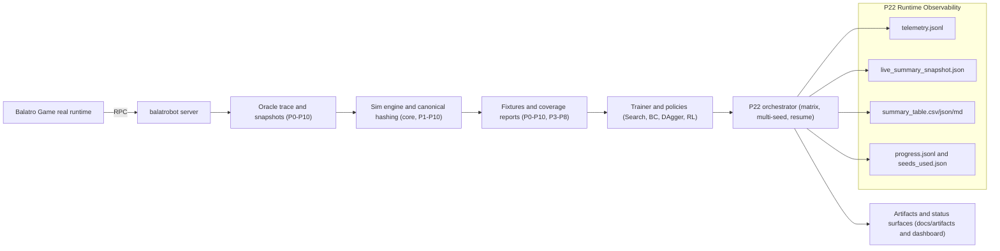

<h1 align="center">BalatroAI</h1>
<p align="center">
  Simulator-first Balatro research platform for parity, reproducibility, and gated policy iteration.
</p>

<!-- BADGES:START -->
[](scripts/run_regressions.ps1)
[](scripts/git_sync.ps1)
[](configs/experiments/seeds_p23.yaml)
[](scripts/run_p22.ps1)
[](docs/TREND_WAREHOUSE_P26.md)
[](docs/)
[](USAGE_GUIDE.md)
[](trainer/requirements.txt)
[](#license-and-contributing)
[](https://github.com/XcapeAxis/BalatroAI/actions/workflows/ci-smoke.yml)
[](https://github.com/XcapeAxis/BalatroAI/stargazers)
[](https://github.com/XcapeAxis/BalatroAI/issues)
<!-- BADGES:END -->

BalatroAI is a high-parity simulator plus strategy experimentation stack for Balatro, backed by oracle traces, seed governance, and gated regressions. Current maturity covers Gold Stake alignment workflows and major mechanics (jokers including stateful behavior, consumables, shop/vouchers/tags, and artifactized experiment operations). It is designed for mechanism research and Search/BC/DAgger/RL iteration, not as a cheat injector or memory-hook tool.

Badge/status refresh source:

- `docs/artifacts/status/latest_badges.json` and `latest_status.json` from `python -m trainer.experiments.status_publish`
- `powershell -ExecutionPolicy Bypass -File scripts\update_readme_badges.ps1 -DryRun|-Apply`

## Project Value & Scope

BalatroAI exists to make policy development and validation for Balatro engineering-grade instead of one-off scripting:

- real-game integration via `balatrobot` RPC
- simulator-driven high-throughput experiments
- oracle/simulator parity checks with canonical traces
- gated experiment operations (orchestrator, campaign manager, triage, ranking)
- reproducibility by seed governance and artifactized reports

Suitable for:

- simulator parity and canonical trace alignment work
- offline-online policy iteration (Search -> BC -> DAgger -> RL)
- regression-gated experiment automation (P22+ / P23+ / P24+)
- engineering workflows around champion/candidate decisions

Not suitable for:

- a plug-and-play "always-win" agent
- uncontrolled real-game execution without safety rails
- interpreting metrics outside seed/budget/config/version context
- claiming universal performance without reproducible gate artifacts

## Quick Start (Windows + PowerShell, < 5 min)

1. Clone and enter the repo.

```powershell
git clone https://github.com/XcapeAxis/BalatroAI.git
cd BalatroAI
```

2. Create and activate a virtual environment, then install dependencies.

```powershell
python -m venv .venv_trainer
.\.venv_trainer\Scripts\Activate.ps1
python -m pip install --upgrade pip
python -m pip install -r trainer/requirements.txt
```

3. Run a minimal baseline regression smoke (P0/P1 path).

```powershell
powershell -ExecutionPolicy Bypass -File scripts\run_regressions.ps1 -RunFast
```

4. Run the P22 quick orchestration matrix (2 experiments x 2 seeds).

```powershell
powershell -ExecutionPolicy Bypass -File scripts\run_p22.ps1 -Quick
```

Optional verbose progress:

```powershell
powershell -ExecutionPolicy Bypass -File scripts\run_p22.ps1 -Quick -VerboseLogs
```

5. Inspect generated artifacts.

- `docs/artifacts/p22/runs/<run_id>/summary_table.md`
- `docs/artifacts/p22/runs/<run_id>/run_plan.json`
- `docs/artifacts/p22/runs/<run_id>/<exp_id>/{run_manifest.json,progress.jsonl,seeds_used.json}`
- optional live snapshot view: `powershell -ExecutionPolicy Bypass -File scripts\show_p22_live.ps1`

Expected console excerpt (trimmed):

```text
[RunFast] PASS (P0/P1 baseline completed)
[P22] Experiment 1/2: quick_baseline (seeds 2, mode=gate)
[P22] Completed 1/2: quick_baseline status=passed | avg_ante=3.4716 median_ante=3.850 win_rate=51.32% hand_top1=59.69% hand_top3=78.52% shop_top1=82.15% illegal=2.41%
[P23] run_id=20260302-223827 mode=gate status=PASS
[P23] live_snapshot=.../docs/artifacts/p22/runs/20260302-223827/live_summary_snapshot.json
[P23] summary_json=.../docs/artifacts/p22/runs/20260302-223827/summary_table.json
```

Real-game step note: for live RPC/oracle workflows you still need a legal local Balatro install plus `balatrobot` runtime. For simulator-only P22 quick mode, this is not required.

More details:

- [trainer/README.md](trainer/README.md)
- [USAGE_GUIDE.md](USAGE_GUIDE.md)
- [docs/EXPERIMENTS_P22.md](docs/EXPERIMENTS_P22.md)
- [docs/REPRODUCIBILITY_P25.md](docs/REPRODUCIBILITY_P25.md)

## Architecture & Data Flow


```mermaid
flowchart LR
  A["Balatro Game real runtime"] -->|RPC| B["balatrobot server"]
  B --> C["Oracle trace and snapshots (P0-P10)"]
  C --> D["Sim engine and canonical hashing (core, P1-P10)"]
  D --> E["Fixtures and coverage reports (P0-P10, P3-P8)"]
  E --> F["Trainer and policies (Search, BC, DAgger, RL)"]
  F --> G["P22 orchestrator (matrix, multi-seed, resume)"]
  G --> H["Artifacts and status surfaces (docs/artifacts and dashboard)"]

  subgraph OBS["P22 Runtime Observability"]
    O1["telemetry.jsonl"]
    O2["live_summary_snapshot.json"]
    O3["summary_table.csv/json/md"]
    O4["progress.jsonl and seeds_used.json"]
  end

  G --> O1
  G --> O2
  G --> O3
  G --> O4
```

Data-flow details: [docs/ARCHITECTURE_P25.md](docs/ARCHITECTURE_P25.md)
For a detailed architecture and dataflow overview, see [docs/ARCHITECTURE.md](docs/ARCHITECTURE.md).

## Core Workflows

| Workflow | Entry | Output |
|---|---|---|
| Regression gates | `scripts/run_regressions.ps1` (`-RunP22/-RunP23/-RunP24/-RunP25`) | `docs/artifacts/p22|p23|p24|p25/*` |
| Orchestrator | `scripts/run_p22.ps1`, `scripts/run_p23.ps1` | run plans, telemetry, live snapshot, summary tables |
| Campaign ops | `scripts/run_p24.ps1` | campaign status/summary, triage, ranking |
| Training | `trainer/train_bc.py`, `trainer/train_rl.py`, `trainer/train_pv.py` | checkpoints + eval metrics |
| Inference | `trainer/infer_assistant.py` | suggestions / optional controlled execution |

## Reproducible Experiments (P22)

P22 experiments are config-first and artifactized:

- experiment matrix config: `configs/experiments/p22.yaml`
- seed governance config: `configs/experiments/seeds_p23.yaml`
- entrypoint: `powershell -ExecutionPolicy Bypass -File scripts\run_p22.ps1 ...`

Each P22 run writes:

- `docs/artifacts/p22/runs/<run_id>/run_plan.json`
- `docs/artifacts/p22/runs/<run_id>/summary_table.{csv,json,md}`
- `docs/artifacts/p22/runs/<run_id>/<exp_id>/run_manifest.json`
- `docs/artifacts/p22/runs/<run_id>/<exp_id>/progress.jsonl`
- `docs/artifacts/p22/runs/<run_id>/<exp_id>/seeds_used.json`

Seed policy clarification:

- regression and alignment gates use fixed seeds for stable regression detection.
- P22 orchestration is multi-seed by design (quick/nightly modes select explicit seed sets).
- actual seeds for each experiment are always persisted in `seeds_used.json`; results are not assumed to be only `AAAAAAA`.

For details and repro patterns: [docs/EXPERIMENTS_P22.md](docs/EXPERIMENTS_P22.md), [docs/REPRODUCIBILITY_P25.md](docs/REPRODUCIBILITY_P25.md)

<!-- STATUS:START -->
<!-- README_STATUS:BEGIN -->
### Repository Status (Auto-generated)

- branch: main
- mainline_status: mainline-dirty (detected main: main)
- working_tree_clean: False
- highest_supported_gate: RunP29
- latest_supported_gate: RunP29
- seed_governance: enabled (P23+)
- experiment_platform: ready
- experiment_orchestrator: enabled (P22+)
- trend_warehouse_status: enabled (P26+)
- trend_warehouse_last_updated: 2026-03-02T12:42:05.280528+00:00
- recent_trend_signal: regression
- latest_gate_snapshot: RunP29:PASS
- docs_specs_range: P15-P30 (available: P16, P17, P18, P19, P20, P21, P23, P24, P25, P26, P27, P29, P30)
- artifacts_guide: docs/artifacts/p24/runs/latest, docs/artifacts/p25/, docs/artifacts/trends/
- published_status_used: True
<!-- README_STATUS:END -->
<!-- STATUS:END -->

## Example Outputs

Assets directory: [docs/assets/readme/](docs/assets/readme/)
These samples are lightweight snapshots derived from recent local gate artifacts.

1. Gate log snippet: [sample_run_log.txt](docs/assets/readme/sample_run_log.txt)
2. Summary table snippet: [sample_summary_table.md](docs/assets/readme/sample_summary_table.md)
3. Data-flow visual source: [architecture_dataflow.mmd](docs/assets/readme/architecture_dataflow.mmd)
4. Dashboard snippet: [sample_dashboard_log.txt](docs/assets/readme/sample_dashboard_log.txt)

Example log excerpt:

```text
[RunP24] gate_status=PASS
artifact_dir=docs/artifacts/p24/20260302-150119
functional.pass=true campaign.pass=true reliability.pass=true ops.pass=true
```

Example summary table excerpt:

| exp_id | status | avg_ante | median_ante | win_rate | seeds |
|---|---:|---:|---:|---:|---:|
| quick_risk_aware | passed | 3.8352 | 3.5750 | 0.4041 | 8 |
| quick_hybrid | passed | 3.7396 | 3.4875 | 0.4876 | 8 |
| quick_baseline | passed | 3.5838 | 3.7125 | 0.4143 | 8 |

## Project Structure

| Path | Purpose |
|---|---|
| `trainer/` | rollout/train/eval/infer pipelines |
| `sim/` | simulator, oracle, canonical schemas, parity fixtures |
| `scripts/` | gates, smokes, maintenance scripts |
| `configs/experiments/` | experiment matrix, seeds, campaign, ranking configs |
| `docs/` | specs, status docs, architecture/repro guides |
| `docs/artifacts/` | persisted run artifacts and gate outputs |

## Roadmap

Done:

- P22 orchestrator (modes, telemetry, summaries)
- P23 seed governance + coverage/flake harness
- P24 campaign manager + triage/bisect + ranking + dashboard
- P25 README/docs productization with RunP25 docs gate

In progress:

- RL pilot stabilization and promotion criteria hardening
- stronger nightly scheduling policy and cost controls
- tighter docs and gate coupling for operator onboarding

Planned:

- deeper real canary safeguards and rollout channels
- broader mechanism coverage and richer failure taxonomy
- CI-friendly docs status publishing and release packaging

## Known Limitations

- Real runtime depends on local Balatro + lovely + balatrobot setup.
- Performance claims are seed/budget/version dependent.
- Some gate logic still uses local/manual artifacts, not centralized CI.
- Simulator/mechanic coverage is still expanding across milestones.
- Generated status/readme snippets are local-run artifacts and should be refreshed before release notes.

## Further Reading

- [docs/SIM_ALIGNMENT_STATUS.md](docs/SIM_ALIGNMENT_STATUS.md)
- [docs/EXPERIMENTS_P22.md](docs/EXPERIMENTS_P22.md)
- Coverage snapshots: `docs/COVERAGE_P*_STATUS.md`
- [docs/ARCHITECTURE.md](docs/ARCHITECTURE.md)

## Documentation Index

- [trainer/README.md](trainer/README.md)
- [sim/README.md](sim/README.md)
- [USAGE_GUIDE.md](USAGE_GUIDE.md)
- [docs/P24_SPEC.md](docs/P24_SPEC.md)
- [docs/P25_SPEC.md](docs/P25_SPEC.md)
- [docs/P26_SPEC.md](docs/P26_SPEC.md)
- [docs/P27_SPEC.md](docs/P27_SPEC.md)
- [docs/P29_SPEC.md](docs/P29_SPEC.md)
- [docs/P30_SPEC.md](docs/P30_SPEC.md)
- [docs/COVERAGE_P30_STATUS.md](docs/COVERAGE_P30_STATUS.md)
- [docs/STATUS_PUBLISHING_P27.md](docs/STATUS_PUBLISHING_P27.md)
- [docs/RELEASE_TRAIN_P27.md](docs/RELEASE_TRAIN_P27.md)
- [docs/EXPERIMENTS_P22.md](docs/EXPERIMENTS_P22.md)
- [docs/ARCHITECTURE.md](docs/ARCHITECTURE.md)
- [docs/REPRODUCIBILITY_P25.md](docs/REPRODUCIBILITY_P25.md)
- [docs/ARCHITECTURE_P25.md](docs/ARCHITECTURE_P25.md)

## License and Contributing

- License: currently not specified by a top-level `LICENSE` file.
- Contributions: use mainline-only workflow and run gates before proposing changes.


