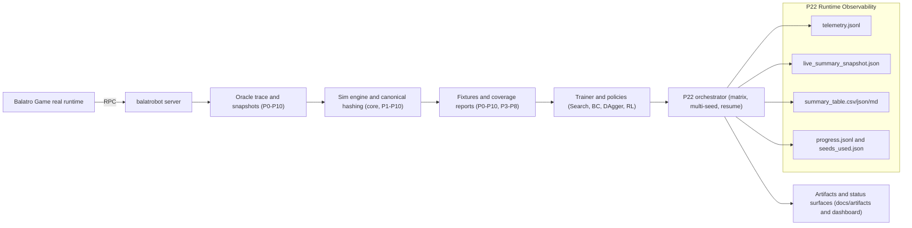

<h1 align="center">BalatroAI</h1>
<p align="center">
  Simulator-first Balatro research platform for parity, reproducibility, and gated policy iteration.
</p>

<!-- BADGES:START -->
[](scripts/run_regressions.ps1)
[](scripts/git_sync.ps1)
[](configs/experiments/seeds_p23.yaml)
[](scripts/run_p22.ps1)
[](docs/TREND_WAREHOUSE_P26.md)
[](docs/)
[](USAGE_GUIDE.md)
[](trainer/requirements.txt)
[](#license-and-contributing)

<!-- BADGES:END -->

BalatroAI is a high-parity simulator plus strategy experimentation stack for Balatro, backed by oracle traces, seed governance, and gated regressions. Current maturity covers Gold Stake alignment workflows and major mechanics (jokers including stateful behavior, consumables, shop/vouchers/tags, and artifactized experiment operations), and now includes P31/P33 self-supervised entries plus a unified P33 action replay contract. It is designed for mechanism research and Search/BC/DAgger/RL/self-supervised iteration, not as a cheat injector or memory-hook tool.

Badge/status refresh source:

- `docs/artifacts/status/latest_badges.json` and `latest_status.json` from `python -m trainer.experiments.status_publish`
- `powershell -ExecutionPolicy Bypass -File scripts\update_readme_badges.ps1 -DryRun|-Apply`

## What This Project Is

BalatroAI exists to make policy development and validation for Balatro engineering-grade instead of one-off scripting:

- real-game integration via `balatrobot` RPC
- simulator-driven high-throughput experiments
- oracle/simulator parity checks with canonical traces
- gated experiment operations (orchestrator, campaign manager, triage, ranking)
- reproducibility by seed governance and artifactized reports

## Scope and Boundaries

Suitable for:

- simulator parity and canonical trace alignment work
- offline-online policy iteration (Search -> BC -> DAgger -> Self-Supervised (P33) -> RL)
- regression-gated experiment automation (P22+ / P23+ / P24+)
- engineering workflows around champion/candidate decisions

Not suitable for:

- a plug-and-play "always-win" agent
- uncontrolled real-game execution without safety rails
- interpreting metrics outside seed/budget/config/version context
- claiming universal performance without reproducible gate artifacts

## Quick Start (Windows + PowerShell, < 5 min)

1. Clone and enter the repo.

```powershell
git clone https://github.com/XcapeAxis/BalatroAI.git
cd BalatroAI
```

2. Create and activate a virtual environment, then install dependencies.

```powershell
python -m venv .venv_trainer
.\.venv_trainer\Scripts\Activate.ps1
python -m pip install --upgrade pip
python -m pip install -r trainer/requirements.txt
```

3. Start `balatrobot` (required for oracle/alignment gates and full regression suites).

```powershell
uvx balatrobot serve --headless --fast --port 12346
```

4. Run a baseline alignment regression (P0-P10 path).

```powershell
powershell -ExecutionPolicy Bypass -File scripts\run_regressions.ps1 -RunP10
```

5. Run the P22 quick orchestration matrix (includes `quick_selfsup_pretrain` and `quick_selfsup_p33`).

```powershell
powershell -ExecutionPolicy Bypass -File scripts\run_p22.ps1 -Quick
```

Optional verbose progress:

```powershell
powershell -ExecutionPolicy Bypass -File scripts\run_p22.ps1 -Quick -VerboseLogs
```

6. Inspect generated artifacts.

- `docs/artifacts/p22/runs/<run_id>/summary_table.md`
- `docs/artifacts/p22/runs/<run_id>/run_plan.json`
- `docs/artifacts/p22/runs/<run_id>/<exp_id>/{run_manifest.json,progress.jsonl,seeds_used.json}`
- optional live snapshot view: `powershell -ExecutionPolicy Bypass -File scripts\show_p22_live.ps1`

Expected console excerpt (trimmed):

```text
[RunFast] PASS (P0/P1 baseline completed)
[P22] Experiment 1/4: quick_baseline (seeds 2, mode=gate)
[P22] Experiment 3/4: quick_selfsup_pretrain (seeds 2, mode=gate)
[P22] Experiment 4/4: quick_selfsup_p33 (seeds 2, mode=gate)
[P22] Completed 4/4: quick_selfsup_p33 status=passed | avg_ante=2.8750 median_ante=2.875 win_rate=29.69% hand_top1=31.25% hand_top3=46.25% shop_top1=0.00% illegal=5.41%
[P23] run_id=20260303-005315 mode=gate status=PASS
[P23] live_snapshot=.../docs/artifacts/p22/runs/20260303-005315/live_summary_snapshot.json
[P23] summary_json=.../docs/artifacts/p22/runs/20260303-005315/summary_table.json
```

Real-game step note: P0-P10/P13 oracle-alignment workflows require a legal local Balatro install plus `balatrobot` runtime. P22 synthetic modes can run simulator-only when gate stages are disabled.

More details:

- [trainer/README.md](trainer/README.md)
- [USAGE_GUIDE.md](USAGE_GUIDE.md)
- [docs/EXPERIMENTS_P22.md](docs/EXPERIMENTS_P22.md)
- [docs/REPRODUCIBILITY_P25.md](docs/REPRODUCIBILITY_P25.md)

## Architecture Overview


```mermaid
flowchart LR
  A["Balatro Game real runtime"] -->|RPC| B["balatrobot server"]
  B --> C["Oracle trace and snapshots (P0-P10)"]
  C --> D["Sim engine and canonical hashing (core, P1-P10)"]
  D --> E["Fixtures and coverage reports (P0-P10, P3-P8)"]
  E --> F["Trainer and policies (Search, BC, DAgger, RL)"]
  F --> G["P22 orchestrator (matrix, multi-seed, resume)"]
  G --> H["Artifacts and status surfaces (docs/artifacts and dashboard)"]

  subgraph OBS["P22 Runtime Observability"]
    O1["telemetry.jsonl"]
    O2["live_summary_snapshot.json"]
    O3["summary_table.csv/json/md"]
    O4["progress.jsonl and seeds_used.json"]
  end

  G --> O1
  G --> O2
  G --> O3
  G --> O4
```

Data-flow details: [docs/ARCHITECTURE_P25.md](docs/ARCHITECTURE_P25.md)
For a detailed architecture and dataflow overview, see [docs/ARCHITECTURE.md](docs/ARCHITECTURE.md).
All BC/DAgger/Self-Supervised (P33) experiment paths now normalize actions through a unified replay adapter so single-step behavior is consistent across sim and real-runtime adapters.

## Core Workflows

| Workflow | Entry | Output |
|---|---|---|
| Regression gates | `scripts/run_regressions.ps1` (`-RunP22/-RunP23/-RunP24/-RunP25`) | `docs/artifacts/p22|p23|p24|p25/*` |
| Orchestrator | `scripts/run_p22.ps1`, `scripts/run_p23.ps1` | run plans, telemetry, live snapshot, summary tables |
| Campaign ops | `scripts/run_p24.ps1` | campaign status/summary, triage, ranking |
| Training | `trainer/train_bc.py`, `trainer/train_rl.py`, `trainer/train_pv.py` | checkpoints + eval metrics |
| Self-supervised (P33) | `scripts/run_p33_selfsup.ps1`, `python -B -m trainer.experiments.selfsupervised_p33` | dataset stats + selfsup summary + checkpoints |
| Inference | `trainer/infer_assistant.py` | suggestions / optional controlled execution |

## Reproducibility

P22 experiments are config-first and artifactized:

- experiment matrix config: `configs/experiments/p22.yaml`
- seed governance config: `configs/experiments/seeds_p23.yaml`
- entrypoint: `powershell -ExecutionPolicy Bypass -File scripts\run_p22.ps1 ...`

Each P22 run writes:

- `docs/artifacts/p22/runs/<run_id>/run_plan.json`
- `docs/artifacts/p22/runs/<run_id>/summary_table.{csv,json,md}`
- `docs/artifacts/p22/runs/<run_id>/<exp_id>/run_manifest.json`
- `docs/artifacts/p22/runs/<run_id>/<exp_id>/progress.jsonl`
- `docs/artifacts/p22/runs/<run_id>/<exp_id>/seeds_used.json`

Seed policy clarification:

- regression and alignment gates use fixed seeds for stable regression detection.
- P22 orchestration is multi-seed by design (quick/nightly modes select explicit seed sets).
- actual seeds for each experiment are always persisted in `seeds_used.json`; results are not assumed to be only `AAAAAAA`.

For details and repro patterns: [docs/EXPERIMENTS_P22.md](docs/EXPERIMENTS_P22.md), [docs/REPRODUCIBILITY_P25.md](docs/REPRODUCIBILITY_P25.md)

P31 self-supervised backbone reproducibility:

- config: `configs/experiments/p31_selfsup.yaml`
- training entrypoint: `python -B trainer/selfsup_train.py --config configs/experiments/p31_selfsup.yaml --max-steps 100`
- orchestrated run: `powershell -ExecutionPolicy Bypass -File scripts\run_p22.ps1 -Quick` (includes `quick_selfsup_pretrain`)
- reference docs: [docs/EXPERIMENTS_P31.md](docs/EXPERIMENTS_P31.md), [docs/COVERAGE_P31_STATUS.md](docs/COVERAGE_P31_STATUS.md)

P33 self-supervised plumbing reproducibility (experimental entry):

- config: `configs/experiments/p33_selfsup.yaml`
- direct run: `python -B trainer/experiments/selfsupervised_p33.py --config configs/experiments/p33_selfsup.yaml`
- wrapper: `powershell -ExecutionPolicy Bypass -File scripts\run_p33_selfsup.ps1`
- artifacts:
  - `docs/artifacts/p33/selfsup_dataset_stats.json`
  - `docs/artifacts/p33/selfsup_training_summary_<timestamp>.json`
- details: [docs/EXPERIMENTS_P33.md](docs/EXPERIMENTS_P33.md), [docs/COVERAGE_P33_STATUS.md](docs/COVERAGE_P33_STATUS.md)

<!-- STATUS:START -->
<!-- README_STATUS:BEGIN -->
### Repository Status (Auto-generated)

- branch: main
- latest_gate: RunP29 (PASS)
- recent_trend_signal: regression
- trend_warehouse_last_updated: 2026-03-02T17:16:27.519440+00:00
- trend_rows_count: 20115
- champion: quick_risk_aware (champion)
- candidate: quick_hybrid (decision: hold)
- docs_coverage: P15-P33
<!-- README_STATUS:END -->
<!-- STATUS:END -->

## Example Outputs

Assets directory: [docs/assets/readme/](docs/assets/readme/)
These samples are lightweight snapshots derived from recent local gate artifacts.

1. Gate log snippet: [sample_run_log.txt](docs/assets/readme/sample_run_log.txt)
2. Summary table snippet: [sample_summary_table.md](docs/assets/readme/sample_summary_table.md)
3. Data-flow visual source: [architecture_dataflow.mmd](docs/assets/readme/architecture_dataflow.mmd)
4. Dashboard snippet: [sample_dashboard_log.txt](docs/assets/readme/sample_dashboard_log.txt)

Example log excerpt:

```text
[RunP24] gate_status=PASS
artifact_dir=docs/artifacts/p24/20260302-150119
functional.pass=true campaign.pass=true reliability.pass=true ops.pass=true
```

Example summary table excerpt:

| exp_id | status | avg_ante | median_ante | win_rate | seeds |
|---|---:|---:|---:|---:|---:|
| quick_risk_aware | passed | 3.8352 | 3.5750 | 0.4041 | 8 |
| quick_hybrid | passed | 3.7396 | 3.4875 | 0.4876 | 8 |
| quick_baseline | passed | 3.5838 | 3.7125 | 0.4143 | 8 |

Example self-supervised metrics excerpt (P22 `quick_selfsup_pretrain`):

| metric | value |
|---|---:|
| selfsup_val_loss | 11.4079 |
| selfsup_score_delta_mae | 1.0000 |
| selfsup_hand_type_acc | 1.0000 |

## Action Fidelity and RealAction Contract (P32)

P32 introduces a unified single-step `RealAction` contract shared by simulator execution, real runtime translation, and fixture replay. The contract now includes position operations (`REORDER_HAND`, `SWAP_HAND_CARDS`, `REORDER_JOKERS`, `SWAP_JOKERS`) and an order-sensitive replay hash scope (`p32_real_action_position_observed_core`) so hand/joker ordering drift is detectable.

Current coverage notes:

- sim engine executes position actions deterministically.
- real executor/env client accepts the same action schema; on runtimes without reorder RPC methods, actions degrade with explicit `degraded_reason` instead of silent failure.
- `real_trace_to_fixture` can infer reorder/swap actions from raw before/after snapshots when explicit action logs are absent.
- shop/rng micro-alignment is augmented with artifactized reroll sampling reports.

See [docs/P32_REAL_ACTION_CONTRACT_STATUS.md](docs/P32_REAL_ACTION_CONTRACT_STATUS.md), [docs/P32_REAL_ACTION_CONTRACT_SPEC.md](docs/P32_REAL_ACTION_CONTRACT_SPEC.md), and [docs/P32_SHOP_RNG_ALIGNMENT.md](docs/P32_SHOP_RNG_ALIGNMENT.md).

## Project Structure

| Path | Purpose |
|---|---|
| `trainer/` | rollout/train/eval/infer pipelines |
| `sim/` | simulator, oracle, canonical schemas, parity fixtures |
| `scripts/` | gates, smokes, maintenance scripts |
| `configs/experiments/` | experiment matrix, seeds, campaign, ranking configs |
| `docs/` | specs, status docs, architecture/repro guides |
| `docs/artifacts/` | persisted run artifacts and gate outputs |

## Roadmap

Done:

- P0-P13 alignment and oracle/sim parity gates
- P22 orchestrator (modes, telemetry, summaries)
- P23 seed governance + coverage/flake harness
- P24 campaign manager + triage/bisect + ranking + dashboard
- P25 README/docs productization with RunP25 docs gate
- P31 self-supervised trajectory backbone (`DecisionStep/Trajectory`, encoder, quick pretrain)
- P33 unified action replay adapter (`trainer/actions/replay.py`) + minimal self-supervised experimental plumbing

In progress:

- RL pilot stabilization and promotion criteria hardening
- stronger nightly scheduling policy and cost controls
- tighter docs and gate coupling for operator onboarding

Planned:

- deeper real canary safeguards and rollout channels
- broader mechanism coverage and richer failure taxonomy
- self-play/RL integration on top of the P31 self-supervised encoder

## Known Limitations

- Real runtime depends on local Balatro + lovely + balatrobot setup.
- Performance claims are seed/budget/version dependent.
- Some gate logic still uses local/manual artifacts, not centralized CI.
- Simulator/mechanic coverage is still expanding across milestones.
- Generated status/readme snippets are local-run artifacts and should be refreshed before release notes.
- P31 self-supervised backbone is alpha-grade: current heads focus on `score_delta` and `hand_type`; broader tactical targets will be added incrementally.
- P33 self-supervised entry is experimental plumbing: it validates data->train->summary flow, not production-strength policy gains.

## Further Reading

- [docs/SIM_ALIGNMENT_STATUS.md](docs/SIM_ALIGNMENT_STATUS.md)
- [docs/EXPERIMENTS_P22.md](docs/EXPERIMENTS_P22.md)
- [docs/EXPERIMENTS_P31.md](docs/EXPERIMENTS_P31.md)
- [docs/EXPERIMENTS_P33.md](docs/EXPERIMENTS_P33.md)
- [docs/P32_REAL_ACTION_CONTRACT_STATUS.md](docs/P32_REAL_ACTION_CONTRACT_STATUS.md)
- [docs/P32_REAL_ACTION_CONTRACT_SPEC.md](docs/P32_REAL_ACTION_CONTRACT_SPEC.md)
- [docs/P32_SHOP_RNG_ALIGNMENT.md](docs/P32_SHOP_RNG_ALIGNMENT.md)
- Coverage snapshots: `docs/COVERAGE_P*_STATUS.md`
- [docs/COVERAGE_P31_STATUS.md](docs/COVERAGE_P31_STATUS.md)
- [docs/COVERAGE_P33_STATUS.md](docs/COVERAGE_P33_STATUS.md)
- [docs/COVERAGE_P32_STATUS.md](docs/COVERAGE_P32_STATUS.md)
- [docs/ARCHITECTURE.md](docs/ARCHITECTURE.md)

## Documentation Index

- [trainer/README.md](trainer/README.md)
- [sim/README.md](sim/README.md)
- [USAGE_GUIDE.md](USAGE_GUIDE.md)
- [docs/P24_SPEC.md](docs/P24_SPEC.md)
- [docs/P25_SPEC.md](docs/P25_SPEC.md)
- [docs/P26_SPEC.md](docs/P26_SPEC.md)
- [docs/P27_SPEC.md](docs/P27_SPEC.md)
- [docs/P29_SPEC.md](docs/P29_SPEC.md)
- [docs/P30_SPEC.md](docs/P30_SPEC.md)
- [docs/COVERAGE_P30_STATUS.md](docs/COVERAGE_P30_STATUS.md)
- [docs/STATUS_PUBLISHING_P27.md](docs/STATUS_PUBLISHING_P27.md)
- [docs/RELEASE_TRAIN_P27.md](docs/RELEASE_TRAIN_P27.md)
- [docs/EXPERIMENTS_P22.md](docs/EXPERIMENTS_P22.md)
- [docs/EXPERIMENTS_P31.md](docs/EXPERIMENTS_P31.md)
- [docs/EXPERIMENTS_P33.md](docs/EXPERIMENTS_P33.md)
- [docs/P32_REAL_ACTION_CONTRACT_STATUS.md](docs/P32_REAL_ACTION_CONTRACT_STATUS.md)
- [docs/P32_REAL_ACTION_CONTRACT_SPEC.md](docs/P32_REAL_ACTION_CONTRACT_SPEC.md)
- [docs/P32_SHOP_RNG_ALIGNMENT.md](docs/P32_SHOP_RNG_ALIGNMENT.md)
- [docs/ARCHITECTURE.md](docs/ARCHITECTURE.md)
- [docs/REPRODUCIBILITY_P25.md](docs/REPRODUCIBILITY_P25.md)
- [docs/ARCHITECTURE_P25.md](docs/ARCHITECTURE_P25.md)
- [docs/COVERAGE_P31_STATUS.md](docs/COVERAGE_P31_STATUS.md)
- [docs/COVERAGE_P33_STATUS.md](docs/COVERAGE_P33_STATUS.md)

## License and Contributing

- License: currently not specified by a top-level `LICENSE` file.
- Contributions: use mainline-only workflow and run gates before proposing changes.

