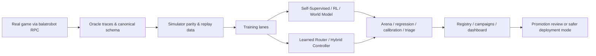
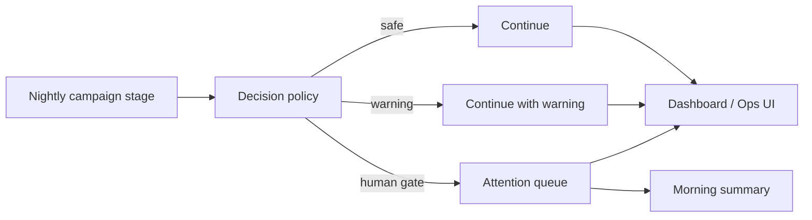

<h1 align="center">BalatroAI</h1>
<p align="center">
  <strong>面向 Balatro 的模拟、训练、评测与夜间运行一体化工程平台。</strong><br />
  A simulator-first Balatro research and ops stack for reproducible training, evaluation, and overnight automation.
</p>

<!-- BADGES:START -->
[](scripts/run_regressions.ps1)
[](scripts/git_sync.ps1)
[](scripts/run_p22.ps1)
[](docs/)
[](USAGE_GUIDE.md)
[](trainer/requirements.txt)
[](#license-and-contributing)
[](https://github.com/XcapeAxis/BalatroAI/tags)
[](https://github.com/XcapeAxis/BalatroAI/actions/workflows/ci-smoke.yml)
<!-- BADGES:END -->

<p align="center">
  <a href="#quick-start">Quick Start</a> ·
  <a href="#choose-your-path">Choose Your Path</a> ·
  <a href="#command-cheat-sheet">Command Cheat Sheet</a> ·
  <a href="docs/EXPERIMENTS_P22.md">P22 Docs</a> ·
  <a href="docs/P57_OVERNIGHT_AUTONOMY_PROTOCOL.md">P57 Docs</a>
</p>

BalatroAI focuses on one thing: making Balatro experimentation understandable, reproducible, and operable.  
本仓库聚焦 Balatro 场景下的研究、评测与运维，不定位为通用模型实验仓库。

This README is intentionally short and navigational.  
如需实现细节，请将本页作为导航入口，再进入对应文档。

## What This Project Is

该仓库覆盖模拟器对齐、模型训练、回归门禁、实验编排、dashboard、ops UI 与夜间自治运行等完整链路。  
BalatroAI combines simulator parity, model training, experiment orchestration, gated evaluation, and overnight ops into one repo.

| 30 秒速览 | 说明 |
|---|---|
| 这是什么？ | 一个围绕 Balatro 构建的“模拟器 + 训练 + 评测 + 运维”工程平台。 |
| 它能做什么？ | 运行回归、比较策略、训练候选、校准 learned router，并生成 dashboard / ops UI / morning summary。 |
| 它不是什么？ | 不提供外挂能力，不执行脱离门禁的自动代理，也不依赖缺乏验证依据的黑盒结论。 |
| 如何开始？ | 启动 `balatrobot`，然后运行 `powershell -ExecutionPolicy Bypass -File scripts\run_p22.ps1 -Quick`。 |

Core capabilities today:

- high-parity simulator + oracle-trace alignment
- experiment orchestration with seeds, summaries, and campaign state
- self-supervised, RL, world-model, and learned-router workflows
- registry, promotion queue, dashboard, ops UI, attention queue, and morning summary

## Scope and Boundaries

本仓库适用于工程化研究与受控运维，不用于脱离门禁的无约束自动化。  
Use it for controlled experimentation, not for unbounded live automation.

Suitable for:

- simulator parity and canonical trace validation
- seed-governed policy comparison and regression gates
- self-supervised, RL, world-model, and learned-router iteration
- resumable campaigns, dashboard visibility, and overnight triage

Not suitable for:

- a plug-and-play “always win” bot
- destructive live promotion without review
- interpreting metrics outside seed / budget / config context
- skipping registry, gate, or provenance evidence when making claims

## Choose Your Path

不同角色关注的入口不同；下表列出最常用的起点。  
Pick the path that matches your job, then dive into the linked docs only if you need more detail.

| 适用角色 | 关注目标 | 推荐入口 | 主要输出 |
|---|---|---|---|
| 初次接触项目的读者 | 确认系统主链路可运行 | `powershell -ExecutionPolicy Bypass -File scripts\run_p22.ps1 -Quick` | `summary_table.json` + dashboard |
| 训练 / 研究人员 | 查看主训练与比较链路 | `powershell -ExecutionPolicy Bypass -File scripts\run_p22.ps1 -Quick` | multi-seed P22 rows + artifacts |
| learned router 开发者 | 查看 calibration / guard / canary | `powershell -ExecutionPolicy Bypass -File scripts\run_p22.ps1 -RunP56` | P56 benchmark / calibration / canary outputs |
| 夜间运行 / 运维人员 | 查看 attention queue 与 morning summary | `powershell -ExecutionPolicy Bypass -File scripts\run_p22.ps1 -RunP57` | autonomy campaign state + morning summary |
| 值班 / 审核人员 | 通过本地 UI 查看状态 | `powershell -ExecutionPolicy Bypass -File scripts\run_ops_ui.ps1` | localhost ops console |

## Quick Start

本节保留最短启动路径：安装依赖、启动服务、运行 quick、查看结果。  
If you only remember four commands, remember these.

1. Clone the repo and install trainer dependencies.

```powershell
git clone https://github.com/XcapeAxis/BalatroAI.git
cd BalatroAI
python -m venv .venv_trainer
.\.venv_trainer\Scripts\Activate.ps1
python -m pip install --upgrade pip
python -m pip install -r trainer/requirements.txt
```

2. Start `balatrobot` on the default local port.

```powershell
uvx balatrobot serve --headless --fast --port 12346
```

3. Run the default quick matrix.

```powershell
powershell -ExecutionPolicy Bypass -File scripts\run_p22.ps1 -Quick
```

4. Open the main outputs.

- summary table: `docs/artifacts/p22/runs/<run_id>/summary_table.json`
- dashboard: `docs/artifacts/dashboard/latest/index.html`
- ops UI: `http://127.0.0.1:8765/`

Common next steps:

```powershell
# Learned-router benchmark / calibration / canary
powershell -ExecutionPolicy Bypass -File scripts\run_p22.ps1 -RunP56

# Overnight autonomy smoke
powershell -ExecutionPolicy Bypass -File scripts\run_p22.ps1 -RunP57

# Overnight nightly template
powershell -ExecutionPolicy Bypass -File scripts\run_p22.ps1 -Overnight
```

More commands live in [docs/EXPERIMENTS_P22.md](docs/EXPERIMENTS_P22.md).

## Architecture Overview

下图展示真实游戏、模拟器、训练、评测、campaign 与人工决策之间的关系。  
The repo is organized as one continuous loop rather than a pile of unrelated scripts.


```mermaid
flowchart LR
  A["Real game via balatrobot RPC"] --> B["Oracle traces & canonical schema"]
  B --> C["Simulator parity & replay data"]
  C --> D["Training lanes"]
  D --> D1["Self-Supervised / RL / World Model"]
  D --> D2["Learned Router / Hybrid Controller"]
  D1 --> E["Arena / regression / calibration / triage"]
  D2 --> E
  E --> F["Registry / campaigns / dashboard"]
  F --> G["Promotion review or safer deployment mode"]
```


```mermaid
flowchart LR
  A["Nightly campaign stage"] --> B["Decision policy"]
  B -->|safe| C["Continue"]
  B -->|warning| D["Continue with warning"]
  B -->|human gate| E["Attention queue"]
  E --> F["Morning summary"]
  C --> G["Dashboard / Ops UI"]
  D --> G
  E --> G
```

Key docs behind this flow:

- [docs/ARCHITECTURE.md](docs/ARCHITECTURE.md)
- [docs/EXPERIMENTS_P22.md](docs/EXPERIMENTS_P22.md)
- [docs/P53_BACKGROUND_EXECUTION_AND_OPS_UI.md](docs/P53_BACKGROUND_EXECUTION_AND_OPS_UI.md)
- [docs/P56_ROUTER_CALIBRATION_AND_CANARY.md](docs/P56_ROUTER_CALIBRATION_AND_CANARY.md)
- [docs/P57_OVERNIGHT_AUTONOMY_PROTOCOL.md](docs/P57_OVERNIGHT_AUTONOMY_PROTOCOL.md)

## Capability Snapshot

目前，模拟器、训练、评测和运维四条链路均已打通，但深度、覆盖面和预算仍在持续扩展。  
This table is the fastest way to see the repo's current surface area.

| Layer | Simulator | Training | Evaluation | Ops |
|---|---|---|---|---|
| Core value | Oracle parity, replay fixtures, canonical traces | Self-Supervised, RL, world model, learned router | Arena, triage, calibration, guard, canary | Registry, campaigns, dashboard, ops UI, overnight autonomy |
| Default entry | `scripts\run_regressions.ps1` | `scripts\run_p22.ps1 -Quick` | `scripts\run_p22.ps1 -RunP56` | `scripts\run_p22.ps1 -RunP57` |
| Main artifacts | `sim/tests/fixtures_runtime/*` | `docs/artifacts/p22/*` | `docs/artifacts/p56/*` | `dashboard`, `attention_required`, `morning_summary` |
| Best docs | `docs/SIM_ALIGNMENT_STATUS.md` | `docs/EXPERIMENTS_P22.md` | `docs/P56_ROUTER_CALIBRATION_AND_CANARY.md` | `docs/P53_BACKGROUND_EXECUTION_AND_OPS_UI.md`, `docs/P57_OVERNIGHT_AUTONOMY_PROTOCOL.md` |

Key shipped milestones worth remembering:

- **P53**: background execution + local ops UI
- **P56**: learned-router calibration + canary promotion path
- **P57**: overnight autonomy protocol + attention queue + morning summary

## Command Cheat Sheet

本节仅列出最常用入口；更完整的矩阵与参数说明请参见 P22 文档。  
熟悉仓库后，可将这一节作为日常速查表。  
If a command is missing here, it was intentionally pushed down into the docs.

| 目标 | 命令 | 主要产物 | 适用场景 |
|---|---|---|---|
| 跑主线 quick matrix | `powershell -ExecutionPolicy Bypass -File scripts\run_p22.ps1 -Quick` | `summary_table.json`, dashboard | 初次了解项目 / 日常 smoke |
| 跑 P22 回归门禁 | `powershell -ExecutionPolicy Bypass -File scripts\run_regressions.ps1 -RunP22` | regression artifacts | 合并前检查 |
| 跑 learned router 校准 | `powershell -ExecutionPolicy Bypass -File scripts\run_p22.ps1 -RunP56` | P56 benchmark / calibration / canary | 研究 / routing |
| 跑 overnight autonomy smoke | `powershell -ExecutionPolicy Bypass -File scripts\run_p22.ps1 -RunP57` | attention queue, morning summary | 夜跑协议验证 |
| 跑 overnight nightly | `powershell -ExecutionPolicy Bypass -File scripts\run_p22.ps1 -Overnight` | blocked campaigns, nightly summary | 值班 / 自动推进 |
| 恢复最新 campaign | `powershell -ExecutionPolicy Bypass -File scripts\run_p22.ps1 -ResumeLatestCampaign` | resumed campaign state | 中断恢复 |
| 启动本地 Ops UI | `powershell -ExecutionPolicy Bypass -File scripts\run_ops_ui.ps1` | localhost console | 运维 / 审核 |
| 重建 dashboard | `python -B -m trainer.monitoring.dashboard_build --input docs/artifacts --output docs/artifacts/dashboard/latest` | `dashboard/latest/index.html` | 静态结果查看 |

## Current Repository Status

以下内容由脚本自动生成，无需手工维护。  
This block is intentionally machine-updated by repo scripts.

<!-- STATUS:START -->
<!-- README_STATUS:BEGIN -->
### Repository Status (Auto-generated)

- branch: main
- latest_gate: RunP38 (PASS)
- recent_trend_signal: regression
- trend_warehouse_last_updated: 2026-03-02T17:16:27.519440+00:00
- trend_rows_count: 20115
- champion: quick_risk_aware (champion)
- candidate:  (decision: hold)
- docs_coverage: P15-P57
<!-- README_STATUS:END -->
<!-- STATUS:END -->

Badge/status refresh source:

- `docs/artifacts/status/latest_badges.json`
- `docs/artifacts/status/latest_status.json`
- `powershell -ExecutionPolicy Bypass -File scripts\update_readme_badges.ps1 -DryRun|-Apply`

## Reproducibility

本仓库的重要工程价值之一，是让实验结果具备可复查性与可追溯性。  
BalatroAI treats seeds, config provenance, and artifact paths as first-class outputs.

What gets recorded:

| 记录项 | 查看位置 |
|---|---|
| seeds used | `summary_table.json`, `seeds_used.json` |
| config provenance | P22 summary rows and sync reports |
| campaign state | `campaign_state.json` |
| promotion review | `promotion_queue.json` |
| dashboard / ops refs | latest dashboard, ops UI state, audit logs |

Recommended docs:

- [docs/REPRODUCIBILITY_P25.md](docs/REPRODUCIBILITY_P25.md)
- [docs/SEEDS_AND_REPRODUCIBILITY.md](docs/SEEDS_AND_REPRODUCIBILITY.md)
- [docs/EXPERIMENTS_P22.md](docs/EXPERIMENTS_P22.md)
- [docs/P51_CHECKPOINT_REGISTRY_AND_CAMPAIGNS.md](docs/P51_CHECKPOINT_REGISTRY_AND_CAMPAIGNS.md)

## Example Outputs

以下列出运行后应优先查看的核心输出，便于快速建立全局认识。  
These are the main files you inspect after a run.

| 输出 | 路径 | 用途 |
|---|---|---|
| P22 summary | `docs/artifacts/p22/runs/<run_id>/summary_table.json` | 查看实验行、seed 数与关键 refs |
| Dashboard | `docs/artifacts/dashboard/latest/index.html` | 查看总体状态与最近结果 |
| Attention queue | `docs/artifacts/attention_required/attention_queue.json` | 查看需要人工决策的问题 |
| Morning summary | `docs/artifacts/morning_summary/latest.md` | 查看夜间运行摘要与待处理事项 |

Sample assets:

- [sample_run_log.txt](docs/assets/readme/sample_run_log.txt)
- [sample_summary_table.md](docs/assets/readme/sample_summary_table.md)
- [architecture_dataflow.mmd](docs/assets/readme/architecture_dataflow.mmd)
- [sample_dashboard_log.txt](docs/assets/readme/sample_dashboard_log.txt)

Example summary snippet:

| exp_id | status | mean | seeds |
|---|---:|---:|---:|
| quick_risk_aware | passed | 3.8352 | 8 |
| quick_hybrid | passed | 3.7396 | 8 |
| quick_baseline | passed | 3.5838 | 8 |

## Roadmap

README 仅保留当前状态与下一步重点；完整里程碑树请参见 docs。  
Use this section as a snapshot, not as the full project history.

| Area | Today | Next |
|---|---|---|
| Core sim | parity + oracle trace workflows are established | broaden mechanic coverage and keep drift visible |
| Training | self-supervised, RL, world model, learned router are wired into P22 | deepen budgets and improve coupling between lanes |
| Evaluation | arena, triage, calibration, guard, and canary are available | expand slice coverage and higher-budget comparisons |
| Ops | dashboard, ops UI, registry, campaigns, overnight autonomy are shipped | improve blocked-campaign resolution and safer night ops |

Roadmap docs:

- [docs/ROADMAP.md](docs/ROADMAP.md)
- [docs/P56_ROUTER_CALIBRATION_AND_CANARY.md](docs/P56_ROUTER_CALIBRATION_AND_CANARY.md)
- [docs/P57_OVERNIGHT_AUTONOMY_PROTOCOL.md](docs/P57_OVERNIGHT_AUTONOMY_PROTOCOL.md)

## Known Limitations

以下限制有助于正确理解当前系统的适用范围与结果边界。  
This repo is powerful, but it is intentionally conservative in a few places.

- real runtime workflows depend on local `balatrobot` / Balatro availability
- learned-router and world-model conclusions still depend on finite seed budgets
- promotion remains review-oriented; human sign-off is still required for high-risk changes
- overnight autonomy stops on unresolved human gates by design
- some docs, summaries, and badges are machine-refreshed and may lag until the next gate run

## Further Reading

如果首页信息已足够，可按关注主题进入对应文档。  
Do not read everything; pick the lane you care about.

| If you care about... | Read this |
|---|---|
| overall architecture | [docs/ARCHITECTURE.md](docs/ARCHITECTURE.md) |
| experiment matrix / commands | [docs/EXPERIMENTS_P22.md](docs/EXPERIMENTS_P22.md) |
| seeds / reproducibility | [docs/SEEDS_AND_REPRODUCIBILITY.md](docs/SEEDS_AND_REPRODUCIBILITY.md) |
| closed-loop / RL | [docs/P41_CLOSED_LOOP_V2.md](docs/P41_CLOSED_LOOP_V2.md), [docs/P42_RL_CANDIDATE_PIPELINE.md](docs/P42_RL_CANDIDATE_PIPELINE.md) |
| world model / planning | [docs/P45_WORLD_MODEL.md](docs/P45_WORLD_MODEL.md), [docs/P47_MODEL_BASED_SEARCH.md](docs/P47_MODEL_BASED_SEARCH.md) |
| learned router | [docs/P48_ADAPTIVE_HYBRID_CONTROLLER.md](docs/P48_ADAPTIVE_HYBRID_CONTROLLER.md), [docs/P54_LEARNED_ROUTER.md](docs/P54_LEARNED_ROUTER.md), [docs/P56_ROUTER_CALIBRATION_AND_CANARY.md](docs/P56_ROUTER_CALIBRATION_AND_CANARY.md) |
| campaigns / registry | [docs/P51_CHECKPOINT_REGISTRY_AND_CAMPAIGNS.md](docs/P51_CHECKPOINT_REGISTRY_AND_CAMPAIGNS.md) |
| ops UI / overnight autonomy | [docs/P53_BACKGROUND_EXECUTION_AND_OPS_UI.md](docs/P53_BACKGROUND_EXECUTION_AND_OPS_UI.md), [docs/P57_OVERNIGHT_AUTONOMY_PROTOCOL.md](docs/P57_OVERNIGHT_AUTONOMY_PROTOCOL.md) |

## License and Contributing

- License: no top-level `LICENSE` file is currently present.
- Contributions: stay on `main`, keep changes auditable, and run the relevant gates before proposing operational changes.
