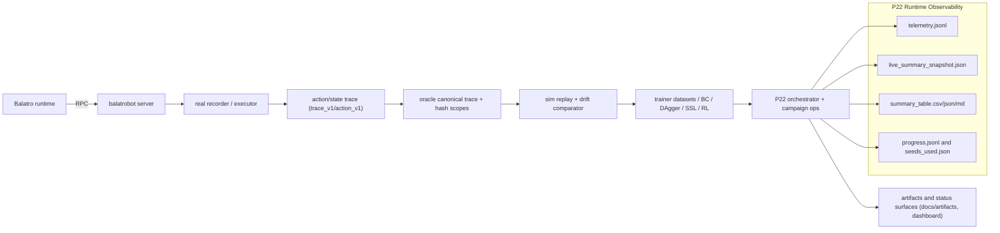

<h1 align="center">BalatroAI</h1>
<p align="center">
  Simulator-first Balatro research platform for parity, reproducibility, and gated policy iteration.
</p>

<!-- BADGES:START -->
[](scripts/run_regressions.ps1)
[](scripts/git_sync.ps1)
[](configs/experiments/seeds_p23.yaml)
[](scripts/run_p22.ps1)
[](docs/TREND_WAREHOUSE_P26.md)
[](docs/)
[](USAGE_GUIDE.md)
[](trainer/requirements.txt)
[](#license-and-contributing)
[](https://github.com/XcapeAxis/BalatroAI/tags)
[](https://github.com/XcapeAxis/BalatroAI/actions/workflows/ci-smoke.yml)
[](https://github.com/XcapeAxis/BalatroAI/stargazers)
[](https://github.com/XcapeAxis/BalatroAI/issues)
<!-- BADGES:END -->

BalatroAI is a high-parity simulator plus strategy experimentation stack for Balatro, backed by oracle traces, seed governance, and gated regressions. Current maturity covers Gold Stake alignment workflows and major mechanics (jokers including stateful behavior, consumables, shop/vouchers/tags, and artifactized experiment operations), and now includes P31/P33/P36 self-supervised entries, P37 SSL pretraining rows, a unified action replay contract, P45 world-model / latent-planning, P46 short-horizon imagination augmentation, P47 uncertainty-aware world-model reranking, P48 adaptive hybrid routing across policy/search/world-model assist, and P49 GPU-mainline runtime profiles with readiness guards and lightweight dashboards. It is designed for mechanism research and Search/BC/DAgger/RL/self-supervised/world-model iteration, not as a cheat injector or memory-hook tool.

Badge/status refresh source:

- `docs/artifacts/status/latest_badges.json` and `latest_status.json` from `python -m trainer.experiments.status_publish`
- `powershell -ExecutionPolicy Bypass -File scripts\update_readme_badges.ps1 -DryRun|-Apply`

## What This Project Is

BalatroAI exists to make policy development and validation for Balatro engineering-grade instead of one-off scripting:

- real-game integration via `balatrobot` RPC
- simulator-driven high-throughput experiments
- oracle/simulator parity checks with canonical traces
- gated experiment operations (orchestrator, campaign manager, triage, ranking)
- reproducibility by seed governance and artifactized reports

## Scope and Boundaries

Suitable for:

- simulator parity and canonical trace alignment work
- offline-online policy iteration (mainline: Self-Supervised -> RL -> Closed-loop; legacy BC/DAgger retained for probes)
- regression-gated experiment automation (P22+ / P23+ / P24+)
- engineering workflows around champion/candidate decisions

Not suitable for:

- a plug-and-play "always-win" agent
- uncontrolled real-game execution without safety rails
- interpreting metrics outside seed/budget/config/version context
- claiming universal performance without reproducible gate artifacts

## Training Strategy (Mainline vs Legacy)

P43 refocuses training into two explicit lanes:

- Mainline (default): Self-Supervised + World Model + RL candidate + Closed-loop promotion (`P40/P41/P42/P44/P45/P47/P48`).
- Legacy baseline (opt-in): BC/DAgger (`trainer/train_bc.py`, `trainer/dagger_collect*.py`) for baseline/probe/warm-start only.

Why this shift:

- high-quality expert data is still scarce and expensive to maintain,
- real-session annotation/recording friction remains high for continuous scale-up,
- replay-centric self-supervised and RL loops now have better tooling, artifacts, and gate integration.

Data dependency by lane:

- mainline: replay-mixer + failure-mining + SSL/selfsup traces + RL rollouts + world-model transition datasets.
- legacy baseline: targeted BC/DAgger smoke/probe datasets for sanity and comparisons.

## Quick Start (Windows + PowerShell, < 5 min)

1. Clone and enter the repo.

```powershell
git clone https://github.com/XcapeAxis/BalatroAI.git
cd BalatroAI
```

2. Create and activate a virtual environment, then install dependencies.

```powershell
python -m venv .venv_trainer
.\.venv_trainer\Scripts\Activate.ps1
python -m pip install --upgrade pip
python -m pip install -r trainer/requirements.txt
```

3. Start `balatrobot` (required for oracle/alignment gates and full regression suites).

```powershell
uvx balatrobot serve --headless --fast --port 12346
```

4. Run baseline alignment regression (P0-P10 path).

```powershell
powershell -ExecutionPolicy Bypass -File scripts\run_regressions.ps1 -RunP10
```

5. Run the P37 action-fidelity gate (includes upstream dependency `RunP32`).

```powershell
powershell -ExecutionPolicy Bypass -File scripts\run_regressions.ps1 -RunP37
```

6. Run the P38 long-horizon statistical consistency gate (includes `RunP37`).

```powershell
powershell -ExecutionPolicy Bypass -File scripts\run_regressions.ps1 -RunP38
```

7. Run the P22 quick orchestration matrix (mainline default: no BC/DAgger rows).

```powershell
powershell -ExecutionPolicy Bypass -File scripts\run_p22.ps1 -Quick
```

Optional verbose progress:

```powershell
powershell -ExecutionPolicy Bypass -File scripts\run_p22.ps1 -Quick -VerboseLogs
```

Optional include legacy baseline probe (BC/DAgger category):

```powershell
powershell -ExecutionPolicy Bypass -File scripts\run_p22.ps1 -Quick -IncludeLegacy
```

Optional multi-seed comparison smoke (2 experiments x 3 seeds):

```powershell
powershell -ExecutionPolicy Bypass -File scripts\run_p22.ps1 -Only quick_baseline,quick_candidate -Seeds "AAAAAAA,BBBBBBB,CCCCCCC"
```

Optional P38 orchestrator smoke row:

```powershell
python -B -m trainer.experiments.orchestrator --config configs/experiments/p22.yaml --out-root docs/artifacts/p22 --only p38_long_consistency_smoke --seed-limit 1
```

Optional P39 standalone policy arena smoke:

```powershell
python -m trainer.policy_arena.arena_runner --quick
```

Optional P39 champion/candidate decision from arena summary:

```powershell
python -m trainer.policy_arena.champion_rules --summary-json docs/artifacts/p39/arena_runs/<run_id>/summary_table.json --out-dir docs/artifacts/p39
```

Optional P40 closed-loop smoke:

```powershell
python -m trainer.closed_loop.closed_loop_runner --quick
```

Optional P41 closed-loop v2 smoke:

```powershell
python -m trainer.closed_loop.closed_loop_runner --config configs/experiments/p41_closed_loop_v2_smoke.yaml --quick
```

Optional P42 RL candidate smoke (standalone PPO-lite + closed-loop):

```powershell
python -m trainer.rl.ppo_lite --config configs/experiments/p42_rl_smoke.yaml
python -m trainer.closed_loop.closed_loop_runner --config configs/experiments/p42_closed_loop_rl_smoke.yaml --quick
```

Optional P44 distributed RL smoke:

```powershell
powershell -ExecutionPolicy Bypass -File scripts\run_p22.ps1 -RunP44
```

Optional P45 world-model smoke:

```powershell
python -m trainer.world_model.train --config configs/experiments/p45_world_model_smoke.yaml --quick
powershell -ExecutionPolicy Bypass -File scripts\run_p22.ps1 -RunP45
```

Optional P46 imagination smoke:

```powershell
python -m trainer.world_model.imagination_rollout --config configs/experiments/p46_imagination_smoke.yaml --quick
powershell -ExecutionPolicy Bypass -File scripts\run_p22.ps1 -RunP46
```

Optional P47 model-based search smoke:

```powershell
python -m trainer.world_model.lookahead_planner --config configs/experiments/p47_wm_search_smoke.yaml --quick
powershell -ExecutionPolicy Bypass -File scripts\run_p22.ps1 -RunP47
```

Optional P48 adaptive hybrid controller smoke:

```powershell
python -m trainer.hybrid.hybrid_controller --quick
powershell -ExecutionPolicy Bypass -File scripts\run_p22.ps1 -RunP48
```

Optional P49 GPU mainline smoke:

```powershell
powershell -ExecutionPolicy Bypass -File scripts\run_p22.ps1 -RunP49
powershell -ExecutionPolicy Bypass -File scripts\run_dashboard.ps1
```

8. Inspect generated artifacts.

- `docs/artifacts/p22/runs/<run_id>/summary_table.md`
- `docs/artifacts/p22/runs/<run_id>/run_plan.json`
- `docs/artifacts/p22/runs/<run_id>/<exp_id>/{run_manifest.json,progress.jsonl,seeds_used.json}`
- `docs/artifacts/p40/closed_loop_runs/<run_id>/{run_manifest.json,promotion_decision.json,summary_table.md}`
- `docs/artifacts/p45/{wm_dataset,wm_train,wm_eval,wm_assist_compare}/<run_id>/`
- `docs/artifacts/p46/{imagination_rollouts,imagination_pipeline,arena_compare,triage}/<run_id>/`
- `docs/artifacts/p47/{lookahead,arena_ablation,triage}/<run_id>/`
- `docs/artifacts/p48/{arena_ablation,triage}/<run_id>/`
- `docs/artifacts/p49/{readiness,rl_cpu_rollout_gpu_learner,wm_gpu_smoke}/`
- `docs/artifacts/dashboard/latest/index.html`
- optional live snapshot view: `powershell -ExecutionPolicy Bypass -File scripts\show_p22_live.ps1`

9. Cleanup runtime files when finished.

```powershell
powershell -ExecutionPolicy Bypass -File scripts\cleanup.ps1
```

Expected console excerpt (trimmed):

```text
[RunFast] PASS (P0/P1 baseline completed)
[P22] Experiment 1/14: quick_baseline (seeds 2, mode=gate)
[P22] Experiment 5/14: quick_selfsup_future_value (seeds 2, mode=gate)
[P22] Experiment 7/14: quick_ssl_pretrain_v1 (seeds 2, mode=gate)
[P22] Experiment 8/14: quick_ssl_probe_v1 (seeds 2, mode=gate)
[P22] Experiment 9/15: rl_ppo_smoke (seeds 2, mode=gate)
[P22] Experiment 10/15: p39_policy_arena_smoke (seeds 2, mode=gate)
[P22] Experiment 11/15: p40_closed_loop_smoke (seeds 2, mode=gate)
[P22] Experiment 12/15: p41_closed_loop_v2_smoke (seeds 2, mode=gate)
[P22] Experiment 13/15: p42_rl_candidate_smoke (seeds 2, mode=gate)
[P22] Experiment 14/15: p45_world_model_smoke (seeds 2, mode=gate)
[P22] Experiment 15/15: p46_imagination_smoke (seeds 2, mode=gate)
[P22] Completed 15/15: p46_imagination_smoke status=passed | avg_ante=... win_rate=... illegal=...
[P23] run_id=20260303-005315 mode=gate status=PASS
[P23] live_snapshot=.../docs/artifacts/p22/runs/20260303-005315/live_summary_snapshot.json
[P23] summary_json=.../docs/artifacts/p22/runs/20260303-005315/summary_table.json
```

Real-game step note: P0-P10/P13 oracle-alignment workflows require a legal local Balatro install plus `balatrobot` runtime. P22 synthetic modes can run simulator-only when gate stages are disabled.

More details:

- [trainer/README.md](trainer/README.md)
- [USAGE_GUIDE.md](USAGE_GUIDE.md)
- [docs/EXPERIMENTS_P22.md](docs/EXPERIMENTS_P22.md)
- [docs/SELF_SUPERVISED_OVERVIEW.md](docs/SELF_SUPERVISED_OVERVIEW.md)
- [docs/P37_SSL_PRETRAINING.md](docs/P37_SSL_PRETRAINING.md)
- [docs/RL_OVERVIEW.md](docs/RL_OVERVIEW.md)
- [docs/REPRODUCIBILITY_P25.md](docs/REPRODUCIBILITY_P25.md)
- [docs/P40_CLOSED_LOOP_IMPROVEMENT.md](docs/P40_CLOSED_LOOP_IMPROVEMENT.md)
- [docs/P41_CLOSED_LOOP_V2.md](docs/P41_CLOSED_LOOP_V2.md)
- [docs/P42_RL_CANDIDATE_PIPELINE.md](docs/P42_RL_CANDIDATE_PIPELINE.md)
- [docs/P44_DISTRIBUTED_RL.md](docs/P44_DISTRIBUTED_RL.md)
- [docs/P45_WORLD_MODEL.md](docs/P45_WORLD_MODEL.md)
- [docs/P46_IMAGINATION_LOOP.md](docs/P46_IMAGINATION_LOOP.md)
- [docs/P47_MODEL_BASED_SEARCH.md](docs/P47_MODEL_BASED_SEARCH.md)
- [docs/P48_ADAPTIVE_HYBRID_CONTROLLER.md](docs/P48_ADAPTIVE_HYBRID_CONTROLLER.md)
- [docs/P49_GPU_MAINLINE_AND_DASHBOARD.md](docs/P49_GPU_MAINLINE_AND_DASHBOARD.md)
- [docs/P43_TRAINING_STRATEGY_REFOCUS.md](docs/P43_TRAINING_STRATEGY_REFOCUS.md)

## Architecture Overview


```mermaid
flowchart LR
  A["Balatro runtime"] -->|RPC| B["balatrobot server"]
  B --> C["real recorder / executor"]
  C --> D["action/state trace (trace_v1/action_v1)"]
  D --> E["oracle canonical trace + hash scopes"]
  E --> F["sim replay + drift comparator"]
  F --> G["trainer datasets / BC / DAgger / SSL / RL"]
  G --> H["P22 orchestrator + campaign ops"]
  H --> I["artifacts and status surfaces (docs/artifacts, dashboard)"]

  subgraph OBS["P22 Runtime Observability"]
    O1["telemetry.jsonl"]
    O2["live_summary_snapshot.json"]
    O3["summary_table.csv/json/md"]
    O4["progress.jsonl and seeds_used.json"]
  end

  H --> O1
  H --> O2
  H --> O3
  H --> O4
```

Data-flow details: [docs/ARCHITECTURE_P25.md](docs/ARCHITECTURE_P25.md)
For a detailed architecture and dataflow overview, see [docs/ARCHITECTURE.md](docs/ARCHITECTURE.md).
All BC/DAgger/Self-Supervised (P33/P36) experiment paths now normalize actions through a unified replay adapter so single-step behavior is consistent across sim and real-runtime adapters.

## Evaluation and Validation

- P37 single-step action fidelity:
  - gate: `powershell -ExecutionPolicy Bypass -File scripts\run_regressions.ps1 -RunP37`
  - signal: replay/action semantics aligned (`diff_fail=0` under `p37_action_fidelity_core`)
- P38 long-horizon statistical consistency:
  - gate: `powershell -ExecutionPolicy Bypass -File scripts\run_regressions.ps1 -RunP38`
  - signal: hard parity `mismatch_count=0`; aggregate drift tracked with soft warnings (`relative diff > 5%`)
- P39 policy arena comparison:
  - quick: `python -m trainer.policy_arena.arena_runner --quick`
  - signal: multi-seed policy summary + bucket metrics + champion decision input
- P40 closed-loop improvement:
  - quick: `python -m trainer.closed_loop.closed_loop_runner --quick`
  - signal: replay-mix + failure-pack + candidate-train + arena-gated promotion recommendation
- P41 closed-loop v2:
  - quick: `python -m trainer.closed_loop.closed_loop_runner --config configs/experiments/p41_closed_loop_v2_smoke.yaml --quick`
  - signal: replay-lineage + curriculum schedule + slice-aware gating + regression triage
- P42 RL candidate pipeline:
  - quick: `python -m trainer.rl.ppo_lite --config configs/experiments/p42_rl_smoke.yaml`
  - closed-loop quick: `python -m trainer.closed_loop.closed_loop_runner --config configs/experiments/p42_closed_loop_rl_smoke.yaml --quick`
  - signal: RL env adapter + rollout collector + PPO-lite candidate training + arena-gated recommendation + triage
- P44 distributed RL:
  - quick: `powershell -ExecutionPolicy Bypass -File scripts\run_p22.ps1 -RunP44`
  - signal: multi-worker rollout collection + curriculum RL stages + multi-seed RL evaluation + diagnostics
- P45 world model / latent planning:
  - quick: `python -m trainer.world_model.train --config configs/experiments/p45_world_model_smoke.yaml --quick`
  - orchestrated quick: `powershell -ExecutionPolicy Bypass -File scripts\run_p22.ps1 -RunP45`
  - signal: transition/reward error, uncertainty diagnostics, slice-aware eval, and wm-assisted arena compare
- P46 imagination / Dyna-style augmentation:
  - quick: `python -m trainer.world_model.imagination_rollout --config configs/experiments/p46_imagination_smoke.yaml --quick`
  - orchestrated quick: `powershell -ExecutionPolicy Bypass -File scripts\run_p22.ps1 -RunP46`
  - signal: short-horizon imagined rollouts, uncertainty-gated replay augmentation, ablation arena compare, and imagined-aware triage
- P47 world-model assisted planning:
  - quick: `python -m trainer.world_model.lookahead_planner --config configs/experiments/p47_wm_search_smoke.yaml --quick`
  - orchestrated quick: `powershell -ExecutionPolicy Bypass -File scripts\run_p22.ps1 -RunP47`
  - signal: candidate generation, uncertainty-aware lookahead, rerank ablations, and slice-aware triage through the real arena
- P48 adaptive hybrid controller:
  - quick: `python -m trainer.hybrid.hybrid_controller --quick`
  - orchestrated quick: `powershell -ExecutionPolicy Bypass -File scripts\run_p22.ps1 -RunP48`
  - signal: controller registry, routing features, explainable router traces, and hybrid-vs-baseline arena ablations

## How to Compare Policies

Fast local comparison:

```powershell
python -m trainer.policy_arena.arena_runner --quick
```

Orchestrated comparison (includes P39 smoke in quick set):

```powershell
powershell -ExecutionPolicy Bypass -File scripts\run_p22.ps1 -Quick
```

Arena artifacts:

- `docs/artifacts/p39/arena_runs/<run_id>/summary_table.json`
- `docs/artifacts/p39/arena_runs/<run_id>/bucket_metrics.json`

Closed-loop artifacts:

- `docs/artifacts/p40/closed_loop_runs/<run_id>/run_manifest.json`
- `docs/artifacts/p40/closed_loop_runs/<run_id>/promotion_decision.json`
- `docs/artifacts/p40/closed_loop_runs/<run_id>/summary_table.{json,csv,md}`
- `docs/artifacts/p41/closed_loop_runs/<run_id>/run_manifest.json`
- `docs/artifacts/p41/closed_loop_runs/<run_id>/promotion_decision.json`
- `docs/artifacts/p41/closed_loop_runs/<run_id>/triage_report.json`
- `docs/artifacts/p41/closed_loop_runs/<run_id>/summary_table.{json,csv,md}`
- `docs/artifacts/p42/rl_train/<run_id>/train_manifest.json`
- `docs/artifacts/p42/closed_loop_runs/<run_id>/run_manifest.json`
- `docs/artifacts/p42/closed_loop_runs/<run_id>/promotion_decision.json`
- `docs/artifacts/p42/closed_loop_runs/<run_id>/triage_report.json`
- `docs/artifacts/p46/imagination_pipeline/<run_id>/pipeline_summary.json`
- `docs/artifacts/p46/arena_compare/<run_id>/summary_table.json`
- `docs/artifacts/p46/triage/<run_id>/triage_report.json`

## Champion/Candidate Workflow

- run arena with fixed seeds and budget
- compare candidate vs champion by global + bucket metrics
- apply `trainer.policy_arena.champion_rules` for machine-readable recommendation
- review `candidate_decision.json` before any manual champion switch

## Closed-loop Training v2 (P41)

P41 extends the P40 candidate-improvement loop with traceable replay lineage, slice-aware gating, and regression triage:

1. `ReplayMixer + Lineage` builds one training manifest from P10/P13/P36/P39-failure data with per-sample source traceability.
2. `SliceLabeling` tags replay and arena records using one shared semantic rule set.
3. `CurriculumScheduler` changes source/slice sampling weights across training stages.
4. `CandidateTrain` runs staged candidate training and records applied curriculum plans.
5. `ArenaEval + Slice-aware Champion Rules` compares candidate vs champion with bootstrap/CI-aware safeguards.
6. `RegressionTriage` attributes regressions to slices, replay sources/seeds, curriculum drift, and lineage-health anomalies.

Fast smoke:

```powershell
python -m trainer.closed_loop.closed_loop_runner --config configs/experiments/p41_closed_loop_v2_smoke.yaml --quick
```

Or through P22:

```powershell
powershell -ExecutionPolicy Bypass -File scripts\run_p22.ps1 -Quick
```

Slice label smoke (shared replay/arena semantics):

```powershell
python -m trainer.closed_loop.slice_smoke
```

Primary outputs:

- `docs/artifacts/p41/replay_mixer/<run_id>/`
- `docs/artifacts/p41/replay_lineage/<run_id>/`
- `docs/artifacts/p41/failure_mining/<run_id>/`
- `docs/artifacts/p41/candidate_train/<run_id>/`
- `docs/artifacts/p41/closed_loop_runs/<run_id>/`

## Reinforcement Learning Candidate Pipeline (P42)

P42 adds an RL candidate route into the same closed-loop governance shell:

1. `RLEnvAdapter` reuses the sim-aligned backend and exposes `reset/step/action_mask` interfaces.
2. `OnlineRolloutCollector` generates standardized rollout artifacts (`rollout_steps.jsonl` + manifest/stats).
3. `PPO-liteTrainer` runs a stability-first policy/value update loop with mask-aware sampling.
4. `ClosedLoopIntegration` reuses arena evaluation, slice-aware champion rules, and regression triage.
5. `P22Integration` adds `p42_rl_candidate_smoke` and `p42_rl_candidate_nightly` rows.

How to run P42 smoke:

```powershell
python -m trainer.rl.ppo_lite --config configs/experiments/p42_rl_smoke.yaml
python -m trainer.closed_loop.closed_loop_runner --config configs/experiments/p42_closed_loop_rl_smoke.yaml --quick
powershell -ExecutionPolicy Bypass -File scripts\run_p22.ps1 -Quick
```

P42 artifacts:

- `docs/artifacts/p42/env_smoke_<timestamp>.json`
- `docs/artifacts/p42/rollouts/<run_id>/`
- `docs/artifacts/p42/rl_train/<run_id>/`
- `docs/artifacts/p42/closed_loop_runs/<run_id>/`

Safety / stability notes:

- action mask is applied before env step and invalid-action events are counted.
- reward shaping is config-driven and persisted (`reward_config.json`) for reproducibility.
- invalid action handling supports fallback/penalty modes and logs warnings.
- arena gating is still mandatory; RL training completion does not imply safe promotion.

## Distributed RL Training (P44)

P44 extends the P42 RL lane into a scale-out self-play path:

1. `DistributedRolloutWorkers` launch multiple rollout processes and aggregate `rollout_buffer.jsonl`.
2. `CurriculumRLScheduler` switches between `stage1_basic`, `stage2_midgame`, and `stage3_highrisk`.
3. `MultiSeedEval` scores candidate checkpoints before arena promotion.
4. `ClosedLoopRunner` keeps P39 arena gating, P41 slice-aware champion rules, and regression triage in the loop.

Quick start:

```powershell
powershell -ExecutionPolicy Bypass -File scripts\run_p22.ps1 -RunP44
```

P44 artifacts:

- `docs/artifacts/p44/rollouts/<run_id>/`
- `docs/artifacts/p44/rl_train/<run_id>/`
- `docs/artifacts/p44/eval/<run_id>/seed_results.json`
- `docs/artifacts/p44/diagnostics/<run_id>/{diagnostics.json,diagnostics_report.md}`
- `docs/artifacts/p44/closed_loop_runs/<run_id>/`

Reference docs:

- [docs/P44_DISTRIBUTED_RL.md](docs/P44_DISTRIBUTED_RL.md)

## World Model / Latent Planning (P45)

P45 adds a research-grade world-model lane on top of replay, self-supervised, and RL artifacts:

1. `WorldModelDataset` builds one-step transition samples from rollout/replay sources (`rl_rollout`, `selfsup_dataset`, `trace_jsonl`, `replay_manifest`).
2. `LatentWorldModel` predicts `z_{t+1}`, `reward`, `score_delta`, and `resource_delta` from `(obs_t, action_t)`.
3. `WorldModelEval` reports transition/reward error plus coarse uncertainty calibration diagnostics.
4. `PlanningHook` provides uncertainty-aware one-step reranking for `heuristic_wm_assist` inside the P39 arena.
5. `P22Integration` adds `p45_world_model_smoke` and `p45_world_model_nightly`.

Quick start:

```powershell
python -m trainer.world_model.train --config configs/experiments/p45_world_model_smoke.yaml --quick
powershell -ExecutionPolicy Bypass -File scripts\run_p22.ps1 -RunP45
```

P45 artifacts:

- `docs/artifacts/p45/wm_dataset/<run_id>/`
- `docs/artifacts/p45/wm_train/<run_id>/`
- `docs/artifacts/p45/wm_eval/<run_id>/`
- `docs/artifacts/p45/wm_assist_compare/<run_id>/`

Boundaries / risks:

- uncertainty is a coarse proxy; it is useful for ranking and diagnostics, not calibrated safety certification.
- the planning hook reranks candidate actions, but real simulator rollouts and arena gates remain the final judge.
- P45 v1 is one-step only; it does not ship full model-based RL or long-horizon imagined-rollout governance.

Reference docs:

- [docs/P45_WORLD_MODEL.md](docs/P45_WORLD_MODEL.md)

## Imagination / Dyna-style Training (P46)

P46 builds on P45 by generating very short imagined rollouts from real root states and feeding them back into replay mixing as an explicitly synthetic source:

1. `ImaginationRolloutGenerator` samples real roots and predicts short `(s, a) -> imagined next-step` transitions.
2. `UncertaintyGating` marks high-uncertainty samples as non-trainable by default.
3. `ReplayMixer` accepts `imagined_world_model` as a first-class source with fraction caps and filter controls.
4. `CandidateAblation` compares `real_only`, `real_plus_imagined`, and `real_plus_imagined_filtered`.
5. `Arena + Triage` decide whether imagined augmentation helped under real simulator evaluation.

Quick start:

```powershell
python -m trainer.world_model.imagination_rollout --config configs/experiments/p46_imagination_smoke.yaml --quick
powershell -ExecutionPolicy Bypass -File scripts\run_p22.ps1 -RunP46
```

P46 artifacts:

- `docs/artifacts/p46/imagination_rollouts/<run_id>/`
- `docs/artifacts/p46/imagination_pipeline/<run_id>/`
- `docs/artifacts/p46/arena_compare/<run_id>/`
- `docs/artifacts/p46/triage/<run_id>/`

Boundaries / risks:

- imagined samples are short-horizon and uncertainty-gated by default; they are not simulator replacements.
- synthetic rows stay lineage-separated from real data and are fraction-capped in replay mixing.
- final promotion still depends on P39 arena outputs and P41-style triage, not model-only training loss.

Reference docs:

- [docs/P46_IMAGINATION_LOOP.md](docs/P46_IMAGINATION_LOOP.md)

## World Model Assisted Planning (P47)

P47 is the first decision-time world-model hook in the stack. It keeps the base policy/search adapter intact, generates top-k candidate actions, runs short latent lookahead, and reranks with an uncertainty penalty.

Quick start:

```powershell
python -m trainer.world_model.lookahead_planner --config configs/experiments/p47_wm_search_smoke.yaml --quick
powershell -ExecutionPolicy Bypass -File scripts\run_p22.ps1 -RunP47
```

P47 artifacts:

- `docs/artifacts/p47/candidate_smoke_<timestamp>.json`
- `docs/artifacts/p47/lookahead/<run_id>/`
- `docs/artifacts/p47/arena_ablation/<run_id>/`
- `docs/artifacts/p47/triage/<run_id>/`

Boundaries / risks:

- P47 is rerank-only; it is not full model-based RL or latent tree search.
- horizon is intentionally short because model bias compounds quickly.
- uncertainty calibration is still coarse, so real arena/simulator outcomes remain the final judge.

Reference docs:

- [docs/P47_MODEL_BASED_SEARCH.md](docs/P47_MODEL_BASED_SEARCH.md)
- [docs/P49_GPU_MAINLINE_AND_DASHBOARD.md](docs/P49_GPU_MAINLINE_AND_DASHBOARD.md)

## Adaptive Hybrid Controller (P48)

P48 adds a state-aware controller router above the existing policy/search/world-model-assisted adapters. It uses explicit routing features such as policy confidence, world-model uncertainty, slice labels, and search budget to choose between `policy_baseline`, `policy_plus_wm_rerank`, `search_baseline`, and heuristic fallback.

Quick start:

```powershell
python -m trainer.hybrid.hybrid_controller --quick
powershell -ExecutionPolicy Bypass -File scripts\run_p22.ps1 -RunP48
```

P48 artifacts:

- `docs/artifacts/p48/controller_registry_<timestamp>.json`
- `docs/artifacts/p48/routing_features_smoke_<timestamp>.json`
- `docs/artifacts/p48/router_traces/<run_id>/routing_trace.jsonl`
- `docs/artifacts/p48/arena_ablation/<run_id>/`
- `docs/artifacts/p48/triage/<run_id>/`

Boundaries / risks:

- P48 is a rule-based, explainable router; it is not a learned meta-policy.
- overusing search can raise inference cost; overtrusting wm-rerank can import model bias.
- arena results and triage remain the promotion authority, not routing confidence alone.

Reference docs:

- [docs/P48_ADAPTIVE_HYBRID_CONTROLLER.md](docs/P48_ADAPTIVE_HYBRID_CONTROLLER.md)
- [docs/P49_GPU_MAINLINE_AND_DASHBOARD.md](docs/P49_GPU_MAINLINE_AND_DASHBOARD.md)

## GPU Training Mainline (P49)

P49 formalizes the runtime lane used by P42/P44/P45/P46: rollout and environment interaction stay CPU-first, learners prefer GPU when CUDA is available, and the whole path is driven by shared device/runtime profiles instead of per-script CUDA flags.

Quick start:

```powershell
powershell -ExecutionPolicy Bypass -File scripts\run_p22.ps1 -Quick
powershell -ExecutionPolicy Bypass -File scripts\run_p22.ps1 -RunP49
powershell -ExecutionPolicy Bypass -File scripts\run_dashboard.ps1
```

Monitoring / dashboard:

- live terminal view: `python -m trainer.monitoring.live_dashboard --watch docs/artifacts/p22/runs/<run_id> --once`
- static HTML: `docs/artifacts/dashboard/latest/index.html`
- unified progress stream: `docs/artifacts/p22/runs/<run_id>/progress.unified.jsonl`

Service readiness guard:

- `scripts/run_regressions.ps1` and `scripts/run_p22.ps1` now call `scripts/wait_for_service_ready.ps1` before service-dependent work.
- the guard waits through cold-start warm-up and requires repeated `health + gamestate` success before releasing the run.

Boundaries / risks:

- GPU enablement does not remove CPU/env bottlenecks; rollout often remains the slow side.
- no-CUDA hosts gracefully fall back to CPU and record that downgrade in `runtime_profile.json`.
- OOM, NaN loss, invalid action spikes, and readiness races remain the operational items to watch.

Reference docs:

- [docs/P49_GPU_MAINLINE_AND_DASHBOARD.md](docs/P49_GPU_MAINLINE_AND_DASHBOARD.md)

## Maturity and Boundaries

- P41 v2 still produces recommendation-only promotion outputs; champion switching remains manual.
- Candidate training is staged and curriculum-driven, but full RL/self-play optimization is not part of P41 scope.
- P42 RL candidate pipeline is v1/research-grade; it prioritizes run stability and traceability over peak policy strength.
- P45 world model is v1/research-grade; it provides one-step latent planning assist, not a simulator replacement.
- P46 imagination augmentation is v1/research-grade; it provides short-horizon synthetic replay, not trusted model-based evaluation.
- P47 model-based reranking is v1/research-grade; it provides short-horizon decision support, not full search or trusted model-only evaluation.
- P48 adaptive hybrid routing is v1/research-grade; routing rules are explainable heuristics and will require recalibration as controller quality shifts.
- P49 GPU mainline is an execution/operations milestone, not a claim of higher policy quality by itself.
- BC/DAgger paths are retained as legacy baselines; they are not default mainline training routes.
- Legacy baseline checks are lightweight smoke/probe checks unless explicitly requested.
- low-sample CI/bootstrap outcomes remain observation-level and should not be treated as decisive promotion proof.
- Slice-aware bootstrap/CI conclusions depend on sample size; low-sample slices degrade to `observe`/`insufficient_samples`.
- Regression triage source/seed attribution is best-effort and depends on replay lineage completeness.
- Missing data sources degrade to `stub/skipped/warn` outputs with explicit reports instead of full-pipeline crashes.

## Core Workflows

| Workflow | Entry | Output |
|---|---|---|
| Regression gates | `scripts/run_regressions.ps1` (`-RunP22/-RunP23/-RunP24/-RunP25`) | `docs/artifacts/p22|p23|p24|p25/*` |
| Orchestrator | `scripts/run_p22.ps1`, `scripts/run_p23.ps1` | run plans, telemetry, live snapshot, summary tables |
| Campaign ops | `scripts/run_p24.ps1` | campaign status/summary, triage, ranking |
| Training | `trainer/train_bc.py`, `trainer/train_rl.py`, `trainer/train_pv.py` | checkpoints + eval metrics |
| Self-supervised replay v1 (P36) | `python -B -m trainer.replay.storage`, `python -B -m trainer.experiments.selfsup_train --config configs/experiments/p22_selfsup_smoke.yaml` | replay-validated dataset + pretrain metrics + checkpoints |
| Self-supervised (P33 plumbing) | `scripts/run_p33_selfsup.ps1`, `python -B -m trainer.experiments.selfsupervised_p33` | dataset stats + selfsup summary + checkpoints |
| Self-supervised core (P36) | `python -B -m trainer.selfsup.build_selfsup_dataset`, `python -B -m trainer.selfsup.train_future_value`, `python -B -m trainer.selfsup.train_action_type` | unified dataset + task metrics + checkpoints |
| Inference | `trainer/infer_assistant.py` | suggestions / optional controlled execution |

## Experiments & Telemetry (P34)

P22 now emits a consistent telemetry event schema across run-level and per-experiment streams so you can trace progress without parsing ad-hoc logs.

- run-level stream: `docs/artifacts/p22/runs/<run_id>/telemetry.jsonl` (`schema: p34_telemetry_event_v1`)
- per-experiment stream: `docs/artifacts/p22/runs/<run_id>/<exp_id>/progress.jsonl` (`schema: p34_progress_event_v1`)
- live queue snapshot: `docs/artifacts/p22/runs/<run_id>/live_summary_snapshot.json`
- final roll-up: `docs/artifacts/p22/runs/<run_id>/summary_table.{csv,json,md}`

Each telemetry/progress event includes `run_id`, `exp_id`, `seed`, `phase`, `stage`, `status`, `step_or_epoch`, `metrics`, and elapsed/wall time fields.

## Reproducibility & Seeds

P22 experiments are config-first and artifactized:

- experiment matrix config: `configs/experiments/p22.yaml`
- seed governance config: `configs/experiments/seeds_p23.yaml`
- local default policy block: `configs/experiments/p22.yaml -> seed_policy`
- entrypoint: `powershell -ExecutionPolicy Bypass -File scripts\run_p22.ps1 ...`

Each P22 run writes:

- `docs/artifacts/p22/runs/<run_id>/run_plan.json`
- `docs/artifacts/p22/runs/<run_id>/summary_table.{csv,json,md}`
- `docs/artifacts/p22/runs/<run_id>/<exp_id>/run_manifest.json`
- `docs/artifacts/p22/runs/<run_id>/<exp_id>/progress.jsonl`
- `docs/artifacts/p22/runs/<run_id>/<exp_id>/seeds_used.json`

Seed policy clarification:

- default sets are split by intent (`regression_smoke`, `train_default`, `eval_default`) and nightly can add deterministic extras.
- `scripts/run_p22.ps1 -Quick` keeps runtime bounded via `--seed-limit 2`, but still uses multi-seed execution.
- actual seeds are persisted in both `run_plan.json -> experiments_with_seeds[]` and each experiment `seeds_used.json`.
- optional CLI override is available with `scripts/run_p22.ps1 -Seeds "AAAAAAA,BBBBBBB,CCCCCCC"` and is recorded in artifacts.
- summary tables now expose `seed_set_name`, `seeds_used`, and final metrics (`final_win_rate`, `final_loss` when applicable).

For details and repro patterns: [docs/EXPERIMENTS_P22.md](docs/EXPERIMENTS_P22.md), [docs/SEEDS_AND_REPRODUCIBILITY.md](docs/SEEDS_AND_REPRODUCIBILITY.md), [docs/REPRODUCIBILITY_P25.md](docs/REPRODUCIBILITY_P25.md)

P31 self-supervised backbone reproducibility:

- config: `configs/experiments/p31_selfsup.yaml`
- training entrypoint: `python -B trainer/selfsup_train.py --config configs/experiments/p31_selfsup.yaml --max-steps 100`
- orchestrated run: `powershell -ExecutionPolicy Bypass -File scripts\run_p22.ps1 -Quick` (includes `quick_selfsup_pretrain`)
- reference docs: [docs/EXPERIMENTS_P31.md](docs/EXPERIMENTS_P31.md), [docs/COVERAGE_P31_STATUS.md](docs/COVERAGE_P31_STATUS.md)

P33 self-supervised plumbing reproducibility (experimental entry):

- config: `configs/experiments/p33_selfsup.yaml`
- direct run: `python -B trainer/experiments/selfsupervised_p33.py --config configs/experiments/p33_selfsup.yaml`
- wrapper: `powershell -ExecutionPolicy Bypass -File scripts\run_p33_selfsup.ps1`
- artifacts:
  - `docs/artifacts/p33/selfsup_dataset_stats.json`
  - `docs/artifacts/p33/selfsup_training_summary_<timestamp>.json`
- details: [docs/EXPERIMENTS_P33.md](docs/EXPERIMENTS_P33.md), [docs/COVERAGE_P33_STATUS.md](docs/COVERAGE_P33_STATUS.md)

P32 representation-pretrain stub (P35 skeleton):

- config: `configs/experiments/p32_self_supervised.yaml`
- orchestrator wrapper: `powershell -ExecutionPolicy Bypass -File scripts\run_p32_self_supervised.ps1 -Quick`
- direct stub run: `python -B -m trainer.self_supervised.run_pretrain --config configs/experiments/p32_self_supervised.yaml`
- artifacts:
  - `docs/artifacts/p32_selfsup/runs/<run_id>/run_plan.json`
  - `docs/artifacts/p32_selfsup/runs/<run_id>/summary_table.{csv,json,md}`
  - `docs/artifacts/p32_selfsup/runs/<run_id>/<exp_id>/progress.jsonl`
- details: [docs/EXPERIMENTS_P32_SELF_SUPERVISED.md](docs/EXPERIMENTS_P32_SELF_SUPERVISED.md)

P36 self-supervised core (dataset + two tasks):

- configs:
  - `configs/experiments/p36_selfsup_future_value.yaml`
  - `configs/experiments/p36_selfsup_action_type.yaml`
- dataset build:
  - `python -B -m trainer.selfsup.build_selfsup_dataset --sources "oracle:sim/tests/fixtures_runtime/oracle_p0_v6_regression" "real:docs/artifacts/p32" --out-dir docs/artifacts/p36/selfsup_datasets/<run_id>`
- task runs:
  - `python -B -m trainer.selfsup.train_future_value --config configs/experiments/p36_selfsup_future_value.yaml`
  - `python -B -m trainer.selfsup.train_action_type --config configs/experiments/p36_selfsup_action_type.yaml`
- P22 matrix integration rows:
  - `quick_selfsup_future_value`
  - `quick_selfsup_action_type`
- details: [docs/P36_SELF_SUP_LEARNING.md](docs/P36_SELF_SUP_LEARNING.md)

P37 SSL pretraining v1 (state encoder + probe):

- configs:
  - `configs/experiments/p37_ssl_pretrain.yaml`
  - `configs/experiments/p37_ssl_probe.yaml`
- entrypoints:
  - `python -B -m trainer.experiments.ssl_trainer --config configs/experiments/p37_ssl_pretrain.yaml`
  - `python -B -m trainer.experiments.ssl_probe --config configs/experiments/p37_ssl_probe.yaml`
- P22 rows:
  - `quick_ssl_pretrain_v1`
  - `quick_ssl_probe_v1`
  - `ssl_pretrain_medium_v1`
- details: [docs/P37_SSL_PRETRAINING.md](docs/P37_SSL_PRETRAINING.md)

P37 action-fidelity parity reproducibility:

- gate:
  - `powershell -ExecutionPolicy Bypass -File scripts\run_regressions.ps1 -RunP37`
- batch runner:
  - `python -B sim/oracle/batch_build_p37_action_fidelity.py --out-dir docs/artifacts/p37/<run_id> --seed P37REPRO --scope p37_action_fidelity_core`
- probability parity audit:
  - `python -B sim/oracle/audit_p37_probability_parity.py --base-url http://127.0.0.1:12346 --seed P37PROB --samples 240 --pack-interval 5 --out-dir docs/artifacts/p37`
- reference docs:
  - [docs/P37_ACTION_GAP_AUDIT.md](docs/P37_ACTION_GAP_AUDIT.md)
  - [docs/P37_PROBABILITY_PARITY.md](docs/P37_PROBABILITY_PARITY.md)

P38 long-horizon statistical consistency reproducibility:

- gate:
  - `powershell -ExecutionPolicy Bypass -File scripts\run_regressions.ps1 -RunP38`
- long episode batch:
  - `python -B sim/oracle/batch_build_p38_long_episode.py --base-url http://127.0.0.1:12346 --episodes 12 --max-steps 260 --seeds "AAAAAAA,BBBBBBB,CCCCCCC,DDDDDDD,EEEEEEE" --scope p37_action_fidelity_core`
- aggregate analysis:
  - `python -B sim/oracle/analyze_p38_long_stats.py --fixtures-dir docs/artifacts/p38/long_episode/<run_id>`
- plots:
  - `python -B sim/oracle/plot_p38_stats.py --fixtures-dir docs/artifacts/p38/long_episode/<run_id>`
- maturity signal:
  - hard parity: `mismatch_count == 0`
  - statistical parity target: aggregate relative diff `< 5%` (soft warning threshold)
- reference docs:
  - [docs/P38_LONG_HORIZON_VALIDATION.md](docs/P38_LONG_HORIZON_VALIDATION.md)

P39 policy arena reproducibility:

- standalone quick:
  - `python -m trainer.policy_arena.arena_runner --quick`
- standalone configurable run:
  - `python -m trainer.policy_arena.arena_runner --policies "heuristic_baseline,search_expert,model_policy" --seeds "AAAAAAA,BBBBBBB,CCCCCCC" --episodes-per-seed 2 --max-steps 180`
- decision layer:
  - `python -m trainer.policy_arena.champion_rules --summary-json docs/artifacts/p39/arena_runs/<run_id>/summary_table.json --out-dir docs/artifacts/p39`
- P22 rows:
  - `p39_policy_arena_smoke`
  - `p39_policy_arena_nightly`
- reference docs:
  - [docs/P39_POLICY_ARENA.md](docs/P39_POLICY_ARENA.md)

P40 closed-loop improvement reproducibility:

- standalone quick:
  - `python -m trainer.closed_loop.closed_loop_runner --quick`
- standalone configurable run:
  - `python -m trainer.closed_loop.closed_loop_runner --config configs/experiments/p40_closed_loop_nightly.yaml`
- standalone replay mix smoke:
  - `python -m trainer.closed_loop.replay_mixer --config configs/experiments/p40_replay_mix_smoke.yaml --quick`
- standalone failure mining smoke:
  - `python -m trainer.closed_loop.failure_mining --config configs/experiments/p40_failure_mining_smoke.yaml --quick`
- standalone candidate training smoke:
  - `python -m trainer.closed_loop.candidate_train --config configs/experiments/p40_candidate_smoke.yaml --quick`
- P22 rows:
  - `p40_closed_loop_smoke`
  - `p40_closed_loop_nightly`
- reference docs:
  - [docs/P40_CLOSED_LOOP_IMPROVEMENT.md](docs/P40_CLOSED_LOOP_IMPROVEMENT.md)

P41 closed-loop v2 reproducibility:

- standalone quick:
  - `python -m trainer.closed_loop.closed_loop_runner --config configs/experiments/p41_closed_loop_v2_smoke.yaml --quick`
- standalone configurable run:
  - `python -m trainer.closed_loop.closed_loop_runner --config configs/experiments/p41_closed_loop_v2_nightly.yaml`
- replay lineage check:
  - `python -m trainer.closed_loop.check_replay_lineage --manifest docs/artifacts/p41/replay_mixer/<run_id>/replay_mix_manifest.json --out-dir docs/artifacts/p41/replay_lineage/<run_id>`
- standalone candidate curriculum smoke:
  - `python -m trainer.closed_loop.candidate_train --config configs/experiments/p41_candidate_smoke.yaml --quick`
- P22 rows:
  - `p41_closed_loop_v2_smoke`
  - `p41_closed_loop_v2_nightly`
- reference docs:
  - [docs/P41_CLOSED_LOOP_V2.md](docs/P41_CLOSED_LOOP_V2.md)

P42 RL candidate pipeline reproducibility:

- env adapter smoke:
  - `python -m trainer.rl.test_env_adapter_smoke`
- rollout collector smoke:
  - `python -m trainer.rl.rollout_collector --seeds AAAAAAA,BBBBBBB --episodes-per-seed 1 --max-steps-per-episode 40 --total-steps-cap 120`
- PPO-lite smoke:
  - `python -m trainer.rl.ppo_lite --config configs/experiments/p42_rl_smoke.yaml`
- closed-loop RL smoke:
  - `python -m trainer.closed_loop.closed_loop_runner --config configs/experiments/p42_closed_loop_rl_smoke.yaml --quick`
- P22 rows:
  - `p42_rl_candidate_smoke`
  - `p42_rl_candidate_nightly`
- reference docs:
  - [docs/P42_RL_CANDIDATE_PIPELINE.md](docs/P42_RL_CANDIDATE_PIPELINE.md)

P44 distributed RL reproducibility:

- standalone PPO-lite smoke:
  - `.\.venv_trainer\Scripts\python.exe -m trainer.rl.ppo_lite --config configs/experiments/p44_rl_smoke.yaml --quick`
- P22 smoke:
  - `powershell -ExecutionPolicy Bypass -File scripts\run_p22.ps1 -RunP44`
- P22 nightly:
  - `powershell -ExecutionPolicy Bypass -File scripts\run_p22.ps1 -RunP44 -Nightly`
- reference docs:
  - [docs/P44_DISTRIBUTED_RL.md](docs/P44_DISTRIBUTED_RL.md)

P45 world model reproducibility:

- standalone dataset build:
  - `python -m trainer.world_model.dataset --config configs/experiments/p45_world_model_smoke.yaml --quick`
- standalone train + eval + assist compare:
  - `python -m trainer.world_model.train --config configs/experiments/p45_world_model_smoke.yaml --quick`
- P22 smoke:
  - `powershell -ExecutionPolicy Bypass -File scripts\run_p22.ps1 -RunP45`
- P22 nightly:
  - `powershell -ExecutionPolicy Bypass -File scripts\run_p22.ps1 -RunP45 -Nightly`
- reference docs:
  - [docs/P45_WORLD_MODEL.md](docs/P45_WORLD_MODEL.md)

## Reinforcement Learning (P37)

P37 adds a research skeleton for RL iteration without claiming a fully optimized agent:

- standard env adapter: `trainer/rl/env.py` (`reset` / `step` / `render`) on top of existing sim backend
- self-play collection loop: `trainer/rl/selfplay.py` with per-episode `progress.jsonl`
- rollout container: `trainer/rl/rollout_buffer.py` with discounted return computation
- PPO-like training skeleton: `trainer/rl/ppo_skeleton.py` (single policy-gradient update, metrics output)
- model interfaces: `trainer/models/rl_policy.py` and `trainer/models/rl_value.py`, encoder-compatible with P36 style reuse
- P22 rows:
  - `rl_ppo_smoke`
  - `rl_ppo_medium`

This path is for experiment plumbing and reproducibility; it is not yet a production-strength RL policy line.
P42 builds on this baseline and wires RL candidate training into the closed-loop promotion workflow.

<!-- STATUS:START -->
<!-- README_STATUS:BEGIN -->
### Repository Status (Auto-generated)

- branch: main
- latest_gate: RunP38 (PASS)
- recent_trend_signal: regression
- trend_warehouse_last_updated: 2026-03-02T17:16:27.519440+00:00
- trend_rows_count: 20115
- champion: quick_risk_aware (champion)
- candidate:  (decision: hold)
- docs_coverage: P15-P41
<!-- README_STATUS:END -->
<!-- STATUS:END -->

## Example Outputs

Assets directory: [docs/assets/readme/](docs/assets/readme/)
These samples are lightweight snapshots derived from recent local gate artifacts.

1. Gate log snippet: [sample_run_log.txt](docs/assets/readme/sample_run_log.txt)
2. Summary table snippet: [sample_summary_table.md](docs/assets/readme/sample_summary_table.md)
3. Data-flow visual source: [architecture_dataflow.mmd](docs/assets/readme/architecture_dataflow.mmd)
4. Dashboard snippet: [sample_dashboard_log.txt](docs/assets/readme/sample_dashboard_log.txt)

Example log excerpt:

```text
[RunP24] gate_status=PASS
artifact_dir=docs/artifacts/p24/20260302-150119
functional.pass=true campaign.pass=true reliability.pass=true ops.pass=true
```

Example summary table excerpt:

| exp_id | status | avg_ante | median_ante | win_rate | seeds |
|---|---:|---:|---:|---:|---:|
| quick_risk_aware | passed | 3.8352 | 3.5750 | 0.4041 | 8 |
| quick_hybrid | passed | 3.7396 | 3.4875 | 0.4876 | 8 |
| quick_baseline | passed | 3.5838 | 3.7125 | 0.4143 | 8 |

Example self-supervised metrics excerpt (P22 `quick_selfsup_pretrain`):

| metric | value |
|---|---:|
| selfsup_val_loss | 11.4079 |
| selfsup_score_delta_mae | 1.0000 |
| selfsup_hand_type_acc | 1.0000 |

Example artifacts tree (P37 + P22 excerpt):

```text
docs/artifacts/
  p37/
    <timestamp>/
      report_p37.json
      report_p37.md
    probability_audit_<timestamp>.json
    probability_audit_<timestamp>.md
    real_sessions/
      hand_move/
      joker_move/
  p22/
    runs/<run_id>/
      run_plan.json
      summary_table.json
      <exp_id>/progress.jsonl
```

## Action Fidelity and RealAction Contract (P32)

P32 introduces a unified single-step `RealAction` contract shared by simulator execution, real runtime translation, and fixture replay. The contract now includes position operations (`REORDER_HAND`, `SWAP_HAND_CARDS`, `REORDER_JOKERS`, `SWAP_JOKERS`) and an order-sensitive replay hash scope (`p32_real_action_position_observed_core`) so hand/joker ordering drift is detectable.

Current coverage notes:

- sim engine executes position actions deterministically.
- real executor/env client accepts the same action schema; on runtimes without reorder RPC methods, actions degrade with explicit `degraded_reason` instead of silent failure.
- `real_trace_to_fixture` can infer reorder/swap actions from raw before/after snapshots when explicit action logs are absent.
- shop/rng micro-alignment is augmented with artifactized reroll sampling reports.

See [docs/P32_REAL_ACTION_CONTRACT_STATUS.md](docs/P32_REAL_ACTION_CONTRACT_STATUS.md), [docs/P32_REAL_ACTION_CONTRACT_SPEC.md](docs/P32_REAL_ACTION_CONTRACT_SPEC.md), and [docs/P32_SHOP_RNG_ALIGNMENT.md](docs/P32_SHOP_RNG_ALIGNMENT.md).

## Project Structure

| Path | Purpose |
|---|---|
| `trainer/` | rollout/train/eval/infer pipelines |
| `sim/` | simulator, oracle, canonical schemas, parity fixtures |
| `scripts/` | gates, smokes, maintenance scripts |
| `configs/experiments/` | experiment matrix, seeds, campaign, ranking configs |
| `docs/` | specs, status docs, architecture/repro guides |
| `docs/artifacts/` | persisted run artifacts and gate outputs |

## Roadmap

Milestone maturity snapshot:

| Band | Status |
|---|---|
| P0-P13 (oracle/sim alignment baseline) | shipped |
| P22-P27 (experiment/campaign/release ops) | shipped |
| P29-P36 (data flywheel + replay + self-supervised) | shipped |
| P37 (single-action fidelity + probability parity audit framework) | shipped |
| P38 (long-horizon statistical consistency framework) | shipped |
| P39 (policy arena + champion decision rules) | shipped |
| P40 (closed-loop improvement: replay mix + failure mining + arena-gated promotion) | shipped |
| P41 (closed-loop v2: lineage + curriculum + slice-aware gating + regression triage) | shipped |
| P42 (RL candidate pipeline v1: env adapter + rollout + PPO-lite + closed-loop integration) | shipped |
| P43 (training strategy refocus: mainline selfsup+RL, BC/DAgger legacy demotion) | shipped |
| P44 (distributed RL training: rollout workers + curriculum + arena-gated evaluation) | shipped |
| P45 (world model / latent planning v1: dataset + dynamics + uncertainty + planning hook) | shipped |
| P46 (Dyna-style imagination loop v1: short imagined rollouts + replay augmentation + arena ablation) | shipped |
| P47 (uncertainty-aware model-based search v1: candidate generation + rerank + arena ablation) | shipped |
| P48 (adaptive hybrid controller v1: state-aware routing across policy/search/wm-rerank) | shipped |
| P49 (GPU mainline + CPU rollout/GPU learner + readiness guard + dashboard) | shipped |

Near-term:

- harden P48 routing thresholds and controller-cost heuristics on larger multi-seed budgets
- push P49 runtime profiles onto a real CUDA host and tune batch/grad-accum settings against actual GPU memory ceilings
- extend adaptive routing toward RL candidate inference without weakening arena-first gating
- keep simulator-first promotion gates strict while improving model-based diagnostics

Detailed milestone tree: [docs/ROADMAP.md](docs/ROADMAP.md)

## Known Limitations

- Real runtime depends on local Balatro + lovely + balatrobot setup.
- Performance claims are seed/budget/version dependent.
- Some gate logic still uses local/manual artifacts, not centralized CI.
- Simulator/mechanic coverage is still expanding across milestones.
- Generated status/readme snippets are local-run artifacts and should be refreshed before release notes.
- P31 self-supervised backbone is alpha-grade: current heads focus on `score_delta` and `hand_type`; broader tactical targets will be added incrementally.
- P33 self-supervised entry is experimental plumbing: it validates data->train->summary flow, not production-strength policy gains.
- P32 representation pretrain line is currently a stub baseline for data plumbing and observability; it is not yet a full contrastive/world-model stack.
- P36 self-supervised core is representation pretraining only; policy gain still requires downstream BC/DAgger/search/RL integration and seed-robust evaluation.
- Some real-runtime reorder RPC paths are runtime-dependent; when unavailable, position actions are recorded with explicit degraded reasons and parity depends on inferred/fallback traces.
- Probability parity in P37 currently validates replay-level outcome equivalence; fully independent native weight formulas remain partially unmapped.
- P38 aggregate thresholds are currently warning-level for statistical drift and should be interpreted with sample-budget context.
- P40 candidate loop currently defaults to recommendation-only promotion flow; champion auto-switch remains manual by design.
- P40 failure mining and replay mixing are only as complete as locally available P10/P13/P36/P39 artifacts.
- P41 slice-aware CI/bootstrapping can be inconclusive on low-count slices and should be read with `ci_status`.
- P41 regression triage attribution is best-effort and depends on lineage completeness from upstream sources.
- P42 PPO-lite is a stability-first baseline and does not yet include full PPO feature coverage (distributed rollouts/opponent pools).
- P42 RL candidate quality remains gated by arena + slice-aware rules; recommendation output is still manual-promotion only.
- P45 world model is one-step and uncertainty-aware only in a coarse sense; real simulator/oracle traces still decide promotion and regression outcomes.
- P46 imagined replay can import world-model bias; short horizon and uncertainty filtering reduce but do not remove that risk.
- P47 rerank quality depends on P45 model quality and candidate-set quality; poor calibration can still degrade decisions, so arena evaluation stays authoritative.
- P48 routing quality depends on both P47 rerank quality and controller calibration; routing traces and arena ablations must be read together.
- P49 runtime profiles currently target single-GPU v1; multi-GPU learner sharding and true utilization telemetry are still future work.

## Further Reading

- [docs/SIM_ALIGNMENT_STATUS.md](docs/SIM_ALIGNMENT_STATUS.md)
- [docs/EXPERIMENTS_P22.md](docs/EXPERIMENTS_P22.md)
- [docs/SEEDS_AND_REPRODUCIBILITY.md](docs/SEEDS_AND_REPRODUCIBILITY.md)
- [docs/EXPERIMENTS_P31.md](docs/EXPERIMENTS_P31.md)
- [docs/EXPERIMENTS_P33.md](docs/EXPERIMENTS_P33.md)
- [docs/P36_SELF_SUP_LEARNING.md](docs/P36_SELF_SUP_LEARNING.md)
- [docs/P40_CLOSED_LOOP_IMPROVEMENT.md](docs/P40_CLOSED_LOOP_IMPROVEMENT.md)
- [docs/P41_CLOSED_LOOP_V2.md](docs/P41_CLOSED_LOOP_V2.md)
- [docs/P42_RL_CANDIDATE_PIPELINE.md](docs/P42_RL_CANDIDATE_PIPELINE.md)
- [docs/P44_DISTRIBUTED_RL.md](docs/P44_DISTRIBUTED_RL.md)
- [docs/P45_WORLD_MODEL.md](docs/P45_WORLD_MODEL.md)
- [docs/P46_IMAGINATION_LOOP.md](docs/P46_IMAGINATION_LOOP.md)
- [docs/P47_MODEL_BASED_SEARCH.md](docs/P47_MODEL_BASED_SEARCH.md)
- [docs/P48_ADAPTIVE_HYBRID_CONTROLLER.md](docs/P48_ADAPTIVE_HYBRID_CONTROLLER.md)
- [docs/P49_GPU_MAINLINE_AND_DASHBOARD.md](docs/P49_GPU_MAINLINE_AND_DASHBOARD.md)
- [docs/P43_TRAINING_STRATEGY_REFOCUS.md](docs/P43_TRAINING_STRATEGY_REFOCUS.md)
- [docs/RL_OVERVIEW.md](docs/RL_OVERVIEW.md)
- [docs/EXPERIMENTS_P32_SELF_SUPERVISED.md](docs/EXPERIMENTS_P32_SELF_SUPERVISED.md)
- [docs/ROADMAP.md](docs/ROADMAP.md)
- [docs/P32_REAL_ACTION_CONTRACT_STATUS.md](docs/P32_REAL_ACTION_CONTRACT_STATUS.md)
- [docs/P32_REAL_ACTION_CONTRACT_SPEC.md](docs/P32_REAL_ACTION_CONTRACT_SPEC.md)
- [docs/P32_SHOP_RNG_ALIGNMENT.md](docs/P32_SHOP_RNG_ALIGNMENT.md)
- Coverage snapshots: `docs/COVERAGE_P*_STATUS.md`
- [docs/COVERAGE_P31_STATUS.md](docs/COVERAGE_P31_STATUS.md)
- [docs/COVERAGE_P33_STATUS.md](docs/COVERAGE_P33_STATUS.md)
- [docs/COVERAGE_P32_STATUS.md](docs/COVERAGE_P32_STATUS.md)
- [docs/COVERAGE_P35_STATUS.md](docs/COVERAGE_P35_STATUS.md)
- [docs/COVERAGE_P36_STATUS.md](docs/COVERAGE_P36_STATUS.md)
- [docs/ARCHITECTURE.md](docs/ARCHITECTURE.md)

## Documentation Index

- [trainer/README.md](trainer/README.md)
- [sim/README.md](sim/README.md)
- [USAGE_GUIDE.md](USAGE_GUIDE.md)
- [docs/P24_SPEC.md](docs/P24_SPEC.md)
- [docs/P25_SPEC.md](docs/P25_SPEC.md)
- [docs/P26_SPEC.md](docs/P26_SPEC.md)
- [docs/P27_SPEC.md](docs/P27_SPEC.md)
- [docs/P29_SPEC.md](docs/P29_SPEC.md)
- [docs/P30_SPEC.md](docs/P30_SPEC.md)
- [docs/COVERAGE_P30_STATUS.md](docs/COVERAGE_P30_STATUS.md)
- [docs/STATUS_PUBLISHING_P27.md](docs/STATUS_PUBLISHING_P27.md)
- [docs/RELEASE_TRAIN_P27.md](docs/RELEASE_TRAIN_P27.md)
- [docs/EXPERIMENTS_P22.md](docs/EXPERIMENTS_P22.md)
- [docs/SEEDS_AND_REPRODUCIBILITY.md](docs/SEEDS_AND_REPRODUCIBILITY.md)
- [docs/EXPERIMENTS_P31.md](docs/EXPERIMENTS_P31.md)
- [docs/EXPERIMENTS_P33.md](docs/EXPERIMENTS_P33.md)
- [docs/EXPERIMENTS_P32_SELF_SUPERVISED.md](docs/EXPERIMENTS_P32_SELF_SUPERVISED.md)
- [docs/P40_CLOSED_LOOP_IMPROVEMENT.md](docs/P40_CLOSED_LOOP_IMPROVEMENT.md)
- [docs/P41_CLOSED_LOOP_V2.md](docs/P41_CLOSED_LOOP_V2.md)
- [docs/P42_RL_CANDIDATE_PIPELINE.md](docs/P42_RL_CANDIDATE_PIPELINE.md)
- [docs/P44_DISTRIBUTED_RL.md](docs/P44_DISTRIBUTED_RL.md)
- [docs/P45_WORLD_MODEL.md](docs/P45_WORLD_MODEL.md)
- [docs/P46_IMAGINATION_LOOP.md](docs/P46_IMAGINATION_LOOP.md)
- [docs/P43_TRAINING_STRATEGY_REFOCUS.md](docs/P43_TRAINING_STRATEGY_REFOCUS.md)
- [docs/RL_OVERVIEW.md](docs/RL_OVERVIEW.md)
- [docs/ROADMAP.md](docs/ROADMAP.md)
- [docs/P32_REAL_ACTION_CONTRACT_STATUS.md](docs/P32_REAL_ACTION_CONTRACT_STATUS.md)
- [docs/P32_REAL_ACTION_CONTRACT_SPEC.md](docs/P32_REAL_ACTION_CONTRACT_SPEC.md)
- [docs/P32_SHOP_RNG_ALIGNMENT.md](docs/P32_SHOP_RNG_ALIGNMENT.md)
- [docs/ARCHITECTURE.md](docs/ARCHITECTURE.md)
- [docs/REPRODUCIBILITY_P25.md](docs/REPRODUCIBILITY_P25.md)
- [docs/ARCHITECTURE_P25.md](docs/ARCHITECTURE_P25.md)
- [docs/COVERAGE_P31_STATUS.md](docs/COVERAGE_P31_STATUS.md)
- [docs/COVERAGE_P33_STATUS.md](docs/COVERAGE_P33_STATUS.md)
- [docs/COVERAGE_P35_STATUS.md](docs/COVERAGE_P35_STATUS.md)

## License and Contributing

- License: currently not specified by a top-level `LICENSE` file.
- Contributions: use mainline-only workflow and run gates before proposing changes.


