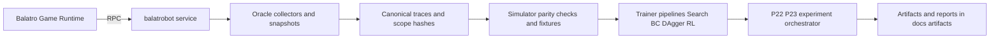

# BalatroAI Architecture and Data Flow

## High-Level Flow

## Module Responsibilities (1-2 sentences each)

### Oracle/Sim Alignment Layer
The alignment layer treats oracle traces from real runtime as source of truth and continuously checks simulator behavior against those traces. It powers parity regressions (P0-P10 scope) so simulator changes can be validated before they affect training or experiment conclusions.

### Hashing/Scopes (`hand_score_observed_core`, etc.)
Scopes define which subset of state/action outcomes is contract-critical for a given milestone, while hashing provides deterministic fingerprints for those scoped observations. This keeps regressions stable and comparable even when non-scoped fields evolve, and allows targeted parity gates per mechanic cluster.

### Trainer Layer (fixtures + real sessions, P13)
Trainer pipelines consume simulator fixtures for fast, repeatable offline iteration and can also consume curated real-session artifacts introduced in P13 to reduce sim-to-real drift. The layer supports policy-search and learning loops (Search -> BC -> DAgger -> RL), with metric outputs written as experiment artifacts.

### Experiment Orchestrator Layer
The orchestrator executes experiment matrices with explicit seed sets, budget controls, resumability, and per-run reports. It drives long-horizon evaluation and strategy comparison by producing normalized summary tables, ranking candidates, and updating champion/candidate states via artifactized decisions.

## Artifact-Centric Data Flow

1. Oracle collection writes runtime traces/fixtures under simulator runtime artifact roots.
2. Alignment gates generate scoped reports (`report_p*.json`) and diff diagnostics.
3. Training/eval emits per-run metrics and per-seed outputs.
4. Orchestrator aggregates experiment rows into:
   - `run_plan.json`
   - `telemetry.jsonl`
   - `live_summary_snapshot.json`
   - `summary_table.{csv,json,md}`
   - per-experiment `run_manifest.json`, `progress.jsonl`, `seeds_used.json`
5. Status publishing and dashboard steps consume these artifacts for README/dashboard/report views.

## Related Documents

- [SIM_ALIGNMENT_STATUS.md](SIM_ALIGNMENT_STATUS.md)
- [EXPERIMENTS_P22.md](EXPERIMENTS_P22.md)
- [ARCHITECTURE_P25.md](ARCHITECTURE_P25.md)
