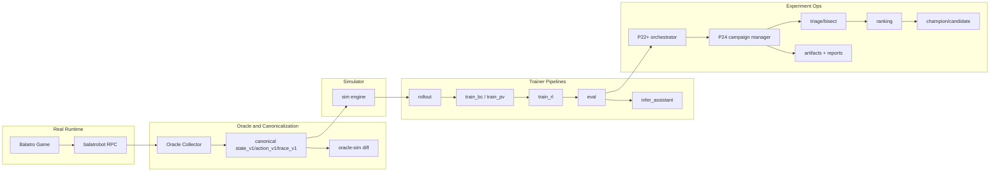

# Architecture and Data Flow (P25)

## System Overview

## Data Flow

1. Real or simulated state transitions are collected into canonical traces.
2. Canonical traces and simulator traces are diffed for parity confidence.
3. Rollout generates datasets for BC/PV/RL training.
4. Evaluation writes summary metrics and run manifests.
5. Orchestrator/campaign manager executes matrix + seed policies.
6. Telemetry, summaries, and gate reports are persisted to `docs/artifacts/*`.
7. Triage/flake/ranking outputs feed champion-candidate decisions.
