# P40 Closed-loop Improvement v1

P40 adds a runnable improvement loop that unifies replay mixing, arena failure mining, candidate training, and arena-gated promotion recommendation.
P41 builds on top of this foundation and adds replay lineage, curriculum scheduling, slice-aware gating, and regression triage.
P42 keeps the same closed-loop control flow and adds RL candidate training (`rl_ppo_lite`) as an additional training mode.
P45 can attach a world-model checkpoint as an auxiliary asset so arena evaluation can compare wm-assisted policy variants without changing the closed-loop promotion contract.

See also: `docs/P41_CLOSED_LOOP_V2.md`.

## Architecture

```mermaid
flowchart LR
  A["ReplayMixer\n(p10/p13/p36/p40-failure-pack)"] --> B["Mixed Replay Manifest\nreplay_mix_manifest.json"]
  C["Failure Mining\n(from P39 arena artifacts)"] --> D["Hard-failure pack\nfailure_pack_manifest.json"]
  D --> A
  B --> E["Candidate Trainer v1\n(mainline-first: rl_ppo_lite/selfsup_warm_bc)"]
  E --> F["Candidate checkpoint\nbest_checkpoint.txt"]
  F --> G["P39 Arena Runner\n(candidate vs champion)"]
  G --> H["P39 Champion Rules"]
  H --> I["P40 Promotion Decision\npromotion_decision.json/.md"]
  I --> J["P22 summary_table + reports"]
```



## Module I/O Contracts

| Module | Inputs | Outputs |
|---|---|---|
| `trainer.closed_loop.replay_mixer` | `configs/experiments/p40_replay_mix_*.yaml`; source roots | `docs/artifacts/p40/replay_mixer/<run_id>/replay_mix_manifest.json`, `replay_mix_stats.json`, `replay_mix_stats.md`, `seeds_used.json` |
| `trainer.closed_loop.failure_mining` | P39 `episode_records.jsonl`, `summary_table.json`, `bucket_metrics.json`, optional `candidate_decision.json` | `docs/artifacts/p40/failure_mining/<run_id>/failure_pack_manifest.json`, `failure_pack_stats.json`, `failure_pack_stats.md`, `hard_failure_replay.jsonl` |
| `trainer.closed_loop.candidate_train` | replay mix manifest + training config | `docs/artifacts/p40/candidate_train/<run_id>/candidate_train_manifest.json`, `metrics.json`, `progress.jsonl`, `seeds_used.json`, `best_checkpoint.txt` |
| `trainer.closed_loop.closed_loop_runner` | P40 closed-loop config | `docs/artifacts/p40/closed_loop_runs/<run_id>/run_manifest.json`, `promotion_decision.json/.md`, `summary_table.{json,csv,md}` |

### Key Manifest Fields

- replay mix: `sources[]`, `selected_entries[]`, `totals`, `seed_hash`
- failure pack: `candidate_policy`, `champion_policy`, `low_score_threshold`, `failures[]`, `replay_jsonl_path`
- candidate train: `training_mode`, `training_mode_category`, `fallback_used`, `fallback_reason`, `legacy_paths_used`, `seed_results[]`, `candidate_checkpoint`
- promotion decision: `recommendation`, `recommend_promotion`, `arena_status`, `candidate_score`, `champion_score`, `score_delta`, `reasons[]`
- closed-loop run manifest: `auxiliary_assets.world_model_*` fields record optional P45 checkpoint + assist parameters

## Failure Mining Logic (v1)

P40 marks episodes as hard failures when one or more conditions match:

- episode status not `ok` (`episode_failure_status`)
- invalid action / timeout / execution exception markers
- score in bottom quantile (configurable `bottom_quantile`)
- risk bucket indicates `resource_tight` with short survival or low score
- candidate-vs-champion regression segment when arena comparison indicates no uplift

If P39 artifacts are unavailable, failure mining returns `status=stub` and emits a valid empty manifest instead of crashing.

## Promotion Decision Logic

P40 reuses P39 `trainer.policy_arena.champion_rules` outputs, then applies a conservative overlay:

- insufficient seeds -> force `observe`
- very high candidate variance -> force `observe`
- no clear uplift (score delta <= 0 and win delta <= 0) -> force `observe`

P40 v1 only emits recommendations. It does **not** auto-replace champion metadata.

## Mainline vs Legacy (P43)

- default candidate route is now mainline (`rl_ppo_lite` first, optional `selfsup_warm_bc` placeholder)
- legacy BC/DAgger (`bc_finetune` / `dagger_refresh`) are retained for opt-in baseline/probe use
- fallback to legacy is explicit and recorded in manifests (`fallback_used`, `fallback_reason`)

## Relationship to P41

P40 remains the baseline closed-loop contract:

- replay mix, failure pack, candidate train, arena eval, recommendation output
- conservative "observe-first" promotion stance
- graceful degrade behavior when data/artifacts are missing

P41 extends the same loop with:

- sample-level replay lineage and health checks
- shared slice labels across replay and arena
- curriculum-based staged mixing during candidate training
- slice-aware champion rules with CI/bootstrap safeguards
- regression triage reports for degraded candidates (including source + seed attribution)

P42 extends candidate training mode options with:

- sim-aligned RL env adapter + online rollouts
- PPO-lite trainer with action-mask and invalid-action guards
- closed-loop-compatible RL candidate manifest output

P45 extends the same shell with optional auxiliary assets:

- `world_model.enabled`
- `world_model.checkpoint`
- `world_model.assist_mode`
- `world_model.weight`
- `world_model.uncertainty_penalty`

When enabled, these fields are passed through to arena evaluation and persisted in `arena_summary.json` plus `run_manifest.json`.

## Run Modes

Quick smoke:

```powershell
python -m trainer.closed_loop.closed_loop_runner --quick
```

P22 quick (includes `p40_closed_loop_smoke`):

```powershell
powershell -ExecutionPolicy Bypass -File scripts\run_p22.ps1 -Quick
```

Nightly-style closed loop:

```powershell
python -m trainer.closed_loop.closed_loop_runner --config configs/experiments/p40_closed_loop_nightly.yaml
```

## Known Gaps / Degrade Paths

- `p10_long_episode` source can be `stub` if local P10 runtime traces are missing.
- legacy `bc_finetune` requires BC-compatible rows and PyTorch; otherwise candidate training degrades to `stub_checkpoint`.
- `model_policy` adapter in P39 currently keeps a stable fallback path; arena deltas should be interpreted as infrastructure smoke unless model inference path is fully wired.
- closed-loop runner continues with `arena_status=skipped` when arena execution is disabled or unavailable.
- world-model assist is heuristic-only; it can influence candidate action ranking during arena evaluation, but it does not replace simulator rollouts or promotion gates.
