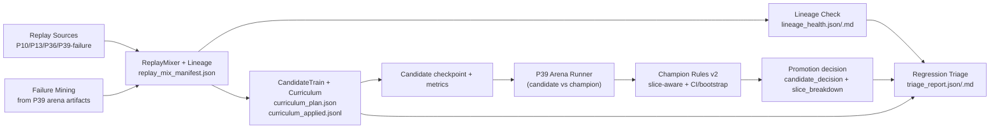

# P41 Closed-loop Improvement v2

P41 upgrades P40 from a runnable loop into an explainable and stability-oriented loop:

- replay lineage and lineage health checks
- shared slice labels across replay and arena
- curriculum-based staged replay mixing
- slice-aware champion gating with bootstrap/CI safeguards
- regression triage with source/slice/curriculum attribution

P41 keeps P40's conservative promotion stance: recommendation-only, no automatic champion swap.
P42 reuses this exact closed-loop shell and adds an RL candidate training mode (`rl_ppo_lite`).

## Architecture



## Module Inputs / Outputs

| Module | Inputs | Outputs |
|---|---|---|
| `trainer.closed_loop.replay_mixer` | `configs/experiments/p41_replay_mix_*.yaml`; source roots | `docs/artifacts/p41/replay_mixer/<run_id>/replay_mix_manifest.json`, `replay_mix_stats.json`, `replay_mix_stats.md`, `seeds_used.json` |
| `trainer.closed_loop.replay_lineage` | replay records selected by mixer | `docs/artifacts/p41/replay_lineage/<run_id>/replay_lineage_summary.json`, `replay_lineage_summary.md` |
| `trainer.closed_loop.check_replay_lineage` | replay manifest | `lineage_health.json`, `lineage_health.md` |
| `trainer.closed_loop.failure_mining` | P39 `episode_records.jsonl`, `summary_table.json`, `bucket_metrics.json`, optional `candidate_decision.json` | `docs/artifacts/p41/failure_mining/<run_id>/failure_pack_manifest.json`, `failure_pack_stats.json`, `failure_pack_stats.md` |
| `trainer.closed_loop.candidate_train` | replay mix manifest + candidate config + optional curriculum config | `docs/artifacts/p41/candidate_train/<run_id>/candidate_train_manifest.json`, `metrics.json`, `progress.jsonl`, `curriculum_plan.json`, `curriculum_applied.jsonl`, `best_checkpoint.txt` |
| `trainer.policy_arena.arena_runner` | arena config/policies/seeds | `docs/artifacts/p41/closed_loop_runs/<run_id>/arena_runs/<arena_run_id>/summary_table.json`, `bucket_metrics.json`, `episode_records.jsonl` |
| `trainer.policy_arena.champion_rules` | arena summary + optional episode records | `promotion_decision.json/.md`, `slice_decision_breakdown.json/.md` |
| `trainer.closed_loop.regression_triage` | closed-loop refs + baseline refs + lineage/curriculum outputs | `triage_report.json`, `triage_report.md` |

## Replay Lineage Contract

P41 replay manifest entries include these key fields:

- `sample_id`
- `source_type` (`p10_long_episode`, `p13_dagger_or_real`, `selfsup_replay`, `arena_failures`, ...)
- `source_run_id`
- `source_artifact_path`
- `source_seed`
- `episode_id`
- `step_id`
- `generation_method`
- `valid_for_training`
- `lineage_version`

Lineage summary reports:

- source share ratios
- seed coverage
- episode coverage
- missing-field rates

Lineage health checker reports:

- required-field missing ratio
- source path existence checks (`warning` when cleaned/missing)
- overall status (`ok` / `warn` / `error`)

## Unified Slice Labels

P41 uses one label rule set (`trainer/common/slices.py`) for replay and arena:

- `slice_stage`: `early` / `mid` / `late` / `unknown`
- `slice_resource_pressure`: `low` / `medium` / `high` / `unknown`
- `slice_action_type`: `play` / `discard` / `shop` / `consumable` / `transition` / `unknown`
- mechanism-sensitive labels:
  - `slice_position_sensitive`: `true` / `false` / `unknown`
  - `slice_stateful_joker_present`: `true` / `false` / `unknown` (stub-compatible)

Missing upstream fields degrade to `unknown` instead of hard failures.

## Curriculum Scheduler

P41 supports staged replay weighting during candidate training:

1. `stabilize`: prioritize `p10_long_episode` + `p13_dagger_or_real`, low `arena_failures`
2. `hardening`: increase `arena_failures` and high-pressure slices
3. `balance`: rebalance to avoid overfitting failure tails

Each phase logs applied plan to `curriculum_applied.jsonl` (including seeds and effective source/slice weights).

## Slice-aware Champion Rules v2

Champion decision combines global constraints and slice-local statistics:

- hard safety gates: invalid/timeout regression caps
- global uplift checks: score/win deltas
- slice-aware CI/bootstrap checks:
  - compute candidate-champion diffs per slice
  - compute bootstrap CI for key metrics
  - if critical slice significantly degrades, downgrade to `observe/reject`
  - if sample count is low, mark `ci_status=insufficient_samples` and stay conservative

Decision artifacts:

- `promotion_decision.json/.md`
- `slice_decision_breakdown.json/.md`

## Regression Triage

Triggered after arena decision, triage reports:

1. overall degraded metrics
2. top regressed slices
3. likely source attribution (replay sources and source seeds from lineage)
4. curriculum drift vs baseline run
5. data quality anomalies (`lineage_health`, `invalid_for_training` shifts)

If baseline is missing, triage emits `baseline_missing` with a non-crashing report.

## Run Commands

Quick smoke (standalone):

```powershell
python -m trainer.closed_loop.closed_loop_runner --config configs/experiments/p41_closed_loop_v2_smoke.yaml --quick
```

P22 quick (includes P41 smoke row):

```powershell
powershell -ExecutionPolicy Bypass -File scripts\run_p22.ps1 -Quick
```

P42 RL candidate quick (same closed-loop shell, RL training mode):

```powershell
python -m trainer.closed_loop.closed_loop_runner --config configs/experiments/p42_closed_loop_rl_smoke.yaml --quick
```

Nightly style:

```powershell
python -m trainer.closed_loop.closed_loop_runner --config configs/experiments/p41_closed_loop_v2_nightly.yaml
```

Lineage check:

```powershell
python -m trainer.closed_loop.check_replay_lineage --manifest docs/artifacts/p41/replay_mixer/<run_id>/replay_mix_manifest.json --out-dir docs/artifacts/p41/replay_lineage/<run_id>
```

Slice label smoke:

```powershell
python -m trainer.closed_loop.slice_smoke
```

## Artifact Layout

- `docs/artifacts/p41/replay_mixer/<run_id>/`
- `docs/artifacts/p41/replay_lineage/<run_id>/`
- `docs/artifacts/p41/failure_mining/<run_id>/`
- `docs/artifacts/p41/candidate_train/<run_id>/`
- `docs/artifacts/p41/closed_loop_runs/<run_id>/`
  - `run_manifest.json`
  - `promotion_decision.json/.md`
  - `slice_decision_breakdown.json/.md`
  - `triage_report.json/.md`
  - `summary_table.{json,csv,md}`
- `docs/artifacts/p41/slice_smoke_<timestamp>.json`

## Known Gaps / Degrade Paths

- Missing replay sources keep the loop runnable (`stub/warn`) but reduce attribution quality.
- Slice CI/bootstrap conclusions on low-count slices degrade to `insufficient_samples`.
- `model_policy` inference quality depends on checkpoint/runtime availability.
- Candidate training modes remain intentionally limited (BC/DAgger-first plumbing).
- P41 does not auto-apply champion replacement; recommendation remains manual-gated.
- P42 extends candidate training with PPO-lite but keeps the same recommendation-only promotion boundary.
