# P42 RL Candidate Pipeline v1

P42 adds a runnable RL candidate path on top of P40/P41 closed-loop operations:

- sim-aligned RL env adapter with action-mask handling
- online rollout collector with standardized step schema
- PPO-lite trainer with stability guards
- closed-loop integration (arena eval + slice-aware champion rules + regression triage)
- P22 integration (`p42_rl_candidate_smoke` / `p42_rl_candidate_nightly`)
- P45-ready integration point for future world-model auxiliary losses / planning hooks

P42 is research-grade v1. It emphasizes stable execution and explainability over peak policy quality.
Under P43 policy, P42 RL candidate is the default mainline training lane for closed-loop candidate generation.

## Architecture

```mermaid
flowchart LR
  A["Sim backend (P37/P38 aligned)"] --> B["RLEnvAdapter\nreset/step/mask/reward"]
  B --> C["RolloutCollector\nrollout_steps.jsonl"]
  C --> D["PPO-lite Trainer\npolicy/value updates"]
  D --> E["RL candidate checkpoint + metrics"]
  E --> F["ClosedLoop Runner (P40/P41)"]
  F --> G["P39 Arena Runner"]
  G --> H["P41 slice-aware champion rules"]
  H --> I["Promotion decision"]
  I --> J["Regression triage report"]
```



## Modules

- `trainer/rl/env_adapter.py`
  - wraps existing `trainer.rl.env.BalatroEnv`
  - API: `reset`, `step`, `get_action_mask`, `close`
  - emits `score_delta`, `round/ante/phase`, `invalid_action`, `episode_metrics_partial`
- `trainer/rl/reward_config.py`
  - configurable reward terms:
    - `score_delta_weight`
    - `survival_bonus`
    - `terminal_win_bonus`
    - `terminal_loss_penalty`
    - `invalid_action_penalty`
  - supports clipping and invalid-action penalty mode wiring
- `trainer/rl/action_mask.py`
  - legal-action normalization and mask generation
  - invalid action resolution strategy (`fallback_first_legal`, `fallback_random_legal`, strict/pass-through)
- `trainer/rl/rollout_schema.py`
  - standard rollout-step schema (`obs_vector`, `action`, `reward`, `done`, `mask_stats`, `invalid_action`, seed/episode/step IDs)
- `trainer/rl/rollout_collector.py`
  - multi-seed online sampling with budget control (`episodes_per_seed`, `max_steps_per_episode`, `total_steps_cap`)
  - early-stop guard when invalid rate is too high
- `trainer/rl/ppo_lite.py`
  - rollout -> update loop
  - PPO clip loss + value loss + entropy bonus
  - gradient clipping, KL logging, NaN fail-fast
  - outputs per-seed checkpoints (`best.pt`, `last.pt`) and run-level manifests
- `trainer/closed_loop/candidate_train.py`
  - mainline-first `candidate_modes` ordering (`rl_ppo_lite` first)
  - explicit optional legacy fallback controls (`allow_legacy_fallback`, `legacy_fallback_modes`)
  - emits P42-compatible candidate manifest while preserving closed-loop interfaces
- `trainer/rl/ppo_config.py`
  - reserves `world_model_aux` config (`enabled/checkpoint/loss_weight`) for future P45 coupling
  - default remains disabled in v1
- `trainer/experiments/orchestrator.py`
  - supports P42 experiment types:
    - `closed_loop_rl_candidate`
    - `rl_candidate_pipeline`
    - `p42_rl_candidate`
    - `p42_rl_candidate_pipeline`

## Reward and Stability Notes

- Reward is explicitly artifactized (`reward_config.json`) to avoid ambiguous run-to-run comparisons.
- Action masking is always applied before env step.
- Invalid action handling is recorded and summarized (`invalid_action_rate`).
- Arena gating remains required after RL training; RL optimization alone does not imply promotion safety.
- Low-sample slice CI/bootstrap outputs can remain inconclusive and should be interpreted as observation-level signals.

## Closed-loop Integration Semantics

- P42 reuses the P41 closed-loop flow and artifacts.
- RL candidate mode can coexist with replay/failure/arena stages.
- RL mode writes:
  - `curriculum_plan.json` with `enabled=false` and explicit reason
  - `candidate_train_manifest.json` including RL train refs
- When a component is unavailable, closed-loop keeps explicit status/reason instead of hard crashing.

### Required Training-Mode Manifest Fields (P43)

Closed-loop/candidate artifacts now include:

- `training_mode`
- `training_mode_category`
- `fallback_used`
- `fallback_reason`
- `legacy_paths_used`

This enables fast triage of whether a candidate came from mainline RL/selfsup or a legacy fallback path.

## Relationship to P45

- P45 can consume P42/P44 rollout artifacts as world-model training data.
- P42 keeps a placeholder `world_model_aux_loss=false` style path in config only; PPO-lite does not yet optimize against world-model losses by default.
- wm-assisted arena policies can still be evaluated through the shared P39/P41/P42 closed-loop shell once a P45 checkpoint is available.

## Commands

Standalone env smoke:

```powershell
python -m trainer.rl.test_env_adapter_smoke
```

Standalone rollout smoke:

```powershell
python -m trainer.rl.rollout_collector --seeds AAAAAAA,BBBBBBB --episodes-per-seed 1 --max-steps-per-episode 40 --total-steps-cap 120
```

Standalone PPO-lite smoke:

```powershell
python -m trainer.rl.ppo_lite --config configs/experiments/p42_rl_smoke.yaml
```

Closed-loop RL quick:

```powershell
python -m trainer.closed_loop.closed_loop_runner --config configs/experiments/p42_closed_loop_rl_smoke.yaml --quick
```

P22 quick (includes P42 smoke row):

```powershell
powershell -ExecutionPolicy Bypass -File scripts\run_p22.ps1 -Quick
```

## Artifact Layout

- env smoke:
  - `docs/artifacts/p42/env_smoke_<timestamp>.json`
- rollout collection:
  - `docs/artifacts/p42/rollouts/<run_id>/rollout_steps.jsonl`
  - `docs/artifacts/p42/rollouts/<run_id>/rollout_manifest.json`
  - `docs/artifacts/p42/rollouts/<run_id>/rollout_stats.{json,md}`
- PPO-lite training:
  - `docs/artifacts/p42/rl_train/<run_id>/train_manifest.json`
  - `docs/artifacts/p42/rl_train/<run_id>/metrics.json`
  - `docs/artifacts/p42/rl_train/<run_id>/progress.jsonl`
  - `docs/artifacts/p42/rl_train/<run_id>/seeds_used.json`
  - `docs/artifacts/p42/rl_train/<run_id>/best_checkpoint.txt`
  - `docs/artifacts/p42/rl_train/<run_id>/reward_config.json`
  - `docs/artifacts/p42/rl_train/<run_id>/warnings.log`
- closed-loop RL runs:
  - `docs/artifacts/p42/closed_loop_runs/<run_id>/run_manifest.json`
  - `docs/artifacts/p42/closed_loop_runs/<run_id>/promotion_decision.json`
  - `docs/artifacts/p42/closed_loop_runs/<run_id>/triage_report.json`

## Known Gaps

- PPO-lite intentionally omits advanced PPO/distributed features (opponent pools, large-batch parallel rollouts).
- Current implementation is single-process and local-budget oriented.
- Model quality is sensitive to replay/arena budget; quick mode is for plumbing validation, not final policy claims.
- Legacy BC/DAgger paths are retained for baseline probes, but are no longer default candidate-training routes.
- P45 world-model coupling is currently a reserved extension point, not an active training loss in the shipped P42 update loop.
