# P42 RL Candidate Pipeline v1

P42 adds a runnable RL candidate path on top of P40/P41 closed-loop operations:

- sim-aligned RL env adapter with action-mask handling
- online rollout collector with standardized step schema
- PPO-lite trainer with stability guards
- closed-loop integration (arena eval + slice-aware champion rules + regression triage)
- P22 integration (`p42_rl_candidate_smoke` / `p42_rl_candidate_nightly`)
- P45/P46/P47-ready integration point for future world-model auxiliary losses, planning hooks, imagined replay, and rerank-assisted inference

P42 is research-grade v1. It emphasizes stable execution and explainability over peak policy quality.
Under P43 policy, P42 RL candidate is the default mainline training lane for closed-loop candidate generation.

## Architecture

```mermaid
flowchart LR
  A["Sim backend (P37/P38 aligned)"] --> B["RLEnvAdapter\nreset/step/mask/reward"]
  B --> C["RolloutCollector\nrollout_steps.jsonl"]
  C --> D["PPO-lite Trainer\npolicy/value updates"]
  D --> E["RL candidate checkpoint + metrics"]
  E --> F["ClosedLoop Runner (P40/P41)"]
  F --> G["P39 Arena Runner"]
  G --> H["P41 slice-aware champion rules"]
  H --> I["Promotion decision"]
  I --> J["Regression triage report"]
```



## Modules

- `trainer/rl/env_adapter.py`
  - wraps existing `trainer.rl.env.BalatroEnv`
  - API: `reset`, `step`, `get_action_mask`, `close`
  - emits `score_delta`, `round/ante/phase`, `invalid_action`, `episode_metrics_partial`
- `trainer/rl/reward_config.py`
  - configurable reward terms:
    - `score_delta_weight`
    - `survival_bonus`
    - `terminal_win_bonus`
    - `terminal_loss_penalty`
    - `invalid_action_penalty`
  - supports clipping and invalid-action penalty mode wiring
- `trainer/rl/action_mask.py`
  - legal-action normalization and mask generation
  - invalid action resolution strategy (`fallback_first_legal`, `fallback_random_legal`, strict/pass-through)
- `trainer/rl/rollout_schema.py`
  - standard rollout-step schema (`obs_vector`, `action`, `reward`, `done`, `mask_stats`, `invalid_action`, seed/episode/step IDs)
- `trainer/rl/rollout_collector.py`
  - multi-seed online sampling with budget control (`episodes_per_seed`, `max_steps_per_episode`, `total_steps_cap`)
  - early-stop guard when invalid rate is too high
- `trainer/rl/ppo_lite.py`
  - rollout -> update loop
  - PPO clip loss + value loss + entropy bonus
  - gradient clipping, KL logging, NaN fail-fast
  - outputs per-seed checkpoints (`best.pt`, `last.pt`) and run-level manifests
- `trainer/closed_loop/candidate_train.py`
  - mainline-first `candidate_modes` ordering (`rl_ppo_lite` first)
  - explicit optional legacy fallback controls (`allow_legacy_fallback`, `legacy_fallback_modes`)
  - emits P42-compatible candidate manifest while preserving closed-loop interfaces
- `trainer/rl/ppo_config.py`
  - reserves `world_model_aux` config (`enabled/checkpoint/loss_weight`) for future P45 coupling
  - default remains disabled in v1
- `trainer/experiments/orchestrator.py`
  - supports P42 experiment types:
    - `closed_loop_rl_candidate`
    - `rl_candidate_pipeline`
    - `p42_rl_candidate`
    - `p42_rl_candidate_pipeline`

## Reward and Stability Notes

- Reward is explicitly artifactized (`reward_config.json`) to avoid ambiguous run-to-run comparisons.
- Action masking is always applied before env step.
- Invalid action handling is recorded and summarized (`invalid_action_rate`).
- Hand-action legality must stay identical between RL training and arena inference. The current shared source of truth is `trainer/legal_actions.py`, which filters `PLAY` / `DISCARD` actions against `round.hands_left` and `round.discards_left` before model-policy inference.
- Arena gating remains required after RL training; RL optimization alone does not imply promotion safety.
- Low-sample slice CI/bootstrap outputs can remain inconclusive and should be interpreted as observation-level signals.

### Arena / Training Legality Parity

The main failure mode observed in March 2026 was not PPO instability; it was legality drift:

- RL training saw filtered hand masks and reported `invalid_action_rate=0.0`.
- Arena/model-policy inference originally consumed unfiltered hand IDs and could still emit `PLAY` after `hands_left=0`.
- That showed up as repeated `no_hands_left` warnings and polluted P42 / P48 / P56 comparisons.

Current expectation:

- RL env, policy arena, and world-model candidate generation all consume the same hand-legality helper.
- If invalid-action spikes return after this point, treat that as a new semantics bug first, not immediate evidence that the policy is weak.

## Closed-loop Integration Semantics

- P42 reuses the P41 closed-loop flow and artifacts.
- RL candidate mode can coexist with replay/failure/arena stages.
- RL mode writes:
  - `curriculum_plan.json` with `enabled=false` and explicit reason
  - `candidate_train_manifest.json` including RL train refs
- When a component is unavailable, closed-loop keeps explicit status/reason instead of hard crashing.

### Required Training-Mode Manifest Fields (P43)

Closed-loop/candidate artifacts now include:

- `training_mode`
- `training_mode_category`
- `fallback_used`
- `fallback_reason`
- `legacy_paths_used`

This enables fast triage of whether a candidate came from mainline RL/selfsup or a legacy fallback path.

## Relationship to P45 / P46

- P45 can consume P42/P44 rollout artifacts as world-model training data.
- P42 keeps a placeholder `world_model_aux_loss=false` style path in config only; PPO-lite does not yet optimize against world-model losses by default.
- wm-assisted arena policies can still be evaluated through the shared P39/P41/P42 closed-loop shell once a P45 checkpoint is available.
- P46 uses the same P39/P41 governance shell for imagined-replay ablations, but P42 itself still does not train on imagined rollouts by default.
- P47 extends that same governance shell to decision-time rerank ablations; future RL-policy inference can reuse the same candidate-source and rerank hooks.

## Commands

Standalone env smoke:

```powershell
python -m trainer.rl.test_env_adapter_smoke
```

Standalone rollout smoke:

```powershell
python -m trainer.rl.rollout_collector --seeds AAAAAAA,BBBBBBB --episodes-per-seed 1 --max-steps-per-episode 40 --total-steps-cap 120
```

Standalone PPO-lite smoke:

```powershell
python -m trainer.rl.ppo_lite --config configs/experiments/p42_rl_smoke.yaml
```

Closed-loop RL quick:

```powershell
python -m trainer.closed_loop.closed_loop_runner --config configs/experiments/p42_closed_loop_rl_smoke.yaml --quick
```

P22 quick (includes P42 smoke row):

```powershell
powershell -ExecutionPolicy Bypass -File scripts\run_p22.ps1 -Quick
```

## Artifact Layout

- env smoke:
  - `docs/artifacts/p42/env_smoke_<timestamp>.json`
- rollout collection:
  - `docs/artifacts/p42/rollouts/<run_id>/rollout_steps.jsonl`
  - `docs/artifacts/p42/rollouts/<run_id>/rollout_manifest.json`
  - `docs/artifacts/p42/rollouts/<run_id>/rollout_stats.{json,md}`
- PPO-lite training:
  - `docs/artifacts/p42/rl_train/<run_id>/train_manifest.json`
  - `docs/artifacts/p42/rl_train/<run_id>/metrics.json`
  - `docs/artifacts/p42/rl_train/<run_id>/progress.jsonl`
  - `docs/artifacts/p42/rl_train/<run_id>/seeds_used.json`
  - `docs/artifacts/p42/rl_train/<run_id>/best_checkpoint.txt`
  - `docs/artifacts/p42/rl_train/<run_id>/reward_config.json`
  - `docs/artifacts/p42/rl_train/<run_id>/warnings.log`
- closed-loop RL runs:
  - `docs/artifacts/p42/closed_loop_runs/<run_id>/run_manifest.json`
  - `docs/artifacts/p42/closed_loop_runs/<run_id>/promotion_decision.json`
  - `docs/artifacts/p42/closed_loop_runs/<run_id>/triage_report.json`

## P49 Runtime Integration

P49 moves the P42 learner path onto the shared runtime/device layer:

- runtime selection now comes from `trainer.runtime.runtime_profile`
- default profile is `single_gpu_mainline`
- rollout stays CPU-first while the learner prefers GPU when CUDA exists
- runs now emit `progress.unified.jsonl` and `runtime_profile.json`
- `scripts/run_p22.ps1` and `scripts/run_regressions.ps1` both pass through the readiness guard before service-dependent execution

## P50 Real CUDA Validation

P50 moved this lane from theoretical GPU support to verified local CUDA execution:

- selected training env: `.venv_trainer_cuda`
- torch stack: `2.10.0+cu128`
- validated device: `cuda:0` on `NVIDIA GeForce RTX 3080 Ti`
- smoke artifact root: `docs/artifacts/p50/p42_gpu_smoke/20260307-112100/`

Observed smoke characteristics:

- rollout remained CPU-first
- learner executed on GPU
- non-zero GPU memory was recorded in the smoke artifacts
- low memory numbers are expected because the shipped smoke config is intentionally tiny

## P51 Checkpoint Registry Integration

P51 makes RL candidate checkpoints first-class tracked assets instead of unnamed `best.pt` files.

What is now recorded automatically when `trainer.rl.ppo_lite` or the closed-loop RL path saves a checkpoint:

- `checkpoint_id`
- family `rl_policy`
- training mode / mode category
- runtime profile + training python
- metrics / manifest / diagnostics refs
- arena / triage refs once closed-loop evaluation completes
- auditable status transitions through the candidate state machine

Primary registry locations:

- `docs/artifacts/registry/checkpoints_registry.json`
- `docs/artifacts/p22/runs/<run_id>/p51_registry_smoke/campaign_runs/seed_*/checkpoint_registry_snapshot.json`

Closed-loop promotion wiring now updates RL checkpoint state along the path:

- `draft -> smoke_passed`
- `smoke_passed -> arena_passed`
- `arena_passed -> promotion_review`
- optional `promotion_review -> promoted|rejected`

## R1 Research Update (2026-03-10)

The post-legality R1 research round produced three important conclusions:

1. fixing legality parity was necessary but not sufficient; it removed false invalid-action failures, but the RL lane still remained weak
2. at the current PPO budget, a flat survival-biased reward outperformed both a harsher loss/invalid penalty variant and two curriculum variants
3. even the best surviving RL variant still failed the closed-loop nightly certification against `heuristic_baseline`

Useful evidence from the R1 branch:

- reward-survival smoke:
  - direct eval `148.5`
- loss-penalty smoke:
  - direct eval `105.5`
- curriculum easy:
  - direct eval `99.0`
- curriculum failure-mining:
  - direct eval `82.5`
- certification nightly:
  - candidate `67.75` vs heuristic `303.0`
  - recommendation `observe`

Interpretation:

- the next high-value lever was no longer more reward tuning or early curriculum tuning
- the RL line needed better data pressure:
  - real hard-case / failure-case sampling that actually reaches PPO
  - or a real supervised / BC warm-start path instead of the current stubbed `selfsup_warm_bc`

## R1 Phase 2 Update (2026-03-10)

Phase 2 answered the hard-case question directly:

1. real failure-case data now reaches PPO end-to-end through `hard_case_sampling`
2. the research worktree now launches candidate training and arena evaluation through the resolver-selected training Python, so R1 closed-loop runs no longer silently fall back to a torch-missing shell interpreter
3. a heavier hard-case replay ratio improved smoke-scale closed-loop score modestly, but the gain did not survive certification

Useful evidence from Phase 2:

- Batch 5 hard-case smoke:
  - failure pack `selected_failures=6`
  - hard-case status `ok`
  - arena candidate `91.5` vs heuristic `400.0`
- Batch 6 hard-case heavy smoke:
  - arena candidate `107.0` vs heuristic `400.0`
  - still `invalid_action_rate=0.0`
- Certification C2 (`hardcase-heavy` nightly):
  - candidate `51.0` vs heuristic `303.0`
  - certified score delta worsened by `-16.75` versus the earlier certification
  - recommendation remained `observe`

Phase-2 interpretation:

- real hard-case ingestion is now infrastructure, not a hypothesis
- hard-case-only PPO was not enough on its own
- the next question became whether pure RL could recover by improving replay balance, self-imitation gating, and stage-aware curriculum rather than by immediately pivoting to teacher-led warm-start

## R2-S1 Pure RL Scaling Update (2026-03-10)

R2-S1 took the post-legality RL line and formalized it into a stronger pure-RL training recipe:

1. hard-case replay is now a first-class PPO input with structured source refs, failure buckets, slice/risk tags, and replay weights
2. failure mining is explicit enough to audit whether PPO is actually being pressured by catastrophic tails, low-score tails, and champion-regression slices
3. self-imitation can no longer be treated as a flat-on switch:
   - flat self-imitation was harmful
   - staged, late-phase, low-ratio self-imitation was usable
4. curriculum and reward scheduling now change replay pressure over training instead of just recording labels

Useful evidence from R2-S1:

- Batch A balanced hard-case replay smoke:
  - candidate `111.5` vs heuristic `400.0`
  - hard-case seeds `3`
  - failure-type coverage `2`
- Batch B flat self-imitation smoke:
  - candidate `60.0`
  - this was worse than the Batch-A hard-case control
- Batch C staged curriculum smoke:
  - candidate `106.0`
  - common 4-seed compare ranked curriculum first among the tested RL recipes
- certification nightly on hard-case-only control:
  - candidate `71.0` vs heuristic `303.0`
  - score-delta improvement vs the old certified survival baseline: `+3.25`
- certification nightly on the curriculum recipe:
  - candidate `107.75` vs heuristic `303.0`
  - score-delta improvement vs the old certified survival baseline: `+40.0`
  - recommendation remained `observe`

R2-S1 interpretation:

- the strongest certified pure-RL recipe is now:
  - balanced hard-case replay
  - stage-aware curriculum / reward schedule
  - late-stage, low-ratio self-imitation
- the pure-RL mainline remains worth continuing
- the next lever is not teacher-first warm-start; it is:
  - broader failure-bucket coverage
  - better replay pressure on early / position-sensitive / stateful-joker degradation slices
  - tighter late-stage self-imitation gating
- no RL recipe is promotion-ready yet, but pure RL is no longer stalled at the old survival baseline

## R2-S2 纯 RL 失败覆盖与切片定向更新（2026-03-10）

R2-S2 没有切换总架构，而是在 R2-S1 strongest certified pure-RL recipe 的基础上继续强化纯 RL 数据引擎，重点放在：

1. 把 hard-case 从黑盒扩展为显式 `failure buckets`
2. 让 replay 真正按 bucket 权重和 caps 进入 PPO，而不是只写 manifest
3. 把 self-imitation 限制在后期、低比例、受控使用
4. 让 curriculum / reward schedule 与 replay bucket 配比联动
5. 输出更清晰的 per-bucket / per-slice 训练诊断

本轮关键证据：

- Batch D（bucket-aware replay smoke）：
  - candidate `61.0` vs heuristic `400.0`
  - bucket-aware replay 已真实进入训练
  - 但当前 failure source 几乎全部集中在 `early_collapse`
- Batch E（受控 self-imitation + curriculum/reward 联动 smoke）：
  - candidate `60.5` vs heuristic `400.0`
  - 后期低比例 self-imitation 已能受控生效
  - 但在当前 failure coverage 仍窄的前提下，没有形成增益
- Certification C3（bucket-aware curriculum nightly）：
  - candidate `74.0` vs heuristic `303.0`
  - recommendation 仍为 `observe`
- 统一 compare 协议：
  - `r2s2_bucket_curriculum_cert = 96.5`
  - `reward_survival_baseline = 94.75`
  - `r2s1_curriculum_cert = 89.25`
  - `heuristic_baseline = 303.0`

R2-S2 结论：

- 当前 strongest bucket-aware certified pure-RL checkpoint 已经出现，但仍远弱于 heuristic champion
- 这轮最重要的负面发现不是“bucket-aware replay 无效”，而是：
  - 当前可用 failure source 覆盖仍过窄
  - 训练看到的主要还是 `early_collapse`
  - 因此 replay mixer 的结构已经具备，但输入分布还不够好
- 下一阶段最值得继续的纯 RL 子路线不是回到 warm-start，而是：
  - 扩大 `resource_pressure_misplay` / `discard_mismanagement` / `shop_or_economy_misallocation` / position-sensitive 相关 failure source
  - 继续保持 late-stage low-ratio self-imitation，只把它当受控辅助
  - 在 richer failure coverage 上重新做 bucket-aware curriculum 认证

## R2-S3 纯 RL 夜间自迭代更新（2026-03-11）

R2-S3 没有切换主线，仍然坚持 pure RL scaling。  
这轮的核心问题不是“要不要换到 teacher / warm-start”，而是：

1. 把 `failure buckets` 从概念变成正式训练输入
2. 让 replay 真正按 bucket / slice / risk 配比进入 PPO
3. 把 self-imitation 进一步收缩到后期、低比例、allowlist 约束下
4. 用新的认证级 compare 判断 strongest certified pure-RL recipe 是否继续前进

本轮关键证据：

- Batch 1（failure taxonomy）：
  - 当前 failure pack 不再被粗粒度 `early_collapse` 主导
  - 实际主导 bucket 为 `discard_mismanagement=6`
- Batch 2（bucket-aware replay smoke）：
  - candidate `61.0` vs heuristic `400.0`
  - `selected_failure_count=6`
  - `failure_type_coverage=2`
  - `failure_bucket_coverage=1`
  - replay wiring 有效，但 source 仍窄
- Batch 3（controlled self-imitation smoke）：
  - candidate `94.0`
  - 但 `selected_episode_total=0`
  - 说明这轮 gain 不是 imitation 真正带来的
- Batch 4（curriculum / reward refine smoke）：
  - candidate `103.5`
  - 这是当前最强 smoke recipe
  - 但 `selected_failure_count=1`，source 甚至进一步收窄
- Certification C4：
  - certified candidate `98.25` vs heuristic `303.0`
  - `score_delta_change_vs_baseline = +24.25`
  - recommendation 仍为 `observe`
- 统一 compare：
  - `r2s3_bucket_curriculum_cert = 87.0`
  - `reward_survival_baseline = 84.25`
  - `r2s3_controlled_selfimit = 73.75`
  - `r2s1_curriculum_cert = 59.75`
  - `r2s3_bucket_replay = 47.0`

R2-S3 结论：

- strongest certified pure-RL recipe 已更新为：
  - bucket-aware replay
  - stage-aware curriculum / reward refine
  - 受控 self-imitation 仅作为次级辅助约束
- 这轮最重要的正面结论不是“self-imitation 找到了增益区间”，而是：
  - pure RL strongest certified recipe 继续向前推进了
  - 但主要增益来自 curriculum / reward refine，而不是 imitation
- 这轮最重要的负面结论是：
  - failure coverage 仍然太窄
  - 当前 dominant source 仍主要集中在 `discard_mismanagement`
  - `resource_pressure_misplay` / `shop_or_economy_misallocation` / `position_sensitive_misplay` / `stateful_joker_misplay` 仍未真正进入主训练压力面
- 因此下一阶段不应回到 warm-start 主线，而应继续 pure RL，并优先做：
  - richer failure source ingestion
  - slice-targeted replay
  - richer bucket mix 下的 curriculum certification

## R2-S4 长时 Pure RL 冲刺更新（2026-03-11）

R2-S4 继续坚持 pure RL 主线，没有切回 `teacher / warm-start`。  
这轮的重点不是再做一轮泛化 reward 微调，而是回答两个更具体的问题：

1. richer failure source 能不能真正扩开当前训练压力面
2. bucket-aware replay / slice-targeted replay 在认证级协议下能否把 strongest certified pure-RL recipe 再往前推

本轮关键结果：

- Batch 1（multi-source failure mining）：
  - 合并 `r2s2` + `r2s3` artifacts 后，source 扩了
  - 但 `by_bucket` 仍塌在 `discard_mismanagement=12`
- Batch 2（slice-aware refine）：
  - bucket truthfulness 提升，但主导 bucket 变成 `risk_undercommit=12`
  - 仍然过窄
- Batch 3（source-expanded PPO smoke）：
  - candidate `121.5`
  - 说明 richer source 对 fast-pass 有帮助
- Batch 4（旧 slice-targeted curriculum smoke）：
  - candidate `82.0`
  - 负收益，说明在 failure source 仍窄时直接加大 curriculum 压力会退化
- Certification C1（source-expanded recipe）：
  - candidate `59.5` vs heuristic `303.0`
  - 没有站住认证
- Batch 5（champion degraded-slice gap seeds）：
  - 首次把 `low_score_survival=2`、`resource_pressure_misplay=2` 真正打进 failure pack
  - `arena_slice_gap_seed` 成为有效 pure-RL replay seed source
- Batch 6（gapmix PPO smoke）：
  - candidate `126.5`
  - 但 PPO 选样仍塌在 `risk_undercommit`
- Batch 7（顶层 bucket minimum）：
  - 证明问题不在 minimum 机制本身，而在 curriculum phase 覆盖了顶层 hard-case 配方
- Batch 8（stage-aware bucket minimum）：
  - candidate `126.5`
  - `failure_bucket_coverage=2`
  - `low_score_survival=2`
  - `slice_resource_pressure:high=2`
  - 这是本轮 strongest fast-pass recipe
- Certification C2（stage-aware bucket minimum recipe）：
  - candidate `67.5` vs heuristic `303.0`
  - 相比 `r2s3-c4-certification` 仍然退化

R2-S4 结论：

- strongest certified pure-RL recipe 目前**没有**从 R2-S3 更新，仍然维持：
  - `rl_policy:p42_rl_candidate:r2s3-c4-certification-candidate-rl:aaaaaaa,bbbbbbb,ccccccc,ddddddd:e3acd6cbae`
- strongest R2-S4 fast-pass recipe 已经出现：
  - stage-aware bucket minimum + richer gap-seed source
  - 但它还没有在认证级协议下站住
- 这轮最重要的正面结果是：
  - richer failure source ingestion 已经开始有效
  - `bucket_minimum_counts` 机制本身有效
  - 训练里已经能看到第二个 bucket 和高 `resource_pressure` slice
- 这轮最重要的限制是：
  - current richer source 仍高度依赖同一组 `arena_slice_gap_seed`
  - `resource_pressure_misplay` 还没有稳定进入 selected replay rows
  - `shop_or_economy_misallocation` / `position_sensitive_misplay` / `stateful_joker_misplay` 依然 scarce

R2-S4 之后的默认下一步仍然是 pure RL：

- 继续扩展非重叠 failure source
- 优先打通 `resource_pressure_misplay` / `shop_or_economy_misallocation`
- 处理 gap seed 的跨 bucket 冲突与去重
- 在 richer source 上重跑 stage-aware bucket-aware certification

## Known Gaps

- PPO-lite intentionally omits advanced PPO/distributed features (opponent pools, large-batch parallel rollouts).
- Current implementation is single-process and local-budget oriented.
- Model quality is sensitive to replay/arena budget; quick mode is for plumbing validation, not final policy claims.
- Legacy BC/DAgger paths are retained for baseline probes, but are no longer default candidate-training routes.
- P45 world-model coupling is currently a reserved extension point, not an active training loss in the shipped P42 update loop.
- P46 does not yet convert PPO-lite into a model-based RL trainer; imagined replay remains a separate research lane.
- P47 does not yet turn PPO-lite into a model-based search policy; rerank-assisted RL inference remains a reserved extension point.

## R3 研究程序更新（2026-03-11）

本轮没有切回 `teacher / warm-start` 主线，而是在 pure RL 路线上连续推进了多轮 batch 与认证：

- 已确认仍有效：
  - legality parity 修复后的评测协议可继续使用
  - `reward_survival` 仍是纯 RL 的可信基线
  - `bucket-aware replay + curriculum / reward refine` 在 smoke 上能带来稳定正收益
- 已确认不值得继续作为默认主线：
  - flat self-imitation
  - 在错误 source pack 基础上的 compound replay
- R3 新增的关键结论：
  - 修复 `source_type_minimum_counts` 与 tracked-slice 选择后，PPO 现在可以真正按 `source_type` / `slice` 进入训练，而不是只停留在 manifest
  - `arena_compound_slice_seed` 已能真实进入 replay
  - `arena_slice_gap_seed` 已在后续 gap-focused 配方中真正进入训练选择
  - strongest certified pure-RL 目前仍未超过 `r2s3-c4-certification`

当前更明确的主瓶颈是：
- failure source 覆盖仍偏窄
- `resource_pressure_misplay` / `shop_or_economy_misallocation` / position-sensitive / stateful-joker 仍未形成足够稳定的训练压力
- strongest certified pure-RL 与 heuristic champion 仍有显著 gap

因此下一阶段默认继续 pure RL，而不是切到 warm-start：
- 优先扩大 failure source coverage
- 优先提高 `arena_slice_gap_seed`、`resource_pressure_misplay`、`shop_or_economy_misallocation` 的有效样本占比
- 在 richer source 上继续做 slice-targeted replay 与认证级 compare
