# P44 Distributed RL

P44 upgrades the P42 RL candidate lane into a distributed self-play training system that stays inside the existing P22/P39/P41 governance shell.

## Architecture

```mermaid
flowchart LR
  A["PolicyValueModel"] --> B["Distributed rollout workers"]
  B --> C["worker_*/rollout_steps.jsonl"]
  C --> D["rollout_buffer.jsonl + rollout_stats.json"]
  D --> E["PPO-lite update"]
  E --> F["per-seed checkpoints"]
  F --> G["multi-seed RL evaluation"]
  G --> H["best_checkpoint.txt"]
  H --> I["P39 arena runner"]
  I --> J["P41 champion rules + slice gating"]
  J --> K["regression triage + promotion decision"]
```



Core modules:

- `trainer/rl/distributed_rollout.py`
- `trainer/rl/curriculum_rl.py`
- `trainer/rl/ppo_lite.py`
- `trainer/rl/eval_multi_seed.py`
- `trainer/rl/diagnostics.py`
- `trainer/closed_loop/closed_loop_runner.py`

## Distributed Rollout Design

Each rollout update launches `num_workers` worker processes. Each worker:

- constructs its own `RLEnvAdapter`
- loads the current policy snapshot
- runs `episodes_per_worker`
- writes `worker_XX/rollout_steps.jsonl`
- writes `worker_XX/worker_summary.json`

The master process then aggregates worker outputs into:

- `rollout_buffer.jsonl`
- `rollout_manifest.json`
- `rollout_stats.json`
- `worker_stats.json`

Artifact root:

- `docs/artifacts/p44/rollouts/<run_id>/`

## Curriculum Training

P44 introduces three curriculum stages:

- `stage1_basic`
  - survival-heavy shaping
  - shorter horizons
  - low difficulty
- `stage2_midgame`
  - balanced score/survival shaping
  - longer horizons
  - midgame difficulty
- `stage3_highrisk`
  - higher score weighting
  - longest horizons
  - failure-heavy sampling weight

Config lives in:

- `configs/experiments/p44_curriculum.yaml`

The scheduler selects the stage from `training_iteration` and writes stage applications into:

- `curriculum_plan.json`
- `curriculum_applied.jsonl`

## Multi-seed Evaluation and Gating

After PPO updates complete, P44 evaluates per-seed best checkpoints across a shared evaluation seed set and selects the best checkpoint before arena promotion.

Evaluation artifacts:

- `docs/artifacts/p44/eval/<run_id>/seed_results.json`

Diagnostics artifacts:

- `docs/artifacts/p44/diagnostics/<run_id>/diagnostics.json`
- `docs/artifacts/p44/diagnostics/<run_id>/diagnostics_report.md`

Closed-loop artifacts:

- `docs/artifacts/p44/closed_loop_runs/<run_id>/arena_summary.json`
- `docs/artifacts/p44/closed_loop_runs/<run_id>/promotion_decision.json`
- `docs/artifacts/p44/closed_loop_runs/<run_id>/triage_report.json`

## Nightly Usage

Smoke:

```powershell
powershell -ExecutionPolicy Bypass -File scripts\run_p22.ps1 -RunP44
```

Nightly:

```powershell
powershell -ExecutionPolicy Bypass -File scripts\run_p22.ps1 -RunP44 -Nightly
```

Relevant configs:

- `configs/experiments/p44_rl_smoke.yaml`
- `configs/experiments/p44_rl_nightly.yaml`
- `configs/experiments/p44_closed_loop_rl_smoke.yaml`
- `configs/experiments/p44_closed_loop_rl_nightly.yaml`

## Notes

- `scripts/run_p22.ps1` maps `-RunP44` to `p44_rl_smoke` by default and `p44_rl_nightly` when `-Nightly` is present.
- `scripts/cleanup.ps1` already preserves `docs/artifacts`, so P44 artifacts remain after cleanup.
- In the default repo environment, YAML readers may rely on generated `.json` sidecars; keep them in sync with the YAML configs.

## P49 Runtime Integration

P49 formalizes the intended P44 runtime split:

- rollout workers stay on CPU
- learner prefers the resolved GPU device from the shared runtime profile
- distributed rollout artifacts now carry throughput and runtime-profile metadata
- PPO-lite surfaces rollout steps/sec, learner updates/sec, backlog proxy, sync count, and OOM restart count in metrics/progress outputs
