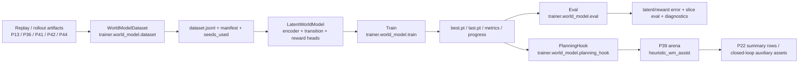

# P45 World Model / Latent Planning v1

P45 adds a world-model research lane on top of the existing replay, self-supervised, RL, and closed-loop stack.

Scope in v1:

- build one-step transition datasets from existing artifacts
- learn latent dynamics and reward-like targets
- expose a coarse uncertainty signal for diagnostics and score damping
- plug a world-model heuristic into arena policy comparison
- integrate smoke/nightly runs into P22

Non-goals in v1:

- replacing the simulator
- shipping full model-based RL
- trusting long-horizon imagined rollouts as final promotion evidence

## Architecture



## Modules

- `trainer/world_model/schema.py`
  - normalized sample schema and action hashing/tokenization
- `trainer/world_model/sample_builder.py`
  - source readers and transition extraction
- `trainer/world_model/dataset.py`
  - config-driven dataset build, split assignment, latent caching, artifacts
- `trainer/world_model/model.py`
  - encoder-backed latent world model with transition/reward/score/resource/uncertainty heads
- `trainer/world_model/losses.py`
  - latent/reward/resource/uncertainty loss aggregation
- `trainer/world_model/train.py`
  - train/val split loop, checkpoints, metrics, progress, eval, assist compare
- `trainer/world_model/eval.py`
  - replay-vs-prediction evaluation and slice summaries
- `trainer/world_model/diagnostics.py`
  - uncertainty/error correlation and worst-sample reports
- `trainer/world_model/planning_hook.py`
  - uncertainty-aware one-step reranking helper for arena policies

## Dataset Construction

Entry point:

```powershell
python -m trainer.world_model.dataset --config configs/experiments/p45_world_model_smoke.yaml --quick
```

Supported source families in v1:

- `rl_rollout` / `rollout`
  - P42/P44 rollout buffers and step logs
- `selfsup_dataset`
  - P36 self-supervised transition-like datasets
- `trace_jsonl`
  - P13 or similar trace/replay jsonl sources
- `replay_manifest`
  - P40/P41 replay-mixer manifests and referenced rows

Standard sample fields:

- `obs_t`
- `action_t` via `action_token` + `action_id`
- `obs_t1`
- `reward_t`
- `score_delta_t`
- `resource_delta_t`
- `done_t`
- `seed`
- `source_type`
- `valid_for_training`
- `slice_labels`
- optional cached `latent_t` / `latent_t1`

Dataset artifacts:

- `docs/artifacts/p45/wm_dataset/<run_id>/dataset_manifest.json`
- `docs/artifacts/p45/wm_dataset/<run_id>/dataset_stats.json`
- `docs/artifacts/p45/wm_dataset/<run_id>/dataset_stats.md`
- `docs/artifacts/p45/wm_dataset/<run_id>/dataset.jsonl`
- `docs/artifacts/p45/wm_dataset/<run_id>/seeds_used.json`

Notes:

- latent caching uses `trainer.models.ssl_state_encoder.StateEncoder`
- if an encoder checkpoint is not provided, latent caching falls back to random-init encoder features and records that status
- missing data sources degrade to warnings/stats output instead of hard failure when enough samples remain

## Model Structure

`trainer/world_model/model.py` defines `LatentWorldModel`:

- encoder:
  - `StateEncoder(input_dim -> latent_dim)`
- action conditioning:
  - learned action embedding from hashed `action_id`
- transition head:
  - `(z_t, a_t) -> z_{t+1_pred}`
- reward head:
  - `(z_t, a_t) -> reward_pred`
- score head:
  - `(z_t, a_t) -> score_delta_pred`
- resource head:
  - `(z_t, a_t) -> resource_delta_pred`
- uncertainty head:
  - `(z_t, a_t) -> uncertainty_pred`
  - current implementation uses a direct scalar head with `softplus`

This is intentionally one-step and lightweight. It is a planning assist and diagnostics model, not a replacement environment.

## Losses and Training

Entry point:

```powershell
python -m trainer.world_model.train --config configs/experiments/p45_world_model_smoke.yaml --quick
```

Current loss components:

- latent transition loss
- reward loss
- score-delta loss
- resource-delta loss
- uncertainty regularization term

Configurable weights live in:

- `configs/experiments/p45_world_model_smoke.yaml`
- `configs/experiments/p45_world_model_nightly.yaml`

Training artifacts:

- `docs/artifacts/p45/wm_train/<run_id>/train_manifest.json`
- `docs/artifacts/p45/wm_train/<run_id>/metrics.json`
- `docs/artifacts/p45/wm_train/<run_id>/progress.jsonl`
- `docs/artifacts/p45/wm_train/<run_id>/best.pt`
- `docs/artifacts/p45/wm_train/<run_id>/last.pt`
- `docs/artifacts/p45/wm_train/<run_id>/best_checkpoint.txt`
- `docs/artifacts/p45/wm_train/<run_id>/reward_config_or_loss_weights.json`
- `docs/artifacts/p45/wm_train/<run_id>/seeds_used.json`

`train.py` also triggers:

- eval on the validation split
- wm-assisted arena compare when `arena_compare.enabled=true`

## Evaluation and Diagnostics

Standalone eval:

```powershell
python -m trainer.world_model.eval --config configs/experiments/p45_world_model_smoke.yaml --checkpoint docs/artifacts/p45/wm_train/<run_id>/best.pt --quick
```

Core metrics in v1:

- `latent_transition_error`
- `reward_prediction_error`
- `score_delta_prediction_error`
- `uncertainty_mean`
- `uncertainty_error_pearson`
- top-error vs top-uncertainty overlap ratio

Slice-aware reporting:

- `slice_stage`
- `slice_resource_pressure`
- `slice_action_type`

Current done/terminal handling:

- explicit done prediction head is not implemented yet
- eval reports `done_prediction.status = skipped_not_implemented`

Eval artifacts:

- `docs/artifacts/p45/wm_eval/<run_id>/eval_metrics.json`
- `docs/artifacts/p45/wm_eval/<run_id>/eval_metrics.md`
- `docs/artifacts/p45/wm_eval/<run_id>/slice_eval.json`
- `docs/artifacts/p45/wm_eval/<run_id>/prediction_rows.jsonl`
- `docs/artifacts/p45/wm_eval/<run_id>/diagnostics.json`
- `docs/artifacts/p45/wm_eval/<run_id>/diagnostics_report.md`

## Planning Hook v1

Planning hook entry:

- `trainer/world_model/planning_hook.py`

Arena-facing adapter:

- `trainer/policy_arena/adapters/world_model_assist_adapter.py`

Supported policy ids:

- `heuristic_wm_assist`
- `baseline_wm_assist`
- `wm_assist`
- `world_model_assist`

Behavior:

1. run the base heuristic policy
2. enumerate legal actions from the simulator state
3. score each action with the world model
4. damp the score by predicted uncertainty
5. rerank actions, but still execute through the real arena simulator

Standalone compare:

```powershell
python -m trainer.world_model.planning_hook --config configs/experiments/p45_world_model_smoke.yaml --checkpoint docs/artifacts/p45/wm_train/<run_id>/best.pt --quick
```

Direct arena usage:

```powershell
python -m trainer.policy_arena.arena_runner --policies "heuristic_baseline,heuristic_wm_assist" --world-model-checkpoint docs/artifacts/p45/wm_train/<run_id>/best.pt --world-model-assist-mode one_step_heuristic --world-model-weight 0.35 --world-model-uncertainty-penalty 0.5 --seeds "AAAAAAA,BBBBBBB" --episodes-per-seed 1 --max-steps 120
```

Important boundary:

- the planning hook only reranks candidate actions
- it does not replace rollouts, arena summaries, champion rules, or regression triage

## P22 Integration

P22 rows:

- `p45_world_model_smoke`
- `p45_world_model_nightly`
- `p46_imagination_smoke` / `p46_imagination_nightly` consume P45 checkpoints through P22 once available

Commands:

```powershell
powershell -ExecutionPolicy Bypass -File scripts\run_p22.ps1 -RunP45
powershell -ExecutionPolicy Bypass -File scripts\run_p22.ps1 -RunP45 -Nightly
```

Quick mode:

- `scripts/run_p22.ps1 -Quick` includes `p45_world_model_smoke` by default
- P22 writes multi-seed summaries under `docs/artifacts/p22/runs/<run_id>/`
- per-seed world-model train runs live under `.../p45_world_model_smoke/world_model_runs/seed_*/seed_*/`
- summary rows expose world-model metrics such as reward error, latent error, and uncertainty correlation

## Closed-Loop / RL Relationships

- P39:
  - consumes `heuristic_wm_assist` as a normal arena policy
- P40/P41:
  - closed-loop manifests can record world-model checkpoints as auxiliary assets
- P42:
  - reserved config hook exists for future `world_model_aux` coupling in PPO config
- P44:
  - distributed RL rollouts are valid world-model dataset sources
- P46:
  - uses P45 checkpoints to generate short, uncertainty-gated imagined replay under `docs/artifacts/p46/`
  - keeps synthetic rows lineage-separated and real-arena-gated

## Configs

- `configs/experiments/p45_world_model_smoke.yaml`
  - small dataset budget, 3 epochs, 2 arena seeds
- `configs/experiments/p45_world_model_nightly.yaml`
  - larger source coverage including P44 rollouts and P41 replay manifests

Because `.venv_trainer` may not always have `PyYAML`, matching `.json` sidecars are also maintained for these configs and for `configs/experiments/p22.yaml`.

## Known Gaps

- one-step only; no long-horizon latent rollout policy gate
- uncertainty is still coarse and lightly calibrated
- no explicit terminal/done prediction head yet
- no direct RL training loss from the world model in the shipped P42 loop
- wm-assisted arena compare currently targets heuristic baseline first; broader policy families are future work
- P46 short-horizon imagination does not upgrade P45 into full model-based RL; simulator/oracle authority remains unchanged
- simulator/oracle traces remain the final authority for promotion and regression decisions
