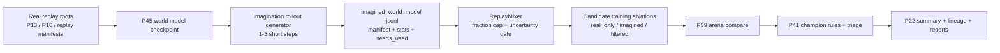

# P46 Imagination / Dyna-style Loop v1

P46 adds a conservative imagined-rollout path on top of P45 world models. The goal is not to replace the simulator. The goal is to create a traceable, uncertainty-gated synthetic replay source that can be evaluated with the same arena and triage stack used for real candidates.

P47 is the complementary lane on top of the same world model:

- P46 uses the world model for training-time replay augmentation
- P47 uses the world model for decision-time candidate reranking

## Architecture



## Imagined Sample Schema

Synthetic rows stay separate from real replay lineage.

Required fields:

- `source_type = imagined_world_model`
- `world_model_checkpoint`
- `imagination_horizon`
- `uncertainty_score`
- `uncertainty_gate_passed`
- `root_sample_id`
- `imagined_step_idx`
- `teacher_seed`
- `valid_for_training`
- `lineage_version`

Artifacts:

- `docs/artifacts/p46/imagination_schema_<timestamp>.md`
- `docs/artifacts/p46/schema_smoke_<timestamp>.json`
- `docs/artifacts/p46/imagination_rollouts/<run_id>/schema_preview.{md,json}`

## Uncertainty Gating

Default safety policy in v1:

1. use real replay states as roots
2. keep horizon short (`1-3`, smoke defaults to `1`)
3. predict one-step next latent, reward proxy, and uncertainty
4. set `uncertainty_gate_passed=false` when predicted uncertainty exceeds threshold
5. only feed gate-passing rows into replay mixing by default
6. cap imagined fraction so synthetic rows remain auxiliary

This is intentionally conservative. Real simulator outcomes still decide whether a candidate is useful.

## Replay Mixer Strategy

`trainer.closed_loop.replay_mixer` now accepts `imagined_world_model` as a first-class source type.

Controls:

- `imagined_weight`
- `require_uncertainty_gate_passed`
- `max_imagined_fraction`
- `max_imagination_horizon`

Mixer stats expose imagined-specific fields:

- source share
- acceptance rate
- average uncertainty
- lineage coverage

## Candidate Ablations

P46 compares at least these recipes:

- `real_only`
- `real_plus_imagined`
- `real_plus_imagined_filtered`

Candidate manifests record:

- `imagined_enabled`
- `imagined_filter_mode`
- `imagined_fraction`
- replay mix manifest reference
- `training_mode` and `training_mode_category`

The point of the ablation is to test whether imagined replay helps under real evaluation, not to assume it does.

## Commands

Standalone imagination smoke:

```powershell
python -m trainer.world_model.imagination_rollout --config configs/experiments/p46_imagination_smoke.yaml --quick
```

Standalone end-to-end smoke:

```powershell
python -m trainer.world_model.imagination_pipeline --config configs/experiments/p46_imagination_smoke.yaml --quick --seeds AAAAAAA
```

P22 smoke:

```powershell
powershell -ExecutionPolicy Bypass -File scripts\run_p22.ps1 -RunP46
```

P22 quick:

```powershell
powershell -ExecutionPolicy Bypass -File scripts\run_p22.ps1 -Quick
```

Nightly:

```powershell
powershell -ExecutionPolicy Bypass -File scripts\run_p22.ps1 -RunP46 -Nightly
```

## Artifacts

- `docs/artifacts/p46/imagination_rollouts/<run_id>/`
  - `imagined_rollouts.jsonl`
  - `imagined_manifest.json`
  - `imagined_stats.json`
  - `imagined_stats.md`
  - `seeds_used.json`
- `docs/artifacts/p46/imagination_pipeline/<run_id>/`
  - `pipeline_summary.json`
  - `pipeline_summary.md`
  - generated recipe configs and model map refs
- `docs/artifacts/p46/arena_compare/<run_id>/`
  - `summary_table.{json,md}`
  - `promotion_decision.json`
- `docs/artifacts/p46/triage/<run_id>/`
  - `triage_report.json`
  - `triage_report.md`

## Planning and Arena Hook

P46 does not add a new simulator. It reuses:

- P45 planning/value proxy outputs inside the imagination generator
- P39 arena for real-policy comparison
- P41 triage for imagined-source attribution
- P47 later reuses the same P45 checkpoint for short-horizon rerank ablations, but keeps that logic separate from replay augmentation

Arena compare can include:

- `heuristic_baseline`
- `candidate_real_only`
- `candidate_real_plus_imagined_filtered`
- optional `candidate_real_plus_imagined`

## P49 Runtime Integration

P49 does not change P46's research boundary, but it does move the imagination generator onto shared runtime plumbing:

- world-model inference device resolves through the runtime profile
- imagined rollout artifacts record `runtime_profile.json`
- unified progress events make P46 visible in the live/static dashboards
- `p49_gpu_mainline_nightly` can include the P46 lane while still keeping imagined replay auxiliary and uncertainty-gated

## P50 GPU Compatibility

P46 is not the primary GPU learner target in P50, but it was validated as compatible with the GPU world-model path:

- compatibility artifact root: `docs/artifacts/p50/p46_gpu_smoke/20260307-113700/`
- runtime is resolved through `.venv_trainer_cuda` when available
- the path remains generation/inference first; P50 does not reframe P46 as a standalone GPU training benchmark

## Known Gaps

- no long-horizon imagined rollout governance
- uncertainty is still approximate
- imagined rows currently serve replay augmentation, not full model-based planning
- if you want decision-time model assistance, use the separate P47 rerank lane instead of overloading imagined replay
- quick smoke runs are plumbing checks and can be too small to show uplift
- simulator/oracle traces remain the final judge for promotion and regression decisions
