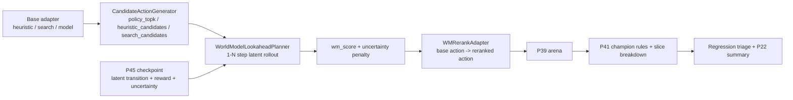

# P47 Model-Based Search / WM Rerank v1

P47 moves the P45 world model from training-time assistance into decision-time assistance.

What ships in v1:

- candidate-action generation from existing policy/search/heuristic adapters
- short-horizon world-model lookahead (`1-3` steps, default conservative)
- uncertainty-aware reranking
- arena ablations through the normal P39/P41 stack
- P22 smoke/nightly integration

What does **not** ship in v1:

- full tree search
- latent MCTS / MuZero-style planning
- simulator replacement
- long-horizon imagined rollout trust for promotion

## Architecture



## Core Modules

- `trainer/world_model/candidate_actions.py`
  - unified candidate schema
  - source coverage for `heuristic_candidates`, `search_candidates`, and `policy_topk`
- `trainer/world_model/lookahead_planner.py`
  - short latent rollout and uncertainty-aware scoring
- `trainer/policy_arena/adapters/wm_rerank_adapter.py`
  - wraps a base adapter without rewriting policy logic
- `trainer/world_model/model_based_search.py`
  - end-to-end P47 smoke/nightly pipeline

## Candidate Generation

P47 does not expand the full action space directly. It reuses existing candidate generators and normalizes them into:

- `candidate_id`
- `action`
- `action_token`
- `action_id`
- `source`
- `source_rank`
- `source_score`
- `legal`

Current source types:

- `heuristic_candidates`
- `search_candidates`
- `policy_topk`

Smoke helper:

```powershell
python trainer/world_model/test_candidate_actions_smoke.py
```

Artifacts:

- `docs/artifacts/p47/candidate_smoke_<timestamp>.json`

## Lookahead Planner

Planner entry:

```powershell
python -m trainer.world_model.lookahead_planner --config configs/experiments/p47_wm_search_smoke.yaml --quick
```

Inputs:

- current observation/state
- top-k candidate actions
- P45 world-model checkpoint
- planning config

Default v1 rollout policy:

- single imagined path
- repeat the same action embedding along the short horizon
- no tree branching

This is deliberately conservative. The goal is to get a stable rerank signal, not to claim full model-based control.

## Scoring Formula

Default v1 score:

```text
wm_score = predicted_return - lambda_uncertainty * uncertainty_score
```

Where `predicted_return` aggregates:

- predicted reward
- predicted score delta
- optional next-latent value proxy on the final step

Important safety rule:

- when uncertainty rises, the planner score must go down
- default horizons are short and uncertainty penalties are non-zero

Planner artifacts:

- `docs/artifacts/p47/lookahead/<run_id>/planner_trace.jsonl`
- `docs/artifacts/p47/lookahead/<run_id>/planner_stats.json`
- `docs/artifacts/p47/lookahead/<run_id>/planner_stats.md`

## Arena Integration

P47 adds rerank wrappers without replacing the underlying adapter:

- `heuristic_wm_rerank_*`
- `search_wm_rerank_*`
- model-backed variants can be wired through `model_path`

Arena runner accepts per-policy rerank configs through `policy_assist_map.json`.

Recorded manifest fields include:

- `world_model_assist=true`
- `assist_mode=rerank`
- `world_model_checkpoint`
- `horizon`
- `uncertainty_penalty`

## Arena Ablations

Smoke config compares:

- `heuristic_baseline`
- `heuristic_wm_rerank_h1`
- `heuristic_wm_rerank_h2`
- `heuristic_wm_rerank_h1_low_unc`

Nightly can also include:

- `search_expert`
- `search_wm_rerank_h1`

Pipeline entry:

```powershell
python -m trainer.world_model.model_based_search --config configs/experiments/p47_wm_search_smoke.yaml --quick
```

Artifacts:

- `docs/artifacts/p47/arena_ablation/<run_id>/summary_table.{json,csv,md}`
- `docs/artifacts/p47/arena_ablation/<run_id>/promotion_decision.json`
- `docs/artifacts/p47/arena_ablation/<run_id>/slice_eval.json`
- `docs/artifacts/p47/triage/<run_id>/triage_report.json`
- `docs/artifacts/p47/adapter_compare_<timestamp>.md`

## P22 Integration

Experiment rows:

- `p47_wm_search_smoke`
- `p47_wm_search_nightly`

Commands:

```powershell
powershell -ExecutionPolicy Bypass -File scripts\run_p22.ps1 -RunP47
powershell -ExecutionPolicy Bypass -File scripts\run_p22.ps1 -Quick
```

Summary metrics exposed in P22:

- `p47_baseline_score`
- `p47_candidate_score`
- `p47_best_variant_score`
- `p47_candidate_delta_vs_baseline`
- `p47_best_variant_delta_vs_baseline`

## Relationship to P45 / P46 / P42

- P45:
  - provides the checkpoint and evaluation reference used by P47
- P46:
  - uses the world model for training-time replay augmentation
  - P47 uses the world model for decision-time reranking
- P42:
  - RL candidates can later become candidate sources for rerank-assisted inference
  - this is still a reserved integration point in v1

## Known Gaps

- no tree expansion or latent MCTS
- repeated-action latent rollout is a simple proxy, not a learned internal policy
- uncertainty calibration is still coarse
- short-horizon rerank can still be harmful when the model is biased
- real arena and simulator outcomes remain the final authority for gating and promotion
