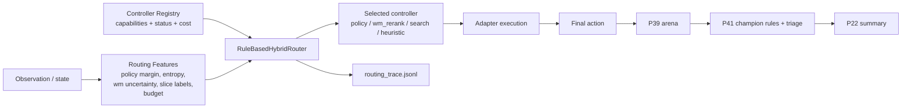

# P48 Adaptive Hybrid Controller v1

P48 adds a state-aware, uncertainty-aware, and budget-aware routing layer above the existing controller set.

This is not a learned meta-policy. v1 is explicitly rule-based and explainable.
P52 later adds a learned router on top of the same controller set while keeping this rule path as the fallback baseline.

## Scope

What ships:

- controller capability registry
- routing-feature extraction
- rule-based router with readable reasons
- hybrid controller wrapper for arena execution
- P39/P41/P22 integration

What does not ship in P48 itself:

- learned router / meta-policy (added later in P52)
- budget-adaptive search depth learning
- long-horizon model-based planning
- controller ensembling with trainable weights

## Architecture



## Controller Registry

Module:

- `trainer/hybrid/controller_registry.py`

Registry rows are machine-readable and include:

- `controller_id`
- `controller_type`
- `status`
- `supports_action_types`
- `supports_position_sensitive`
- `supports_stateful_jokers`
- `requires_world_model`
- `estimated_inference_cost`
- `recommended_use_cases`
- `known_failure_modes`

Current controllers:

- `policy_baseline`
- `heuristic_baseline`
- `search_baseline`
- `policy_plus_wm_rerank`
- `hybrid_controller_v1`

CLI:

```powershell
python -m trainer.hybrid.controller_registry --list
```

Artifacts:

- `docs/artifacts/p48/controller_registry_<timestamp>.json`

## Routing Features

Module:

- `trainer/hybrid/routing_features.py`

Current feature groups:

- policy confidence:
  - `policy_margin`
  - `policy_entropy`
  - `policy_top1_prob`
  - `policy_topk_concentration`
- world-model signal:
  - `wm_uncertainty`
  - `wm_predicted_return`
  - `wm_score`
- P41 slice labels:
  - `slice_stage`
  - `slice_resource_pressure`
  - `slice_action_type`
- budget:
  - `budget_level`
  - `search_time_budget_ms`
  - `search_max_depth`
- controller availability:
  - `policy_available`
  - `search_available`
  - `wm_available`
  - `fallback_available`

Smoke command:

```powershell
python -m trainer.hybrid.routing_features
```

Artifacts:

- `docs/artifacts/p48/routing_features_smoke_<timestamp>.json`

## Rule-Based Router

Module:

- `trainer/hybrid/router.py`

Default router policy:

1. if policy confidence is high and world-model uncertainty is low, prefer `policy_plus_wm_rerank`
2. if policy confidence is low and search budget is available, prefer `search_baseline`
3. if world-model uncertainty is too high, disable wm-rerank
4. if the slice is late/high-risk, search gets extra weight
5. if policy/search are unavailable, fall back to `heuristic_baseline`

Every decision records:

- `selected_controller`
- `routing_reason`
- `routing_score_breakdown`
- `rejected_controllers`
- `key_feature_values`

Artifacts:

- `docs/artifacts/p48/router_traces/<run_id>/routing_trace.jsonl`
- `docs/artifacts/p48/router_smoke_<timestamp>.md`

## Hybrid Controller

Module:

- `trainer/hybrid/hybrid_controller.py`

`AdaptiveHybridController` is the arena-facing wrapper. For each state it:

1. extracts routing features
2. asks the router for a controller choice
3. calls the selected adapter
4. falls back if the selected adapter fails
5. writes a trace row

Supported controller set in v1:

- `policy_baseline`
- `policy_plus_wm_rerank`
- `search_baseline`
- `heuristic_baseline`

Trace sample shape:

```json
{
  "selected_controller": "policy_plus_wm_rerank",
  "routing_reason": "policy_confident_and_wm_reliable",
  "key_feature_values": {
    "policy_margin": 0.99,
    "wm_uncertainty": 0.03,
    "slice_stage": "early",
    "budget_level": "medium"
  },
  "fallback_used": false
}
```

## Arena Ablation Design

Smoke compare includes:

- `policy_baseline`
- `policy_plus_wm_rerank`
- `hybrid_controller_v1`
- `search_baseline`
- `heuristic_baseline`

Outputs:

- `summary_table.{json,csv,md}`
- `slice_eval.json`
- `routing_summary.json`
- `promotion_decision.json`
- `triage_report.json`

The hybrid controller is judged by the same real arena episodes as other policies. The router does not override the simulator.

## P22 Integration

Experiment rows:

- `p48_hybrid_controller_smoke`
- `p48_hybrid_controller_nightly`

Commands:

```powershell
powershell -ExecutionPolicy Bypass -File scripts\run_p22.ps1 -RunP48
powershell -ExecutionPolicy Bypass -File scripts\run_p22.ps1 -Quick
```

P22 row outputs include:

- `p48_baseline_score`
- `p48_hybrid_score`
- `p48_wm_rerank_score`
- `p48_search_score`
- `p48_hybrid_delta_vs_baseline`

## Quick / Nightly

Quick:

```powershell
python -m trainer.hybrid.hybrid_controller --quick
```

Nightly:

```powershell
python -m trainer.hybrid.hybrid_controller --config configs/experiments/p48_hybrid_controller_nightly.yaml
```

Recommended wrapper:

```powershell
powershell -ExecutionPolicy Bypass -File scripts\run_p22.ps1 -RunP48
powershell -ExecutionPolicy Bypass -File scripts\run_p22.ps1 -RunP48 -Nightly
```

## Known Gaps

- router thresholds are hand-tuned heuristics, not learned
- search budget is static per config, not dynamically reallocated
- wm uncertainty is only as strong as P45/P47 calibration
- long-horizon planning is intentionally out of scope
- policy availability still depends on local checkpoint presence

## P52 Follow-on

P52 keeps the P48 router as the safe default and adds a learned meta-controller trained from routing traces plus arena/triage outcomes.

New router modes introduced by P52:

- `rule`
- `learned`
- `learned_with_rule_guard`

The guarded mode falls back to the P48 rule router when:

- routing features are incomplete
- the learned router confidence is too low
- OOD-like or high-risk signals are present
- the predicted controller is unavailable or invalid

Reference docs:

- [P52_LEARNED_ROUTER.md](P52_LEARNED_ROUTER.md)
