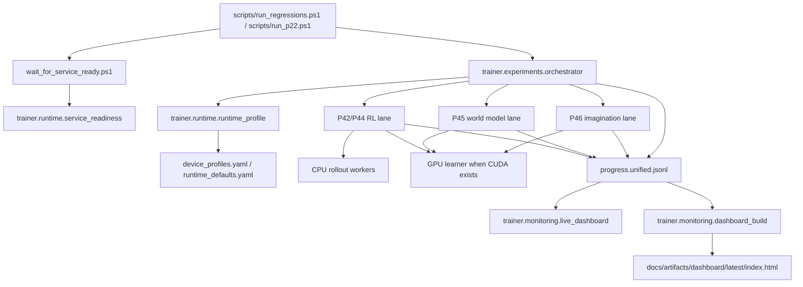

# P49 GPU Mainline + Dashboard

P49 turns the P42/P44/P45/P46 training lanes into a shared runtime surface:

- common device/runtime profiles
- CPU rollout + GPU learner defaults
- readiness guarding before service-dependent runs
- unified progress events for dashboards

P49 is an operations/runtime milestone. It does not claim that GPU enablement alone improves policy quality.
P50 then validates that runtime on a real local CUDA host, adds a shared training-python resolver, and benchmarks recommended single-GPU profiles.

## Architecture



## Device Profiles

Shared profile loader:

- `trainer.runtime.device_profile`
- `trainer.runtime.runtime_profile`

Shipped profiles:

- `single_gpu_mainline`
  - `learner_device: cuda`
  - `rollout_device: cpu`
  - AMP/BF16 requested when supported
  - fallback policy defaults to batch reduction
- `cpu_safe_fallback`
  - all paths on CPU
  - safe for debugging or hosts without CUDA
- `gpu_debug_small`
  - smaller batch sizes and conservative runtime settings
- `single_gpu_nightly_balanced`
  - benchmark-derived safer nightly preset for a 12 GB single GPU
- `single_gpu_nightly_aggressive`
  - optional higher-pressure nightly preset with the same fallback policy

CLI:

```powershell
python -m trainer.runtime.device_profile --profile single_gpu_mainline
```

Artifacts:

- `docs/artifacts/p49/device_profile_<timestamp>.json`
- each training run also writes `runtime_profile.json`

## P50 Real CUDA Follow-through

P49 defined the runtime abstraction. P50 verified it on this workstation:

- CUDA env: `.venv_trainer_cuda`
- torch: `2.10.0+cu128`
- GPU: `NVIDIA GeForce RTX 3080 Ti`
- direct real-CUDA smoke passed for:
  - P42 RL candidate
  - P45 world-model train/eval
  - P46 imagination compatibility

Reference docs:

- `docs/P50_CUDA_ENVIRONMENT.md`
- `docs/P50_GPU_TROUBLESHOOTING.md`

## CPU Rollout / GPU Learner Design

P42/P44 RL path:

- rollout workers stay on CPU by default
- PPO learner prefers the resolved `learner_device`
- rollout artifacts now record:
  - rollout steps/sec
  - learner updates/sec
  - backlog proxy
  - weight sync count
  - OOM restart count
  - invalid action rate

P45 world model path:

- train/eval/imagination inference all resolve device through the same runtime profile
- dataloader workers, pin-memory, batch size, and grad accumulation come from the shared runtime layer
- OOM fallback is conservative: batch reduction before hard failure

P46 imagination path:

- the world-model inference device is runtime-profile driven
- artifacts preserve the resolved runtime so synthetic data lineage stays auditable

Current implementation note:

- on hosts without CUDA, the resolved profile degrades to CPU and records `cuda_requested_but_unavailable`

## Readiness Guard

Cold-start `health` alone was not reliable enough for service-dependent runs. P49 adds a stronger readiness gate:

- `trainer.runtime.service_readiness`
- `scripts/wait_for_service_ready.ps1`

Guard logic:

1. optional warm-up grace period
2. repeated probe attempts with timeout + retry interval
3. `health + gamestate` probe path by default
4. requires consecutive successes before releasing the run

Integrated entry points:

- `scripts/run_regressions.ps1`
- `scripts/run_p22.ps1`

Artifacts:

- `docs/artifacts/p49/readiness/<run_id>/service_readiness_report.json`
- `docs/artifacts/p49/readiness_validation_<timestamp>.md`

## Unified Telemetry

P49 introduces `schema: p49_progress_event_v1`.

Fields include:

- `run_id`
- `component`
- `phase`
- `step`
- `epoch_or_iter`
- `seed`
- `metrics`
- `device_profile`
- `learner_device`
- `rollout_device`
- `gpu_mem_mb`
- `throughput`
- `eta_sec`
- `warning`
- `status`

Writers now attached to:

- P22 orchestrator
- P42/P44 PPO-lite lane
- P44 distributed rollout
- P45 world-model train/eval
- P46 imagination rollout

Reference artifact:

- `docs/artifacts/p49/progress_schema_example.json`

## Dashboard Usage

Terminal view:

```powershell
python -m trainer.monitoring.live_dashboard --watch docs/artifacts/p22/runs/<run_id> --once
```

Static build:

```powershell
python -m trainer.monitoring.dashboard_build --input docs/artifacts --output docs/artifacts/dashboard/latest
```

Wrapper:

```powershell
powershell -ExecutionPolicy Bypass -File scripts\run_dashboard.ps1
```

Artifacts:

- `docs/artifacts/dashboard/latest/index.html`
- `docs/artifacts/dashboard/latest/dashboard_data.json`
- `docs/artifacts/p49/dashboard_smoke_<timestamp>.md`

## P22 Integration

New experiment templates:

- `p49_gpu_mainline_smoke`
- `p49_gpu_mainline_nightly`

Config files:

- `configs/experiments/p49_gpu_mainline_smoke.yaml`
- `configs/experiments/p49_gpu_mainline_nightly.yaml`

Smoke covers:

- P42 closed-loop RL candidate lane
- P45 world-model lane
- readiness guard
- dashboard generation

Nightly template additionally enables:

- P44 distributed RL lane
- P46 imagination lane

Commands:

```powershell
powershell -ExecutionPolicy Bypass -File scripts\run_p22.ps1 -Quick
powershell -ExecutionPolicy Bypass -File scripts\run_p22.ps1 -RunP49
powershell -ExecutionPolicy Bypass -File scripts\run_p22.ps1 -RunP49 -Nightly
```

## P51 Operational Layer on Top of P49

P49 provided the runtime, telemetry, dashboard, and readiness substrate. P51 builds the long-running operations layer on top of it:

- checkpoints are registered with runtime/device metadata instead of being anonymous files
- nightly-style runs persist `campaign_state.json` with stage-level status
- dashboard data now includes campaign-state and registry summaries
- `scripts/run_p22.ps1 -RunP51` and `-RunP51 -Resume` reuse the same readiness guard and dashboard pipeline introduced here

Operationally, P49 remains the runtime foundation while P51 is the asset/campaign bookkeeping layer above it.

## Troubleshooting

No CUDA available:

- expected fallback is `learner_device: cpu`
- confirm in `runtime_profile.json`
- check `warnings` for `cuda_requested_but_unavailable`

OOM during training:

- reduce batch via `gpu_debug_small`
- raise `grad_accum_steps`
- keep `oom_fallback_policy: reduce_batch` unless debugging failures

Readiness failures:

- inspect `service_readiness_report.json`
- verify balatrobot is reachable at the configured base URL
- if health is green but game state is unavailable, keep the readiness guard enabled and do not bypass it in nightly paths

Dashboard looks empty:

- confirm the run produced `progress.unified.jsonl`
- rebuild with `trainer.monitoring.dashboard_build`
- the live terminal view can target either a single run directory or the broader `docs/artifacts` tree

## Known Gaps

- no multi-GPU learner path yet
- GPU utilization is still a proxy via PyTorch memory rather than full `nvidia-smi` sampling
- rollout backlog is a lightweight diagnostic, not a full queueing subsystem
- readiness probing is service-level only; it does not validate every downstream simulator dependency
