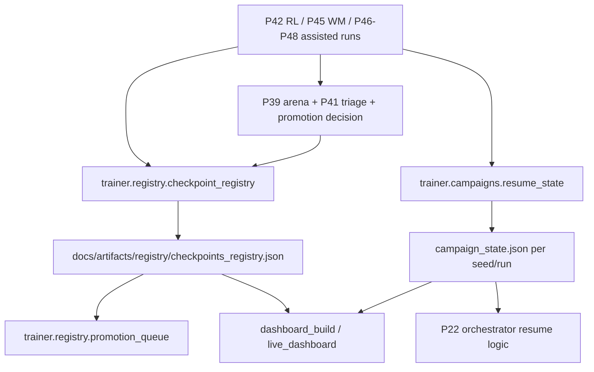

# P51 Checkpoint Registry + Resumeable Nightly Campaigns

P51 adds a durable training-operations layer on top of the P49/P50 GPU mainline:

- checkpoints are tracked assets with metadata and lineage
- candidate checkpoints move through an auditable state machine
- nightly-style runs persist stage-level campaign state
- reruns can skip completed resume-safe stages instead of restarting blindly
- arena, triage, and dashboard outputs now reference checkpoint identities

P52 extends this layer to learned-router checkpoints and resumeable learned-router campaigns.
P53 then adds a local operator surface over the same registry/campaign artifacts without changing the underlying state model.

P51 is an operations milestone. It improves traceability and rerun behavior; it does not replace trainer checkpoints, simulator truth, or manual promotion judgment.

## Architecture



## Registry Schema Overview

Primary modules:

- `trainer/registry/checkpoint_schema.py`
- `trainer/registry/checkpoint_registry.py`
- `trainer/registry/checkpoint_query.py`
- `trainer/registry/checkpoint_state_machine.py`
- `trainer/registry/promotion_queue.py`

Primary registry file:

- `docs/artifacts/registry/checkpoints_registry.json`

Each checkpoint entry stores at least:

- `checkpoint_id`
- `family`
- `training_mode`
- `training_mode_category`
- `source_run_id`
- `source_experiment_id`
- `seed_or_seed_group`
- `device_profile`
- `training_python`
- `artifact_path`
- `created_at`
- `status`
- `lineage_refs`
- `metrics_ref`
- `arena_ref`
- `triage_ref`
- `notes`

Important optional fields:

- `parent_checkpoint_id`
- `wm_checkpoint_ref`
- `imagined_data_used`
- `curriculum_profile`
- `git_commit`

## Candidate State Machine

Allowed transitions:

- `draft -> smoke_passed`
- `smoke_passed -> arena_passed`
- `arena_passed -> promotion_review`
- `promotion_review -> promoted`
- `promotion_review -> rejected`
- `any -> archived`

Each transition records:

- `transition_time`
- `reason`
- `operator`
- optional refs to arena / triage / promotion outputs

Current producer wiring:

- P42/P44 RL candidate checkpoints are auto-registered and move through the state machine when closed-loop evaluation completes.
- P45 world-model checkpoints are auto-registered as `family=world_model` with train/eval refs.
- P52 learned-router checkpoints are auto-registered as `family=learned_router` with dataset/train/inference/arena refs.
- assisted/hybrid lanes can reference upstream checkpoint IDs even when they do not emit a new standalone learner artifact.

## Campaign Stage Model

Primary modules:

- `trainer/campaigns/campaign_schema.py`
- `trainer/campaigns/resume_state.py`
- `trainer/campaigns/nightly_campaign.py`

Default stage set:

- `service_readiness`
- `train_rl`
- `train_world_model`
- `build_imagination_data`
- `arena_eval`
- `triage`
- `promotion_decision`
- `dashboard_build`
- `cleanup_finalize`

P52 adds an alternative learned-router campaign stage set:

- `build_router_dataset`
- `train_learned_router`
- `eval_learned_router`
- `arena_ablation`
- `triage`
- `promotion_queue_update`
- `dashboard_build`

P53 adds a background-ops campaign stage set:

- `background_mode_validation`
- `promotion_queue_update`
- `dashboard_build`
- `ops_ui_metadata`

Each stage records:

- `stage_id`
- `status`
- `started_at`
- `ended_at`
- `attempt_count`
- `artifacts`
- `resume_safe`
- `error_summary`

Campaign state location:

- `docs/artifacts/p22/runs/<run_id>/<exp_id>/campaign_runs/seed_*/campaign_state.json`

## Resume Semantics

P51 resume is stage-aware, not arbitrary mid-step continuation inside trainers.

Behavior:

1. completed resume-safe stages are skipped
2. failed stages can be retried from their own boundary
3. the PowerShell wrapper exposes experiment-level resume via:
   - `powershell -ExecutionPolicy Bypass -File scripts\run_p22.ps1 -RunP51 -Resume`
4. experiment-level `status.json` still short-circuits already-successful experiments; stage-level resume matters when the experiment reruns and campaign state already exists

Validated example artifact:

- `docs/artifacts/p51/campaign_resume_validation_20260307-142501.md`

In that validation run, `service_readiness`, `train_rl`, and `train_world_model` stayed at `attempt_count=1`, while intentionally reopened tail stages (`dashboard_build`, `cleanup_finalize`) moved to `attempt_count=2`.

P52 validated the same semantics for learned-router campaigns:

- `docs/artifacts/p52/campaign_resume_validation_20260307-161918.md`
- in that run, `build_router_dataset` through `promotion_queue_update` stayed at `attempt_count=1`
- the intentionally reopened `dashboard_build` stage advanced to `attempt_count=2`

## Arena / Triage / Promotion Wiring

P51 pushes checkpoint identities into the evaluation stack:

- arena summaries include candidate/champion checkpoint IDs when available
- regression triage reports reference current/baseline checkpoint IDs and world-model dependencies
- promotion decisions can move checkpoints from `arena_passed` to `promotion_review`, and optionally to `promoted` / `rejected`

Key artifact examples:

- `docs/artifacts/p22/runs/<run_id>/p51_registry_smoke/campaign_runs/seed_*/p42/arena_summary.json`
- `docs/artifacts/p22/runs/<run_id>/p51_registry_smoke/campaign_runs/seed_*/p42/triage_report.json`
- `docs/artifacts/p22/runs/<run_id>/p51_registry_smoke/campaign_runs/seed_*/p42/promotion_decision.json`

## P22 Commands

Smoke:

```powershell
powershell -ExecutionPolicy Bypass -File scripts\run_p22.ps1 -RunP51
```

Resume latest compatible run:

```powershell
powershell -ExecutionPolicy Bypass -File scripts\run_p22.ps1 -RunP51 -Resume
```

Quick matrix (includes P51 smoke row):

```powershell
powershell -ExecutionPolicy Bypass -File scripts\run_p22.ps1 -Quick
```

Registry query examples:

```powershell
python -m trainer.registry.checkpoint_registry --family rl_policy --json
python -m trainer.registry.checkpoint_registry --latest --json
python -m trainer.registry.promotion_queue --out docs/artifacts/p51/promotion_queue_smoke.json
```

## Dashboard Surface

P51 extends the dashboard with:

- latest campaign stages
- registry summary and latest checkpoint items
- promotion-queue counts
- campaign-state refs from recent P22 rows

Primary outputs:

- `docs/artifacts/dashboard/latest/index.html`
- `docs/artifacts/dashboard/latest/dashboard_data.json`

P53 reuses the same outputs and adds a local operator entrypoint:

- `powershell -ExecutionPolicy Bypass -File scripts\run_ops_ui.ps1`
- the ops UI reads `campaign_state.json`, registry snapshots, promotion queues, progress events, readiness reports, and dashboard artifacts
- the UI does not own promotion logic; it only exposes the current state plus low-risk commands

## P52 Learned Router Extension

P52 treats learned-router checkpoints as first-class registry assets:

- `family = learned_router`
- `training_mode = p52_learned_router`
- source refs point to dataset, train, inference, arena, and triage artifacts
- state transitions follow the same machine (`draft -> smoke_passed -> arena_passed -> promotion_review`)

Representative P52 artifacts:

- `docs/artifacts/p52/router_train/<run_id>/train_manifest.json`
- `docs/artifacts/p52/arena_ablation/<run_id>/promotion_decision.json`
- `docs/artifacts/p22/runs/<run_id>/p52_learned_router_smoke/campaign_runs/seed_*/campaign_state.json`
- `docs/artifacts/p22/runs/<run_id>/p52_learned_router_smoke/campaign_runs/seed_*/checkpoint_registry_snapshot.json`

## P53 Local Ops Console Extension

P53 keeps the registry/campaign system authoritative while adding a localhost-only control/view layer:

- window mode, validation refs, and ops UI path are now written into P22 summaries
- P53 campaign runs publish `ops_ui_metadata.json` so the dashboard and UI can cross-link
- low-risk UI actions such as registry refresh or dashboard rebuild are audited to `docs/artifacts/p53/ops_audit/ops_audit.jsonl`
- the promotion queue remains file-backed and readable by both the dashboard and the ops UI

## Known Limitations

- imported historical checkpoints can be incomplete until their producing pipeline reruns under P51-aware code
- a local operator UI now exists, but it is intentionally localhost-only and limited to low-risk actions
- resume safety is stage-granular, not arbitrary checkpointing inside every inner trainer loop
- registry retention/deduplication is still minimal; imported historical artifacts can produce a noisy draft pool
